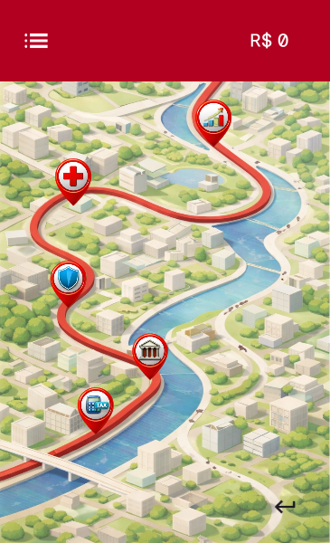
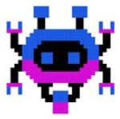
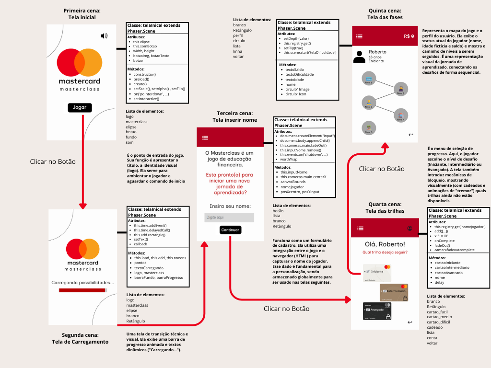
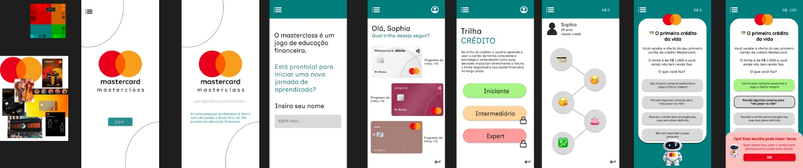
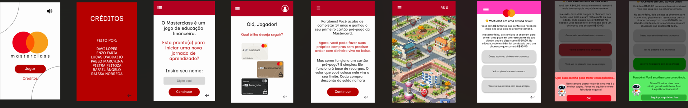

# GDD - Game Design Document - Módulo 1 - Inteli

**_Os trechos em itálico servem apenas como guia para o preenchimento da seção. Por esse motivo, não devem fazer parte da documentação final_**

## Nome do Grupo
**Masterminds**

#### Nomes dos integrantes do grupo
- Raissa Guimarães  
- Lucas D'Addazio  
- Pietra Feitoza  
- Davi Lopes  
- Enzo Faria  
- Pablo Marchina  
- Rafael Botelho 

## Sumário

[1. Introdução](#c1)

[2. Visão Geral do Jogo](#c2)

[3. Game Design](#c3)

[4. Desenvolvimento do jogo](#c4)

[5. Casos de Teste](#c5)

[6. Conclusões e trabalhos futuros](#c6)

[7. Referências](#c7)

[Anexos](#c8)

 

# 1. Introdução (sprints 1 a 4)

## 1.1. Plano Estratégico do Projeto

### 1.1.1. Contexto da indústria (sprint 2)

A Mastercard é uma empresa que atua no setor de serviços financeiros e meios de pagamento. Inserida na indústria financeira global, a organização opera principalmente como bandeira de cartões, estabelecendo parcerias B2B com outras instituições financeiras que utilizam sua tecnologia para processar pagamentos.

Além disso, a Mastercard desenvolve soluções digitais voltadas para consumidores finais e empresas, oferecendo serviços relacionados a crédito, débito, pré-pago, pagamentos digitais e inclusão financeira. Sua atuação vai além da simples intermediação de transações, envolvendo também análise de dados, cibersegurança e desenvolvimento de tecnologias para o ecossistema financeiro.

A abrangência de suas atividades é internacional, com presença global em diversos países, conectando consumidores, instituições financeiras, e empresas por meio de uma ampla rede de pagamentos digitais.

#### 1.1.1.1. Modelo de 5 Forças de Porter (sprint 2)

**1.1.1.1.1. Análise da Ameaça de Novos Entrantes: Baixa**

A ameaça de novos entrantes no setor de bandeiras é relativamente baixa, principalmente devido às elevadas barreiras de entrada estruturais, econômicas e regulatórias. A Mastercard opera em escala global (220 países) e possui uma rede consolidada de bancos emissores, adquirentes, estabelecimentos comerciais e parceiros tecnológicos. 

A entrada nesse mercado exige investimentos massivos em infraestrutura tecnológica, segurança cibernética, sistemas antifraude, compliance regulatório internacional (incluindo normas como PCI-DSS e exigências de bancos centrais) e construção de marca. O efeito de rede também é um dos principais obstáculos: quanto mais instituições utilizam uma bandeira, mais valiosa ela se torna.

Em 2025, o valor da marca da Mastercard ultrapassou $22.495 bilhões segundo a Brand Finance (Janeiro, 2026). Esse tipo de reconhecimento é construído por décadas, portanto em um mercado já consolidado com gigantes como o Mastercard, Visa e Elo, novos entrantes se tornam menos prováveis de suceder. 

**1.1.1.1.2. Análise da Ameaça de Produtos ou Serviços Substitutos: Moderada a Alta**

A ameaça de substitutos é moderada a alta, impulsionada principalmente pela evolução tecnológica no setor financeiro. Sistemas de pagamentos instantâneos (RTP), como o Pix no Brasil e o UPI na Índia, permitem transferências diretas e, muitas vezes, com custo reduzido, contornando completamente as redes tradicionais de cartões. 

Além disso, o rápido avanço do Open Banking viabiliza pagamentos account-to-account (A2A), permitindo transferências entre contas sem intermediação de bandeiras. Stablecoins e integrações com criptomoedas também representam uma ameaça crescente, especialmente em pagamentos internacionais, ao oferecer liquidação rápida e custos potencialmente menores. 

Embora esses substitutos ampliem a concorrência e pressionem o volume transacionado em cartões, a Mastercard e outras bandeiras ainda mantêm forte relevância devido à sua ampla aceitação global, segurança e padronização mundial. 

**1.1.1.1.3. Análise do Poder de Barganha dos Fornecedores: Baixo**

O poder de barganha dos fornecedores é relativamente baixo. A Mastercard possui diversas parcerias com fintechs de tecnologia, serviços de processamento de dados, cibersegurança e infraestrutura digital. Portanto, por ser uma corporação global de grande porte, possui ampla capacidade de negociação e pode diversificar seus parceiros estratégicos. 

Além disso, como disse o líder de RH global da Mastercard Michael Fraccaro em entrevista com VOCÊ S/A em 2025: “Hoje, 60% dos nossos projetos são realizados internamente”, reduzindo a dependência de terceiros. Pelo setor de pagamentos estar fortemente ligado ao conhecimento tecnológico e sistemas digitais, a possibilidade de múltiplos fornecedores qualificados e desenvolvimento interno é ampliada, diminuindo o poder individual de cada um.

**1.1.1.1.4. Análise do Poder de Barganha dos Clientes: Moderado**

Os principais clientes da Mastercard Incorporated não são os consumidores finais, mas sim bancos emissores, instituições financeiras e grandes adquirentes. Essas organizações movimentam altos volumes financeiros e, portanto, possuem poder de negociação sobre taxas, contratos e condições comerciais. 

O poder de barganha está sujeito ao tipo de cliente Mastercard. Bancos emissores, por terem relativa facilidade de trocar de bandeiras, apresentam alto poder de negociação e exigem da bandeira incentivos comerciais e suporte tecnológico para manter a parceria. Por outro lado, as empresas credenciadoras e adquirentes (empresas de maquininha) não podem simplesmente deixar de oferecer determinadas bandeiras sem comprometer a aceitação dos estabelecimentos comerciais e perder clientes devido a falta de compatibilidade e cobertura de mercado, o que diminui o seu poder de barganha.

Esse poder tende a se ampliar diante de propostas legislativas como o Credit Card Competition Act, que prevê que bancos com mais de US$100 bilhões em ativos ofereçam aos comerciantes alternativas de redes além das tradicionais (The Credit Card Competition Act 2023, Durbin). Caso implementada, tal medida pode reduzir parcialmente o poder estrutural exercido pela Mastercard e pela Visa, ao aumentar as opções disponíveis no mercado. 

Ademais, observa-se o fortalecimento do poder de barganha dos comerciantes. As taxas pagas às redes de pagamento atingiram aproximadamente US$187,2 bilhões no último ano (Statista, Dezembro 2025), configurando-se como o segundo maior custo operacional do varejo. Considerando que as taxas de intercâmbio normalmente variam entre 2% e 3% do valor da transação (Banco Central do Brasil, Janeiro 2026), mesmo reduções aparentemente pequenas produzem impactos financeiros relevantes quando aplicadas a grandes volumes de vendas.

A substituição completa da bandeira para os clientes da Mastercard implicaria elevados custos operacionais, riscos tecnológicos e possíveis perdas de aceitação no mercado global. Dessa forma, embora o poder de barganha dos clientes esteja em ascensão, ele permanece moderado, dada a escala e a relevância estratégica da rede Mastercard.

**1.1.1.1.5. Análise da Rivalidade entre os Concorrentes Existentes: Alta**

A rivalidade no setor é alta e intensa. No Brasil, a Mastercard domina aproximadamente 60% do mercado de bandeiras, com a Visa em segundo lugar e o Elo em terceiro (NORBR). A disputa ocorre principalmente em inovação tecnológica, segurança de dados, expansão internacional, parcerias estratégicas e taxas cobradas. 

Como o setor financeiro está em constante transformação digital, as empresas precisam investir continuamente em novas soluções, como pagamentos por aproximação, tokenização e inteligência artificial. A alta rivalidade exige diferenciação estratégica constante e forte investimento em tecnologia para manter participação de mercado.

### 1.1.2. Análise SWOT (sprint 2)

**1.1.2.1. Forças**
- Marca global com credibilidade forte: A Mastercard é uma bandeira reconhecida internacionalmente sendo ainda maior que a Visa no Brasil (~60% do mercado). A marca foi avaliada em $22.495 bilhões pela Brand Finance em 2025, esse nível de reconhecimento é construído por décadas e pode ser usado para atrair usuários ao aplicativo. 
- Rede ampla de parceiros e integração com bancos: O modelo da Mastercard é baseado em parcerias com banco emissores e adquirentes, o que facilita a integração do jogo com instituições que já utilizam a bandeira como o Banco do Brasil, Bradesco, Itaú, Santander, BTG Pactual, Inter, NuBank, e outros (Mastercard). 
- Coerência visual e identidade da empresa: Estudos de branding pela Harvard Business Review (2013) indicam que a consistência visual aumenta a confiança e retenção de clientes durante o uso. Ademais, a padronização visual da Mastercard e aplicativo reforça o reconhecimento da marca e fortalece o posicionamento do jogo como produto oficial afiliado.
- Capacidade tecnológica de ferramentas e integração com a bandeira: A expertise tecnológica da Mastercard facilita a conexão do jogo com a realidade através do uso de bancos e operações financeiras reais como pedir um empréstimo em um banco parceiro, simular o pagamento de uma fatura, e antecipação de parcelas para liberação de limite. 

**1.1.2.2. Oportunidades**
- Baixo nível de educação financeira: O Brasil possui uma grande lacuna de educação financeira. De acordo com a FEBRABAN, 40% dos brasileiros sabem pouco e 15% não sabem nada de educação financeira, enquanto 72% das famílias brasileiras dizem ter dificuldade em fechar as contas do mês (IBGE). Esse ambiente cria demanda para uma solução de educação financeira digital. 
- Crescimento da gamificação como ferramenta educacional: De acordo com a Market.us (2025/2026, Game-Based Learning Market Report), mais de 72% dos jovens apresentam maior engajamento quando o conteúdo é ensinado por formatos gamificados, em comparação com métodos tradicionais. Além disso, até 93% do tempo em sala pode ser utilizado de forma produtiva quando jogos educacionais estruturados são integrados ao plano de aula, aumentando foco, participação e retenção de conhecimento. Nesse contexto, um jogo de educação financeira afiliado à Mastercard se beneficia diretamente dessa tendência, ao combinar conteúdos técnicos com mecânicas de progressão, recompensas e feedback imediato, alinhando educação financeira à lógica contemporânea de aprendizagem interativa.
- Uso indevido de cartões: Reportagens do Banco Central (Estatísticas Monetárias e de Crédito, Janeiro 2026) mostram que a inadimplência no crédito rotativo ultrapassou 60%, indicando que mais da metade dos consumidores não consegue quitar suas dívidas no prazo e permanece com saldo em atraso nessa modalidade. Assim, a população brasileira está em necessidade de alfabetização financeira, seja do funcionamento de cartões ou hábitos financeiros saudáveis para pagar suas dívidas e construir seu capital. 
- Potencial de diferenciação da empresa: O mercado de games de educação financeira é relativamente inexplorado, no Brasil tendo apenas o Financial Football da Visa. Outros como o Aprender Valor do Banco Central e Meu Bolso Em Dia possuem menor ênfase em mecânicas de progressão, narrativa ou simulação imersiva e são focados no aprendizado pedagógico. Dessa maneira há um espaço claro para a diferenciação por uma plataforma que une profundidade técnica com experiência realística gamificada, algo que o Financial Football não tem. 
- Redução da geração “nem-nem”: Dados do IBGE indicam que a proporção de jovens de 15 a 29 anos que não estudam nem trabalham (geração “nem-nem”) atingiu os menores níveis da última década nos dados mais recentes da PNAD Contínua: 19,7% (Outubro, 2025). Essa redução indica maior inserção educacional e produtiva dos jovens na economia, ampliando o potencial de alcance de soluções de educação financeira gamificada. 

**1.1.2.3. Fraquezas**
- Pouca experiência da programação da equipe: Os integrantes do grupo não possuem experiência extensa de programação, criando limitações técnicas e de mercado e exigindo mentoria e apoio institucional. 
- Falta de expertise pedagógica: A educação eficaz exige uma metodologia didática estruturada. Sem especialistas em pedagogia, o jogo pode se tornar apenas informativo e não transformador. 
- Dependência de parceiros por credibilidade: O aplicativo é extremamente dependente na associação com a Mastercard, e sem essa parceria o aplicativo poderia perder sua credibilidade como ferramenta educacional financeira. Sem essa parceria formal, o aplicativo poderia reduzir a confiança dos usuários e a aceitação por instituições educacionais ou financeiras, além de enfraquecer o valor de possíveis certificados como diferencial competitivo.
- Modelo B2B (não direto ao cliente): A Mastercard opera principalmente via instituições financeiras, portanto para oferecer recompensas como cashbacks e benefícios financeiros o jogo precisaria: ser promovido por bancos emissores e integrado a seus aplicativos (exige aprovação política e regulatória) ou depender de campanhas conjuntas entre a bandeira e os bancos.
- Falta de recompensas tangíveis: A impossibilidade atual de implementação de um banco de dados não permite associação com qualquer sistema da Mastercard, como pontos do Mastercard Surpreenda como recompensa. Além disso, benefícios tangíveis como recompensas, descontos e certificados Mastercard dependem, além da bandeira, da adesão de bancos emissores parceiros, reduzindo a autonomia estratégica do projeto. Sem isso, o aplicativo pode oferecer apenas reconhecimento in-game como títulos e cosméticos, diminuindo sua atratividade para o público. 

**1.1.2.4. Ameaças**
- Surgimento de novas Fintechs de educação financeira: Bancos digitais como Nubank, C6 Bank, Neon e a fintech PicPay operam diretamente no modelo B2C e possuem milhões de usuários. Muitas dessas empresas já oferecem conteúdos educativos dentro de seus próprios aplicativos e recompensas financeiras (C6 Experience do C6 e Nunos do Nubank), aumentando a concorrência por atenção e fidelização de jovens e jovens adultos.  
- Desintermediação por sistemas account-to-account (A2A): O Pix tornou-se o meio de pagamento mais utilizado no país, superando cartões em volume de transações (BCB, Dezembro 2025). Como ele opera no modelo A2A, sem intermediação de bandeiras, o Pix reduz a dependência do cartão em transações cotidianas, o que pode diminuir a centralidade estratégica da Mastercard e, consequentemente, o interesse do público em aprofundar conhecimentos específicos sobre crédito e bandeiras tradicionais.
- Risco de percepção comercial excessiva: Pesquisas publicadas pela Harvard Business Review demonstram que consumidores, especialmente jovens (nosso público alvo), tendem a rejeitar iniciativas percebidas como marketing velado. Se o jogo for interpretado como incentivo ao uso de cartões em vez de ferramenta educacional imparcial, pode haver perda de menor adesão do público-alvo e credibilidade
- Possível baixo engajamento devido a perguntas conceituais: A solução desenvolvida pela equipe vai exigir do jogador responder perguntas conceituais aplicadas em cenários reais, o que pode ser considerado menos atrativo do que uma solução imersão completa ou completamente gamificada. 

### 1.1.3. Missão / Visão / Valores (sprint 2)

**Missão:** Democratizar o acesso à educação financeira por meio de uma plataforma gamificada que ensina, na prática, como usar cartões de crédito, débito e pré-pago e constrói costumes financeiros sustentáveis.

**Visão:** Consolidar-se como referência nacional em educação financeira gamificada, ampliando o acesso ao conhecimento prático e reduzindo o déficit de alfabetização financeira no Brasil.

**Valores:** 
- Educação como motor de mudança social
- Inclusão financeira
- Confiança e segurança
- Conhecimento aplicado
- Ensino acessível

### 1.1.4. Proposta de Valor (sprint 4)

*Posicione aqui o canvas de proposta de valor. Descreva os aspectos essenciais para a criação de valor da ideia do produto com o objetivo de ajudar a entender melhor a realidade do cliente e entregar uma solução que está alinhado com o que ele espera.*

### 1.1.5. Descrição da Solução Desenvolvida (sprint 4)

*Descreva brevemente a solução desenvolvida para o parceiro de negócios. Descreva os aspectos essenciais para a criação de valor da ideia do produto com o objetivo de ajudar a entender melhor a realidade do cliente e entregar uma solução que está alinhado com o que ele espera. Observe a seção 2 e verifique que ali é possível trazer mais detalhes, portanto seja objetivo aqui. Atualize esta descrição até a entrega final, conforme desenvolvimento.*

### 1.1.6. Matriz de Riscos (sprint 4)

*Registre na matriz os riscos identificados no projeto, visando avaliar situações que possam representar ameaças e oportunidades, bem como os impactos relevantes sobre o projeto. Apresente os riscos, ressaltando, para cada um, impactos e probabilidades com plano de ação e respostas.*

### 1.1.7. Objetivos, Metas e Indicadores (sprint 4)

*Definição de metas SMART (específicas, mensuráveis, alcançáveis, relevantes e temporais) para seu projeto, com indicadores claros para mensuração*

## 1.2. Requisitos do Projeto (sprints 1 e 2)
-Requisitos necessários para o desenvolvimento do jogo.

    - Desenvolver o jogo para WebMobile
    
    - Criar um menu de início
        - Inserir nome do jogo
        - Inserir logo
        - Inserir botão de “Jogar”
    
    - Criar tela de carregamento
        - Conectá-la para aparecer quando clicar o botão “Jogar” do menu de início
        - Programar para passar para a tela de Nome após um tempo
    
    - Criar a tela de nome
        - Texto na parte de cima da tela
        - Caixa para o jogador adicionar o nome
        
    - Criar um menu de seleção de dificuldade para o jogo
        - Texto na parte de cima da tela
        - Iniciante (botão)
        - Intermediário (botão)
        - Expert (botão)
        - Os botões são os cartões da Mastercard
    
    - Criar uma tela de fases para cada dificuldade, no formato de ilhas, como “Candy Crush”, com designs diferentes e condizentes com uma temática de “caminho da vida”.
        - Criar os elementos visuais que serão usados
        - Criar um botão para cada uma das fases
        - Criar as questões e a tela com um tema de vida, começando com a pessoa nova até chegar na aposentadoria
        - Separar as fases ou perguntas por cores
            - Pré-pago
            - Débito
            - Crédito
            - Mesclado
            - talvez perguntas sobre conceitos financeiros
        - Fases:
            - 1 fase: Pré-adolescente
                - 14 a 16 anos
                - Pré-pago
                - 3 a 5 questões
            - 2 fase: Final adolescência
                - 16 a 19 anos
                - Débito
                - Última pergunta sobre ter ou não cartão de crédito sem ter renda
                - 5 questões
            - 3 fase: Jovem adulto
                - 20 a 40 anos
                - Crédito e perguntas mescladas
                - Começar com noções de dívidas para aprofundar na próxima fase
                - 6+ questões
            - 4 fase: Final da fase adulta
                - 40 a 65 anos
                - Mesclado e endividamento
                - 6 + questões
            - 5 fase: Final: Pré-aposentadoria e aposentadoria
                - 65+ anos
                - Mesclado e foco forte em endividamento e projeto de vida
                - 5+ questões
    
    - Criar as fases em um formato de questionário, com número de questões à definir baseado na pesquisa para as questões, podendo variar.
        - Modelar como será o design do questionário
        - Criar os botões necessários
        - Criar perguntas para cada fase, que sejam condizentes com a dificuldade escolhida, utilizando exemplos reais do dia-a-dia.
        - Criar dicas para cada pergunta, que podem ajudar a pessoa a chegar na resposta.
        - Implementar o design de um robô para que, quando clicado, ele mostre a dica daquela questão.
        - Programar de modo que, após terminar cada pergunta, o questionário fique verde se a pessoa acertou, amarelo caso acerte com a ajuda do robô e vermelho caso erre.
        - Mostrar uma explicação da pergunta após a pessoa terminá-la, de forma fácil e clara de entender, independentemente do desempenho do jogador.
        - Programar de modo que, quando a pessoa erre, ela receba a explicação e tenha que responder novamente a pergunta até acertar.
        - Criar um botão para continuar para a próxima pergunta
    
    - Criar um sistema de pontuação
        - Desenhá-lo de forma que, a pontuação seja conta em R$ (simbólico), acertos verdes valem muitos pontos, amarelos poucos e vermelhos façam perder pontos
    
    - Implementar sistema de avanço entre as fases
        - Decidir se será baseado na pontuação do Jogador ou em completar as fases anteriores
    
    - Criar uma parte de conquistas
        - Fazer com que, quando a pessoa termine certa dificuldade, ela ganhe um troféu especial que seria armazenado em um menu de conquistas (Cartão Mastercard)

## 1.3. Público-alvo do Projeto (sprint 2)

O jogo é direcionado a pessoas de diferentes faixas etárias que buscam desenvolver ou aprofundar seus conhecimentos em educação financeira. Abrange jovens em fase escolar, adultos em início ou consolidação de carreira e até indivíduos que desejam reorganizar sua vida financeira, com o foco sendo aqueles que começaram agora ou estão consolidando sua vida financeira. O público pode estar localizado em qualquer região do Brasil ou em outros países de língua portuguesa, uma vez que a plataforma está disponível exclusivamente em português.

Em termos de perfil comportamental, o jogo atende usuários que valorizam aprendizado aplicado ao cotidiano. São pessoas interessadas em melhorar sua relação com o planejamento estratégico e consumo consciente. O formato é especialmente atrativo para quem aprecia jogos baseados em quizzes e desafios de conhecimento, priorizando raciocínio em vez de mecânicas de arcade.

# 2. Visão Geral do Jogo (sprint 2)

Nesta seção 2, serão apresentados alguns detalhes do jogo, como o objetivo para o qual foi construído, detalhando os efeitos que o jogo provocará, bem como as características mais técnicas do jogo, a exemplo do gênero, a plataforma, o número de jogadores, as inspirações e o tempo para completá-lo.

## 2.1. Objetivos do Jogo (sprint 2)

O objetivo do Masterclass é promover o desenvolvimento da educação financeira dos jogadores por meio de um jogo com situações imersivas que simulam decisões recorrentes que ocorrem ao longo da vida. O objetivo do jogo é que ao final da experiência, o jogador tenha um de como funcionam as diferentes formas de pagamentos, cartões de crédito, débito e pré-pago, e compreender a dimensão das consequências de suas decisões financeiras. O jogo procura incentivar o pensamento crítico e a tomada de decisão consciente, ajudando o usuário em sua vida financeira, ensinando conceitos importantes da educação financeira.

Assim, o sucesso do jogo é quando o jogador termina a experiência com maior conhecimento sobre o funcionamento dos meios de pagamento e maior capacidade de tomar decisões financeiras conscientes, mostrando que aprendizado adquirido durante o jogo pode ser usado para situações reais.

## 2.2. Características do Jogo (sprint 2)

### 2.2.1. Gênero do Jogo (sprint 2)

Nosso jogo se enquadra no gênero de trívia narrativo, visto que se trata de um jogo de perguntas e respostas, com uma progressão entre as fases e questões que narram uma história de vida, com o jogador se colocando no lugar da vida dessa pessoa.

### 2.2.2. Plataforma do Jogo (sprint 2)

Nosso jogo foi desenvolvido para a plataforma WebMobile, pois, dessa maneira, conseguimos desenvolver o jogo para ser utilizado no celular, tornando-o mais acessível ao público, e, mais especificamente, no navegador, por questões técnicas.

### 2.2.3. Número de jogadores (sprint 2)

1 jogador

### 2.2.4. Títulos semelhantes e inspirações (sprint 2)

A construção do Masterclass foi inspirada por diferentes jogos que combinam progressão visual por fases, tomadas de decisão com consequências e simulação de situações reais, elementos fundamentais para a proposta do projeto. Entre as principais referências visuais está o Candy Crush Saga. O jogo utiliza um mapa em formato de trilha com fases representadas por "ilhas" ou pontos sequenciais, criando uma sensação de progresso. Essa estrutura inspira diretamente a ideia de organizar as fases do Masterclass em um “caminho da vida”, no qual cada etapa representa um momento da jornada financeira do jogador. Além disso, a lógica de desbloqueio progressivo e botão individual para cada fase serve como base paA construção do Masterclass foi inspirada por diferentes jogos que combinam progressão por fases, tomada de ra o design de navegação e progressão por dificuldade (iniciante, intermediário e expert).

Outra referência essencial é o BitLife, que trabalha a progressão da vida do personagem por meio de decisões sequenciais. No BitLife, o jogador vivencia diferentes fases da vida (infância, juventude, vida adulta) tomando decisões que impactam indicadores como dinheiro, felicidade e carreira. Essa estrutura inspira o conceito do Masterclass de criar fases que possam seguir uma sequência lógica (por exemplo, da infância à vida adulta financeira) ou apresentar situações independentes, sempre baseadas em escolhas e consequências mensuráveis.

No campo da educação financeira com simulação realista, destaca-se o SPENT. O jogo simula a experiência de viver com um orçamento extremamente limitado, obrigando o jogador a tomar decisões financeiras difíceis em contextos de vulnerabilidade. A cada escolha, o impacto é imediato e pode levar a consequências severas, como perda de moradia ou dificuldades básicas. Essa mecânica de simulação realista inspira o Masterclass a demonstrar, de forma prática, como o uso inadequado do crédito ou a falta de planejamento financeiro pode gerar consequências negativas. A lógica de decisão com impacto direto no saldo do jogador (ganho ou perda de dinheiro simbólico) dialoga fortemente com essa proposta.

Em conjunto, essas referências contribuem para três pilares do Masterclass: (1) progressão visual organizada em mapa de fases, como em Candy Crush; (2) jornada de vida estruturada por decisões sequenciais, como em BitLife; e (3) simulação financeira realista com consequências claras, como em SPENT. A combinação desses elementos permite criar uma experiência que une narrativa, desafio, aprendizado prático e impacto direto das escolhas, alinhada à proposta educativa e interativa do projeto.

### 2.2.5. Tempo estimado de jogo (sprint 5)

O jogo todo demora entre 2 e 3 horas, com cada fase durando entre 30m e 45m

# 3. Game Design (sprints 2 e 3)

## 3.1. Enredo do Jogo (sprints 2 e 3)

O Masterclass utiliza uma abordagem UI-driven (orientada por interface), na qual a experiência é centrada na interação com menus, botões e elementos visuais, sem a necessidade de movimentação 3D ou controle direto de avatares.

Embora não apresente uma narrativa linear clássica (com início, meio e fim cinematográficos), o jogo utiliza o conceito de cenários contextuais. A progressão do jogador ocorre através das "Ilhas da Vida": representações visuais de fases que agrupam cards de perguntas baseadas em situações reais do cotidiano financeiro. Essa estrutura garante que, embora a jogabilidade seja focada em interface, exista uma sensação de jornada e evolução conforme o jogador navega pelos desafios de complexidade crescente.

## 3.2. Personagens (sprints 2 e 3)

### 3.2.1. Controláveis

Diferente de jogos de aventura ou RPG, o Masterclass opta pela ausência de um personagem controlável pelo jogador, uma escolha de design que se fundamenta no conceito central do projeto, onde o próprio usuário assume o papel de protagonista absoluto ao interagir com os cards de situação e o conteúdo pedagógico. Ao eliminar a figura de um avatar intermediário, o jogo busca gerar uma conexão direta entre as decisões financeiras e suas consequências, tornando o aprendizado mais pessoal. O jogador deve interpretar sua posição como a simulação de sua própria vida financeira.

### 3.2.2. Non-Playable Characters (NPC)

Para equilibrar a estrutura técnica e garantir o suporte necessário ao aprendizado, o jogo apresenta o Wink, um NPC de suporte que atua como o guia da jornada educacional. Ele é representado como um robô com estética inspirada na marca Mastercard (paleta de cores e formas circulares), para fornecer dicas contextuais e entregar feedbacks imediatos sobre acertos e erros.

### 3.2.3. Diversidade e Representatividade dos Personagens

Nosso jogo não possui personagens definidos. Entretanto, a pessoa que está jogando se torna o “personagem principal”, à medida que responde perguntas em primeira pessoa em cada fase, para ir avançando em um enredo de vida até chegar à aposentadoria. Dessa forma, para podermos buscar uma maior identificação da maioria da população brasileira, desenvolvemos a sequência do enredo do jogo de modo que o papel que o jogador assume seja um perfil com o qual grande parte das pessoas possa se identificar o máximo possível, considerando diferentes realidades socioeconômicas presentes no Brasil.

Além disso, a própria estrutura de jogo escolhida por nós foi pensada de forma a interessar diferentes públicos-alvo de diferentes idades. Escolhemos o estilo de jogo de Trivia narrativa pensando, principalmente, naqueles que são nosso principal, mas não único, foco: pessoas iniciando sua vida financeira ou que ainda a estão consolidando. Essa escolha de estilo se sustenta por um relatório feito pela ESA em 2024, no qual é afirmado que cerca de 84% desse grupo em que focamos (representados por Gen Z e Millennials) concordam que os jogos ajudam na estimulação mental e na melhora de habilidades cognitivas, o que reforça a adequação do formato ao público-alvo definido.

Outra nuance de nosso jogo que busca a inclusão é a plataforma em que ele é jogado. Nosso jogo está sendo desenvolvido para a plataforma mobile (tablets e celulares), visto que essa é a plataforma mais utilizada pelos jogadores, como comprovado pelo mesmo relatório da ESA de 2024, que mostra que 78% dos usuários utilizam dessa plataforma, além de dialogar com dados da PNAD Contínua, que apontam o telefone celular como principal meio de acesso à internet no Brasil, favorecendo maior equidade digital e ampliação do alcance do projeto.

Dentre as medidas tomadas visando à inclusão, também se destaca a organização e escolha dos elementos da tela. Além de termos organizado o jogo de um modo que ele seja intuitivo de se jogar e proporcione um aprendizado fácil de ser assimilado, que abrange diferentes níveis de conhecimento prévio (Separação por nível “Iniciante”, “Intermediário” e “Avançado”), também nos preocupamos com as cores utilizadas, se atentando ao contraste entre elas, de modo que o texto e os elementos sejam facilmente compreendidos e legíveis em qualquer máquina, independente da sua capacidade de gerar imagem, seguindo princípios de acessibilidade e equidade no design digital.

Por último, algo que planejamos implementar futuramente em nosso jogo são questões de acessibilidade, como um modo daltônico, visando garantir que esse grupo consiga usufruir do jogo de forma plena e, consequentemente, ter sua experiência potencializada.

## 3.3. Mundo do jogo (sprints 2 e 3)

### 3.3.1. Locações Principais e/ou Mapas (sprints 2 e 3)

O Masterclass utiliza uma abordagem UI-driven (orientada por interface). A experiência é centrada na interação com menus, botões e elementos visuais, sem a necessidade de movimentação 3D ou controle direto de avatares.

O ambiente principal do jogo é um mapa em formato de trilha, inspirado na progressão visual de *Candy Crush*. As fases são representadas por "Ilhas da Vida" ou pontos sequenciais interconectados. Estas ilhas possuem designs diferentes e condizentes com a temática de "caminho da vida", agrupando cards de perguntas baseadas em situações reais do cotidiano financeiro.

Abaixo estão detalhadas as fases presentes no mapa, que representam os diferentes momentos da jornada de vida do jogador:

| Fase | Etapa da Vida | Faixa Etária | Tema das Perguntas e Foco Financeiro | Quantidade de Questões |
| :--- | :--- | :--- | :--- | :--- |
| **Fase 1** | Pré-adolescente | 14 a 16 anos | **Pré-pago.** | 3 a 5 questões |
| **Fase 2** | Final da adolescência | 16 a 19 anos | **Débito.** A última pergunta aborda o dilema de ter ou não cartão de crédito sem ter renda. | 5 questões |
| **Fase 3** | Jovem adulto | 20 a 40 anos | **Crédito e Mesclado.** Inicia com noções de dívidas para aprofundamento na fase seguinte. | 6+ questões |
| **Fase 4** | Final da fase adulta | 40 a 65 anos | **Mesclado.** Foco em endividamento. | 6+ questões |
| **Fase 5** | Pré-aposentadoria e aposentadoria | 65+ anos | **Mesclado.** Foco forte em endividamento e projeto de vida. | 5+ questões |

### 3.3.2. Navegação pelo mundo (sprints 2 e 3)

Como o Masterclass utiliza uma abordagem UI-driven (orientada por interface) e não possui um personagem controlável, a "movimentação" pelo mundo do jogo ocorre inteiramente por meio da interação com menus, botões e elementos visuais no mapa. 

A navegação e o desbloqueio das áreas seguem um fluxo linear e condicional, estruturado da seguinte forma:

* **Acesso Inicial e Escolha de Trilha:**
    * A partir do menu inicial, o jogador aperta "jogar", passa por uma tela de carregamento e insere seu nome.
    * Em seguida, o jogador seleciona uma das três trilhas disponíveis (Iniciante, Intermediário ou Avançado) nos botões representados por cartões da Mastercard. Essa escolha define o contexto das situações que serão apresentadas.

* **Progressão e Desbloqueio de Dificuldades (O Mapa):**
    A navegação principal ocorre no mapa de "Ilhas da Vida", onde o jogador deve avançar obrigatoriamente pelas dificuldades na seguinte ordem:
    * **Nível Iniciante:** Desbloqueado por padrão. É o ponto de partida obrigatório para qualquer trilha escolhida.
    * **Nível Intermediário:** Bloqueado no início. Para acessá-lo, o jogador precisa concluir todas as perguntas do nível Iniciante e alcançar um desempenho suficiente por meio do sistema de pontuação.
    * **Nível Díficil:** Bloqueado no início. Só é liberado após a conclusão total do nível Intermediário com a pontuação necessária.

* **Navegação Dentro das Fases (Ilhas):**
    * No mapa de ilhas, o jogador clica no botão correspondente a cada fase da vida (da fase Pré-adolescente até a Aposentadoria).
    * Dentro da fase, a navegação ocorre card a card. Após responder, o jogador deve usar o botão de "continuar" para ir à próxima questão.
    * **Condição de avanço na pergunta:** Se o jogador errar uma questão, ele recebe uma explicação e é obrigado a responder a mesma pergunta novamente até acertar, sendo este um requisito para prosseguir na fase.

### 3.3.3. Condições climáticas e temporais (sprints 2 e 3)

*\<opcional\> Descreva diferentes condições de clima que podem afetar o mundo e as fases, se aplicável*

*Caso seja relevante, descreva como o tempo passa, se ele é um fator limitante ao jogo (ex. contagem de tempo para terminar uma fase)*

### 3.3.4. Concept Art (sprint 2)

Imagem 1: Concept art inicial do jogo, com tela de início do jogo, configuração do perfil, e seleção das trilhas.

### 3.3.5. Trilha sonora (sprint 4)

\# | titulo | ocorrência | autoria
--- | --- | --- | ---
1 | tema de abertura | tela de início | própria
2 | tema de combate | cena de combate com inimigos comuns | Hans Zimmer
3 | audio background | Plano de fundo do jogo | WormwoodMusic
4 | audio erro | erro 05 | Universfield 
5 | audio acerto | correct | chrisiex1

## 3.4. Inventário e Bestiário (sprint 3)

### 3.4.1. Inventário

*\<opcional\> Caso seu jogo utilize itens ou poderes para os personagens obterem, descreva-os aqui, indicando títulos, imagens, meios de obtenção e funções no jogo. Utilize listas ou tabelas para organizar esta seção. Caso utilize material de terceiros em licença Creative Commons, não deixe de citar os autores/fontes.* 

*Exemplo de tabela*
\# | item |  | como obter | função | efeito sonoro
--- | --- | --- | --- | --- | ---
1 | moeda |  | há muitas espalhadas em todas as fases | acumula dinheiro para comprar outros itens | som de moeda
2 | madeira |  | há muitas espalhadas em todas as fases | acumula madeira para construir casas | som de madeiras
3 | ... 

### 3.4.2. Bestiário

*\<opcional\> Caso seu jogo tenha inimigos, descreva-os aqui, indicando nomes, imagens, momentos de aparição, funções e impactos no jogo. Utilize listas ou tabelas para organizar esta seção. Caso utilize material de terceiros em licença Creative Commons, não deixe de citar os autores/fontes.* 

*Exemplo de tabela*
\# | inimigo |  | ocorrências | função | impacto | efeito sonoro
--- | --- | --- | --- | --- | --- | ---
1 | robô terrestre |  |  a partir da fase 1 | ataca o personagem vindo pelo chão em sua direção, com velocidade constante, atirando parafusos | se encostar no inimigo ou no parafuso arremessado, o personagem perde 1 ponto de vida | sons de tiros e engrenagens girando
2 | robô voador |  | a partir da fase 2 | ataca o personagem vindo pelo ar, fazendo movimento em 'V' quando se aproxima | se encostar, o personagem perde 3 pontos de vida | som de hélice
3 | ... 

## 3.5. Gameflow (Diagrama de cenas) (sprint 2)

## 3.6. Regras do jogo (sprint 3)

O jogador deve completar a "Trilha da Vida", progredindo por cinco fases cronológicas (da pré-adolescência à aposentadoria) através do acerto obrigatório de cards de perguntas. O objetivo central é acumular o maior saldo possível de "R$ simbólicos", evitando o endividamento e desbloqueando níveis de dificuldade superiores (Intermediário e Expert).

Para alcançar esse objetivo, o jogador deve buscar o acerto direto (Verde), que garante a recompensa total. Ele pode utilizar as dicas do robô Wink para facilitar a resposta, porém isso reduz a pontuação pela metade (Amarelo). Caso erre, o jogador perde saldo e fica retido na questão até que, após ler a explicação didática, consiga responder corretamente. Ao final, o sucesso é medido pela conquista dos cartões Mastercard baseados no saldo acumulado e na precisão das decisões financeiras tomadas ao longo da jornada.

## 3.7. Mecânicas do jogo (sprint 3)

O Masterclass utiliza interações baseadas em toque (touch) para dispositivos móveis, focando na facilidade de navegação e na tomada de decisão rápida. Abaixo estão detalhadas as formas de controle e as consequências de cada comando:
| Comando | Ação do Jogador | Consequência no Jogo |
| :--- | :--- | :--- |
| **Toque Simples (Tap)** | Pressionar botões de menu ou cartões de resposta. | Seleciona opções, confirma escolhas e realiza a transição entre telas. |
| **Seleção de Alternativa**| Tocar em um dos cards de resposta na fase. | O sistema valida a resposta: se correta, o card fica verde e soma saldo (R$), funcionalidade que será implementada na programação; se incorreta, fica vermelho e exibe o feedback educativo. |
| **Navegação no Mapa** | Tocar nas "Ilhas da Vida" no mapa principal. | Carrega a fase correspondente à idade/etapa financeira, desde que a anterior tenha sido concluída. |
| **Inserção de Dados** | Tocar na caixa de texto e usar o teclado virtual. | Permite a entrada de caracteres para definir o nome do usuário no perfil. |

## 3.8. Implementação Matemática de Animação/Movimento (sprint 4)

*Descreva aqui a função que implementa a movimentação/animação de personagens ou elementos gráficos no seu jogo. Sua função deve se basear em alguma formulação matemática (e.g. fórmula de aceleração). A explicação do funcionamento desta função deve conter notação matemática formal de fórmulas/equações. Se necessário, crie subseções para sua descrição.*

# 4. Desenvolvimento do Jogo

## 4.1. Desenvolvimento preliminar do jogo (sprint 1)

A versão 1.0 do jogo Masterclass foi desenvolvida com o objetivo de criar uma experiência interativa e acessível de educação financeira, suprindo lacunas identificadas em jogos já existentes no mercado. Desde o início, o foco esteve na construção de uma jornada intuitiva, visualmente atrativa e pedagógica, capaz de guiar o jogador desde conceitos básicos até decisões financeiras mais complexas. 

O processo de criação começou com uma concept art simples, que definiu a identidade visual do projeto, a paleta de cores e a estrutura das telas. Nessa fase inicial, também foi concebido o personagem “Wink”, o “robôzinho” com a identidade visual inspirada na marca Mastercard, que atua como guia do jogador ao longo da experiência. O Wink foi pensado como um facilitador do aprendizado, oferecendo dicas, explicações e feedbacks após cada decisão tomada, reforçando o caráter educativo do jogo. 

Em termos de jogo, a primeira versão entrega uma estrutura funcional composta por: tela inicial, seleção de modo de jogo e progressão por níveis de dificuldade. Na tela principal, o usuário pode escolher entre três modos representados por cartões visuais: “crédito”, “pré-pago” e “débito”. Essa escolha define o contexto das situações apresentadas ao longo da jornada. Após selecionar o modo, o jogador inicia obrigatoriamente no nível “iniciante”, sendo necessário concluir esse estágio para desbloquear os níveis “intermediário” e “expert”. Essa progressão foi implementada para garantir a construção gradual do conhecimento. 

A jogabilidade se dá por meio de trilhas compostas por cards de perguntas e cenários práticos. Cada card apresenta uma situação contextualizada, acompanhada de múltiplas opções de resposta. Ao selecionar uma alternativa, o jogador recebe um feedback imediato: se ele acertou, ganha pontos no jogo (que são representados em forma de dinheiro); se errou, ele fica com saldo negativo ou perde o que tinha; e se acertou com a ajuda do Wink, ele não ganha nada.

## 4.2. Desenvolvimento básico do jogo (sprint 2)

Nesta etapa do desenvolvimento, focamos na implementação da base estrutural do jogo para mobile e na criação das primeiras experiências visuais e interativas. Configuramos corretamente o projeto para rodar em dispositivos móveis, estruturando a inicialização do jogo e organizando o fluxo entre as telas.

No menu inicial, além de inserir o nome do jogo, a logo e o botão “Jogar”, adicionamos animações e efeitos de movimento para tornar a interface mais dinâmica. O botão possui efeito visual ao ser clicado, reforçando a interatividade, e está programado para realizar a transição para a tela de carregamento. Com isso, cumprimos totalmente o requisito de criar o menu de início com identidade visual e botão funcional.

Na tela de carregamento, implementamos uma barra de progresso animada e elementos visuais em movimento que indicam que o jogo está sendo preparado. Programamos a transição automática para a tela de nome após um tempo determinado, atendendo ao requisito de conectá-la ao botão “Jogar” e garantir a passagem para a próxima etapa.

A tela de nome também foi desenvolvida com organização visual clara, contendo texto na parte superior e campo de inserção para o jogador. 

No menu de seleção de dificuldade, criamos os três botões (Iniciante, Intermediário e Expert) no formato de cartões Mastercard, com interatividade e resposta visual ao toque. Essa tela já cumpre integralmente o requisito de seleção de dificuldade com botões personalizados.

Por fim, estruturamos a tela de fases em formato de ilhas, organizando o conceito do “caminho da vida”. Implementamos a base visual e a navegação até essa etapa, cumprindo o requisito de criar a tela de fases no formato solicitado.

Assim, até o momento, já cumprimos os requisitos de desenvolvimento para mobile, criação do menu inicial completo, implementação da tela de carregamento com transição automática, criação da tela de nome e desenvolvimento do menu de seleção de dificuldade, além da estrutura inicial da tela de fases com organização temática.

## 4.3. Desenvolvimento intermediário do jogo (sprint 3)
A versão intermediária do projeto Masterclass consolidou os pilares fundamentais da experiência através de uma trilha de aprendizado gamificada e uma mecânica de ilhas, garantindo uma imersão gradual que começa nas telas preliminares de perfil e seleção de dificuldade. O grande diferencial desta etapa é a introdução de telas de contexto dinâmicas, que funcionam como guias estratégicos ao situar o jogador acerca do contexto das perguntas, uma vez que o jogo simula uma jornada da vida. Por exemplo, ao clicar em iniciante, a tela de contexto descreve que o jogador acaba de completar 14 anos e terá acesso ao seu primeiro cartão pré-pago.

A progressão ocorre por meio de ilhas temáticas com conjuntos de cinco perguntas, onde a narrativa evolui conforme o avanço do jogador, simulando o amadurecimento financeiro da vida adulta até a fase final. Tecnicamente, adotamos uma estrutura Data-Driven em que as perguntas estão isoladas em um objeto literal dentro de um arquivo .js dedicado, facilitando a manutenção e permitindo que o arquivo cena-pergunta.js monte a interface de forma dinâmica. Para otimizar a experiência do usuário, implementamos pop-ups de feedback com animação de scroll para visualização simultânea da questão e das opções e corrigirmos um bug de interação com a implementação de um bloqueador de cliques na área externa ao pop-up.

Além disso, fizemos outras melhoras em telas já existentes e corrigimos alguns bugs: adicionamos uma nova tela de créditos no começo do jogo, acessível por um botão implementado na tela inicial, removemos o nome “Mastercard”, deixando a tela inicial com apenas a logo, conforme solicitação do parceiro. Outro ponto importante foi a correção da tela de inserção de nomes, limitando o número máximo de caracteres possíveis na caixa, além de ajustar o modo como o nome é posicionado na tela das dificuldades de acordo com o número de caracteres inseridos, evitando um posicionamento confuso dos textos. Uma outra tela que foi modificada é a tela da trilha, na qual mudamos a imagem de fundo, para melhor renderização, e a organização dos ícones das fases, deixando em destaque a fase atual do jogador, utilizando recursos como animação e sombreamento.

Por fim, um ajuste vital em nosso projeto foi a inclusão de responsividade, para melhor experiência do jogador. Para isso, utilizamos comandos novos na config do Phaser, permitindo que esse ajuste ocorra automaticamente.

Como próximos passos para a continuidade do desenvolvimento, o projeto focará na imersão através da adição do NPC mentor "Wink", na integração de efeitos sonoros, na implementação de um sistema de pontuação financeira que reage às escolhas do jogador e no polimento visual com uma tela de configurações e transições fluidas entre todas as interfaces do jogo.

## 4.4. Desenvolvimento final do MVP (sprint 4)

*Descreva e ilustre aqui o desenvolvimento da versão final do jogo, explicando brevemente o que foi entregue em termos de MVP. Utilize prints de tela para ilustrar. Indique as eventuais dificuldades e planos futuros.*

## 4.5. Revisão do MVP (sprint 5)

*Descreva e ilustre aqui o desenvolvimento dos refinamentos e revisões da versão final do jogo, explicando brevemente o que foi entregue em termos de MVP. Utilize prints de tela para ilustrar.*

# 5. Testes

## 5.1. Casos de Teste (sprints 2 a 4)

*Nesta seção, estão registrados os casos de teste comuns que podem ser executados a qualquer momento para testar o funcionamento e integração das partes do jogo. As tabelas foram usadas para facilitar a organização.*

\# | pré-condição | descrição do teste | pós-condição 
--- | --- | --- | --- 
1 | Pegar o link do GitLab Pages | Clicar no link do GitLab Pages | O jogo deve na tela inicial (telaInicial) com todas as funcionalidades.
2 | Posicionar o jogo na tela inicial (telaInicial) | Clicar no Botão "Créditos" | O jogo deve redirecionar para a tela de créditos (telaCreditos).
3 | Posicionar o jogo na tela de créditos (telaCreditos) | Clicar no botão de retorno (ícone de retorno no canto inferior direito) | O jogo deve redirecionar para a tela inicial (telaInicial).
4 | Posicionar o jogo na tela inicial (telaInicial) | Clicar no Botão "Jogar" | O jogo deve redirecionar para a tela de carregamento (telaCarregamento).
5 | Posicionar o jogador na tela de carregamento (telaCarregamento) | Esperar 1,5 segundos | As animações devem funcionar e o jogo deve redirecionar para a tela para inserir o nome (telaNome).
6 | Posicionar o jogo na tela para inserir o nome (telaNome) | Esperar o texto todo aparecer | A caixa de inserção deve estar poscionada corretamente, sem tampar outros elementos.
7 | Posicionar o jogo na tela para inserir o nome (telaNome) | Clicar na caixa de inserção e digitar um nome | O texto deve ser exibido corretamente na caixa de inserção.
8 | Posicionar o jogo na tela para inserir o nome (telaNome) | Clicar no botão "Continuar" | A caixa de inserção deve ser removida da tela e o jogo deve redirecionar para a tela das dificuldades (telaDificuldade).
9 | Posicionar o jogo na tela para inserir o nome (telaNome) | Inserir o máximo de caracteres | A caixa deve travar em um máximo de 15 caracteres.
10 | Posicionar o jogo na tela para inserir o nome (telaNome) | Não inserir caracteres | O nome do jogador na tela das dificuldades deve ser "Jogador".
11 | Posicionar o jogo na tela das dificuldades (telaDificuldade) | Observar a posição dos textos e elementos | O nome inserido na caixa de inserção deve estar posicioando corretamente, sem tampar outros textos.
12 | Posicionar o jogo na tela das dificuldades (telaDificuldade) | Clicar no botão de retorno (ícone de retorno no canto inferior direito) | O jogo deve redirecionar para a tela para inserir o nome (telaNome).
13 | Posicionar o jogo na tela das dificuldades (telaDificuldade) | Clicar no botão de iniciante (cartão branco) | O jogo deve redirecionar para a tela do menu de contexto do iniciante (contextoFacil).
14 | Posicionar o jogo na tela do menu de contexto do iniciante (contextoFacil) | Clicar no botão de retorno (ícone de retorno no canto inferior direito) | O jogo deve redirecionar para a tela das dificuldades (telaDificuldade).
15 | Posicionar o jogo na tela do menu de contexto do iniciante (contextoFacil) | Clicar no botão "Continuar" | O jogo deve redirecionar para a tela da trilha (telaTrilha).
16 | Posicionar o jogo na tela da trilha (telaTrilha) | Observar todos os elementos | A imagem de fundo deve estar carregada, o primeiro ícone de fase deve estar colorido e "pulando", enquanto os outros devem estar escuros.
17 | Posicionar o jogo na tela da trilha (telaTrilha) | Clicar no ícone de fase que estiver pulando | O jogo deve redirecionar para a parte da perguntas (cenaPergunta).
18 | Posicionar o jogo na parte das perguntas (cenaPergunta) | Responder a questão de forma errada | Um pop-up deve aparecer com uma explicação e a tela atrás deve levantar, sendo possível ver as alternativas, além de um botão para responder novamente.
19 | Posicionar o jogo na parte das perguntas (cenaPergunta) | Responder a questão de forma correta | Um pop-up deve aparecer parabenizando o jogador, com um botão de próxima pergunta.
20 | Posicionar o jogo na parte das perguntas (cenaPergunta) | Responder corretamente e clicar no "próxima pergunta" | Uma pergunta deve aparecer e devem ser repetidos os testes 18,19 e 20, até o término da fase.

## 5.2. Testes de jogabilidade (playtests) (sprint 5)

### 5.2.1 Registros de testes

*Descreva nesta seção as sessões de teste/entrevista com diferentes jogadores. Registre cada teste conforme o template a seguir.*

Nome | João Jonas (use nomes fictícios)
--- | ---
Já possuía experiência prévia com games? | sim, é um jogador casual
Conseguiu iniciar o jogo? | sim
Entendeu as regras e mecânicas do jogo? | entendeu as regras, mas sobre as mecânicas, apenas as essenciais, não explorou os comandos complexos
Conseguiu progredir no jogo? | sim, sem dificuldades  
Apresentou dificuldades? | Não, conseguiu jogar com facilidade e afirmou ser fácil
Que nota deu ao jogo? | 9.0
O que gostou no jogo? | Gostou  de como o jogo vai ficando mais difícil ao longo do tempo sem deixar de ser divertido
O que poderia melhorar no jogo? | A responsividade do personagem aos controles, disse que havia um pouco de atraso desde o momento do comando até a resposta do personagem

### 5.2.2 Melhorias

*Descreva nesta seção um plano de melhorias sobre o jogo, com base nos resultados dos testes de jogabilidade*

# 6. Conclusões e trabalhos futuros (sprint 5)

*Escreva de que formas a solução do jogo atingiu os objetivos descritos na seção 1 deste documento. Indique pontos fortes e pontos a melhorar de maneira geral.*

*Relacione os pontos de melhorias evidenciados nos testes com plano de ações para serem implementadas no jogo. O grupo não precisa implementá-las, pode deixar registrado aqui o plano para futuros desenvolvimentos.*

*Relacione também quaisquer ideias que o grupo tenha para melhorias futuras*

# 7. Referências (sprint 5)

ABRIL. Colaboradores precisam abraçar as mudanças e se juntar a elas, diz RH da Mastercard sobre o uso de IA. Você S/A. Disponível em: https://vocesa.abril.com.br/sociedade/colaboradores-precisam-abracar-as-mudancas-e-se-juntar-a-elas-diz-rh-da-mastercard-sobre-o-uso-de-ia/. Acesso em: 17 fev. 2026.  

BANCO CENTRAL DO BRASIL. Estatísticas monetárias e de crédito. Disponível em: https://www.bcb.gov.br/estatisticas/estatisticasmonetariascredito. Acesso em: 20 fev. 2026.  

BANCO CENTRAL DO BRASIL. Pix em números - Estatísticas. Disponível em: https://www.bcb.gov.br/estabilidadefinanceira/pix-em-numeros-estatisticas. Acesso em: 17 fev. 2026.  

BANCO CENTRAL DO BRASIL. Relatório de letramento financeiro. Disponível em: https://www.bcb.gov.br/content/cidadaniafinanceira/documentos_cidadania/letramento/relatorio-de-letramento-financeiro.pdf. Acesso em: 20 fev. 2026.  

CONSUMIDOR MODERNO. Educação financeira no Brasil. Disponível em: https://consumidormoderno.com.br/educacao-financeira-brasil/
. Acesso em: 15 fev. 2026.  

DURBIN, Richard. The Credit Card Competition Act of 2023 - One Pager. Disponível em: https://www.durbin.senate.gov/imo/media/doc/The%20Credit%20Card%20Competition%20Act%20of%202023%20-%20one-pager.pdf
. Acesso em: 20 fev. 2026.  

ECONSTOR. Working paper. Disponível em: https://www.econstor.eu/handle/10419/249539. Acesso em: 20 fev. 2026.  

ESTUDOS EM DESIGN. Artigo. Disponível em: https://estudosemdesign.emnuvens.com.br/design/article/view/436. Acesso em: 20 fev. 2026.  

FUNDAÇÃO EDUCACIONAL DO MUNICÍPIO DE ASSIS (FEMA). Educação financeira: um jeito mais prático de aprender. Disponível em: https://www.fema.edu.br/wp-content/uploads/2023/08/EDUCAC%CC%A7A%CC%83O_FINANCEIRA__UM_JEITO_MAIS_PRA%CC%81TICO_DE_APRENDER.pdf. Acesso em: 20 fev. 2026.  

INSTITUTO BRASILEIRO DE GEOGRAFIA E ESTATÍSTICA (IBGE). 72,4% dos brasileiros vivem em famílias com dificuldades para pagar as contas. Disponível em: https://agenciadenoticias.ibge.gov.br/agencia-noticias/noticias/31401-72-4-dos-brasileiros-vivem-em-familias-com-dificuldades-para-pagar-as-contas. Acesso em: 20 fev. 2026.  

INSTITUTO NACIONAL DE ESTUDOS E PESQUISAS EDUCACIONAIS ANÍSIO TEIXEIRA (INEP). Matriz de referência de análise e avaliação de letramento financeiro - PISA 2021. Disponível em: https://download.inep.gov.br/publicacoes/institucionais/avaliacoes_e_exames_da_educacao_superior/matriz_de_referencia_de_analise_e_de_avaliacao_de_letramento_financeiro_pisa_2021.pdf. Acesso em: 20 fev. 2026.  

MASTERCARD BRASIL. Emissores parceiros. Disponível em: https://www.mastercard.com/br/pt/personal/find-a-card/emissores-parceiros.html. Acesso em: 16 fev. 2026.  

NORBR. Payment Methods in Brazil. Disponível em: https://norbr.com/library/payworldtour/payment-methods-in-brazil/. Acesso em: 17 fev. 2026.  

OABPREV-PR. Endividamento atinge mais de 76% das famílias em 2024 e reforça a falta de educação financeira no país. Disponível em: https://www.oabprevpr.org.br/noticias/endividamento-atinge-mais-de-76-das-familias-em-2024-e-reforca-a-falta-de-educacao-financeira-no-pais/. Acesso em: 26 fev. 2026.  

PERIÓDICO REASE. Artigo científico. Disponível em: https://periodicorease.pro.br/rease/article/view/8619. Acesso em: 24 fev. 2026.  

PONTIFÍCIA UNIVERSIDADE CATÓLICA DE SÃO PAULO (PUC-SP). Artigo científico - Educação Matemática. Disponível em: https://revistas.pucsp.br/emd/article/view/36841. Acesso em: 20 fev. 2026.  

REDALYC. Artigo científico. Disponível em: https://www.redalyc.org/journal/3071/307169275002/307169275002.pdf. Acesso em: 20 fev. 2026.  

SCIENCE DIRECT. Artigo científico. Disponível em: https://www.sciencedirect.com/science/article/pii/S104523542500036X. Acesso em: 20 fev. 2026.  

SCIELO BRASIL. Cadernos EBAPE.BR. Disponível em: https://www.scielo.br/j/cebape/a/kNmkwXDdW3LZSsPn7PjmYfg/?format=html&lang=pt. Acesso em: 20 fev. 2026.  

SCIELO BRASIL. Revista de Administração Pública (RAP). Disponível em: https://www.scielo.br/j/rap/a/XhqxBt4Cr9FLctVvzh8gLPb/?format=html&lang=pt. Acesso em: 24 fev. 2026.  

SOCIEDADE BRASILEIRA DE COMPUTAÇÃO (SBC). ERIES - Artigo. Disponível em: https://sol.sbc.org.br/index.php/eries/article/view/38231. Acesso em: 20 fev. 2026.  

STATISTA. Visa, Mastercard and American Express - statistics & facts. Disponível em: https://www.statista.com/topics/13029/visa-mastercard-and-american-express/#topicOverview. Acesso em: 18 fev. 2026.  

UNIVERSIDADE DE BRASÍLIA (UnB). Design de Jogos - livro completo. Disponível em: https://ppgdesign.unb.br/wp-content/uploads/2024/08/livro-design-jogos-completo-pq.pdf. Acesso em: 20 fev. 2026.  

UNIVERSIDADE DE SÃO PAULO (USP). Falta de planejamento financeiro é o principal motivo de endividamento das novas gerações. Disponível em: https://jornal.usp.br/atualidades/falta-de-planejamento-financeiro-e-o-principal-motivo-de-endividamento-das-novas-geracoes/. Acesso em: 20 fev. 2026.  

UNIVERSIDADE FEDERAL DO RIO GRANDE DO NORTE (UFRN). Dissertação/Tese. Disponível em: https://repositorio.ufrn.br/server/api/core/bitstreams/7c6429c8-28bf-432d-b59a-63b95ce59409/content. Acesso em: 20 fev. 2026.  

UNIVERSIDADE FEDERAL DO RIO GRANDE DO SUL (UFRGS). RENOTE - Revista Novas Tecnologias na Educação. Disponível em: https://seer.ufrgs.br/renote/article/view/57663. Acesso em: 20 fev. 2026.  

# Anexos

*Inclua aqui quaisquer complementos para seu projeto, como diagramas, imagens, tabelas etc. Organize em sub-tópicos utilizando headings menores (use ## ou ### para isso)*
