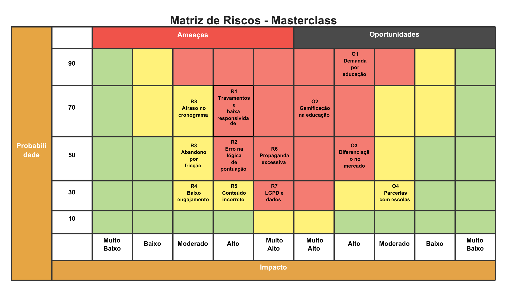
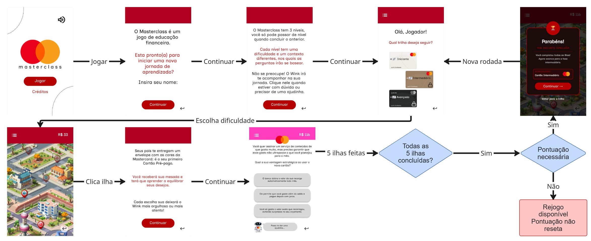
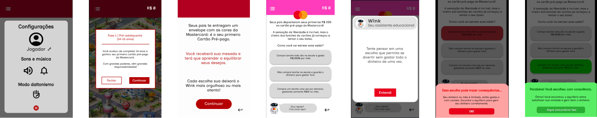
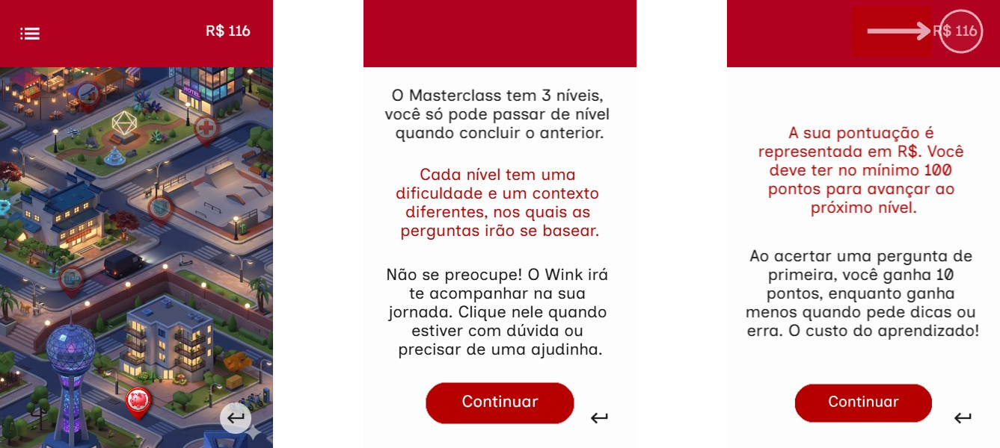

# GDD - Game Design Document - Módulo 1 - Inteli

## Nome do Grupo
&emsp;**Masterminds**

#### Nomes dos integrantes do grupo
- <a href="https://www.linkedin.com/in/dg-lopes/">Davi Lopes</a>
- <a href="https://www.linkedin.com/in/lucas-daddazio/">Lucas D'Addazio</a>
- <a href="https://www.linkedin.com/in/pablo-marchina/">Pablo Marchina</a> 
- <a href="https://www.linkedin.com/in/enzo-c-a221b23b3/">Enzo Faria</a> 
- <a href="https://www.linkedin.com/in/victorbarq/">Rafael Botelho</a>
- <a href="https://www.linkedin.com/in/pietra-feitoza/">Pietra Feitoza</a> 
- <a href="https://www.linkedin.com/in/raissaguimaraes/">Raissa Guimaraes</a>

## Sumário

&emsp;[1. Introdução](#c1)

&emsp;[2. Visão Geral do Jogo](#c2)

&emsp;[3. Game Design](#c3)

&emsp;[4. Desenvolvimento do jogo](#c4)

&emsp;[5. Casos de Teste](#c5)

&emsp;[6. Conclusões e trabalhos futuros](#c6)

&emsp;[7. Referências](#c7)

&emsp;[Anexos](#c8)
<br>

# <a name="c1"></a>1. Introdução

## 1.1. Plano Estratégico do Projeto

### 1.1.1. Contexto da indústria

&emsp;	A indústria global de meios de pagamento passa por uma fase de disrupção tecnológica, deixando de ser um sistema centrado em cartões físicos para se tornar um ecossistema de pagamentos digitais e fluxos de dados. Este setor é caracterizado por uma rede complexa de interdependência entre bancos emissores, credenciadores (adquirentes), estabelecimentos comerciais e consumidores finais.

&emsp;	O mercado é altamente concentrado e competitivo, dominado por gigantes globais como Visa e Mastercard, que operam como infraestruturas críticas (bandeiras). No cenário brasileiro, a Elo mantém relevância local, enquanto a ascensão de fintechs (como Nubank, Inter e Stone) e o avanço das Big Techs (Apple Pay, Google Pay e WhatsApp Pay) redefinem a experiência do usuário, desafiando o modelo tradicional de intermediação e exigindo constante inovação em segurança e velocidade.

&emsp;	A dinâmica do setor está sendo moldada por três grandes tendências que alteram o comportamento de consumo e a receita das empresas:

&emsp;	Sistemas de Pagamento Instantâneo: A consolidação do Pix no Brasil e do Open Finance permite transações diretas entre contas (A2A), reduzindo custos e pressionando as margens das taxas de intercâmbio tradicionais.

&emsp;	Digitalização e Segurança: A migração massiva para o e-commerce impulsionou tecnologias de tokenização e biometria para combate a fraudes, tornando a cibersegurança um produto tão importante quanto o processamento financeiro em si.

&emsp;	Inclusão e Multicanalidade: O setor evolui para soluções que integram crédito, débito e pré-pago em ambientes omnichannel (físico e digital integrados).

&emsp;	Inserida neste contexto, a Mastercard opera como uma organização de tecnologia voltada ao setor financeiro. Sua atuação principal é o modelo B2B, estabelecendo a rede que permite que outras instituições utilizem sua tecnologia para processar pagamentos globalmente. A empresa transcende a simples intermediação ao oferecer soluções de análise de dados e cibersegurança, posicionando-se não apenas como uma "bandeira", mas como uma provedora de infraestrutura para a economia digital global.

#### 1.1.2. Modelo de 5 Forças de Porter

&emsp;**Análise da Ameaça de Novos Entrantes: Baixa**

&emsp;	A ameaça de novos entrantes no setor de bandeiras é relativamente baixa, principalmente devido às elevadas barreiras de entrada estruturais, econômicas e regulatórias. A Mastercard opera em escala global (220 países) e possui uma rede consolidada de bancos emissores, adquirentes, estabelecimentos comerciais e parceiros tecnológicos. 

&emsp;	A entrada nesse mercado exige investimentos massivos em infraestrutura tecnológica, segurança cibernética, sistemas antifraude, compliance regulatório internacional (incluindo normas como PCI-DSS e exigências de bancos centrais) e construção de marca. O efeito de rede também é um dos principais obstáculos: quanto mais instituições utilizam uma bandeira, mais valiosa ela se torna.

&emsp;	Em 2025, o valor da marca da Mastercard ultrapassou $22.495 bilhões segundo a Brand Finance (Janeiro, 2026). Esse tipo de reconhecimento é construído por décadas, portanto em um mercado já consolidado com gigantes como o Mastercard, Visa e Elo, novos entrantes se tornam menos prováveis de suceder. 


&emsp;**Análise da Ameaça de Produtos ou Serviços Substitutos: Moderada a Alta**

&emsp;	A ameaça de substitutos é moderada a alta, impulsionada principalmente pela evolução tecnológica no setor financeiro. Sistemas de pagamentos instantâneos (RTP), como o Pix no Brasil e o UPI na Índia, permitem transferências diretas e, muitas vezes, com custo reduzido, contornando completamente as redes tradicionais de cartões. 

&emsp;	Além disso, o rápido avanço do Open Banking viabiliza pagamentos account-to-account (A2A), permitindo transferências entre contas sem intermediação de bandeiras. Stablecoins e integrações com criptomoedas também representam uma ameaça crescente, especialmente em pagamentos internacionais, ao oferecer liquidação rápida e custos potencialmente menores. 

&emsp;	Embora esses substitutos ampliem a concorrência e pressionem o volume transacionado em cartões, a Mastercard e outras bandeiras ainda mantêm forte relevância devido à sua ampla aceitação global, segurança e padronização mundial. 


&emsp;**Análise do Poder de Barganha dos Fornecedores: Baixo**

&emsp;	O poder de barganha dos fornecedores é relativamente baixo. A Mastercard possui diversas parcerias com fintechs de tecnologia, serviços de processamento de dados, cibersegurança e infraestrutura digital. Portanto, por ser uma corporação global de grande porte, possui ampla capacidade de negociação e pode diversificar seus parceiros estratégicos. 

&emsp;	Além disso, como disse o líder de RH global da Mastercard Michael Fraccaro em entrevista com VOCÊ S/A em 2025: “Hoje, 60% dos nossos projetos são realizados internamente”, reduzindo a dependência de terceiros. Pelo setor de pagamentos estar fortemente ligado ao conhecimento tecnológico e sistemas digitais, a possibilidade de múltiplos fornecedores qualificados e desenvolvimento interno é ampliada, diminuindo o poder individual de cada um.


&emsp;**Análise do Poder de Barganha dos Clientes: Moderado**

&emsp;	Os principais clientes da Mastercard Incorporated não são os consumidores finais, mas sim bancos emissores, instituições financeiras e grandes adquirentes. Essas organizações movimentam altos volumes financeiros e, portanto, possuem poder de negociação sobre taxas, contratos e condições comerciais. 

&emsp;	O poder de barganha está sujeito ao tipo de cliente Mastercard. Bancos emissores, por terem relativa facilidade de trocar de bandeiras, apresentam alto poder de negociação e exigem da bandeira incentivos comerciais e suporte tecnológico para manter a parceria. Por outro lado, as empresas credenciadoras e adquirentes (empresas de maquininha) não podem simplesmente deixar de oferecer determinadas bandeiras sem comprometer a aceitação dos estabelecimentos comerciais e perder clientes devido a falta de compatibilidade e cobertura de mercado, o que diminui o seu poder de barganha.

&emsp;	Esse poder tende a se ampliar diante de propostas legislativas como o Credit Card Competition Act, que prevê que bancos com mais de US$100 bilhões em ativos ofereçam aos comerciantes alternativas de redes além das tradicionais (The Credit Card Competition Act 2023, Durbin). Caso implementada, tal medida pode reduzir parcialmente o poder estrutural exercido pela Mastercard e pela Visa, ao aumentar as opções disponíveis no mercado. 

&emsp;	Ademais, observa-se o fortalecimento do poder de barganha dos comerciantes. As taxas pagas às redes de pagamento atingiram aproximadamente US$187,2 bilhões no último ano (Statista, Dezembro 2025), configurando-se como o segundo maior custo operacional do varejo. Considerando que as taxas de intercâmbio normalmente variam entre 2% e 3% do valor da transação (Banco Central do Brasil, Janeiro 2026), mesmo reduções aparentemente pequenas produzem impactos financeiros relevantes quando aplicadas a grandes volumes de vendas.

&emsp;	A substituição completa da bandeira para os clientes da Mastercard implicaria elevados custos operacionais, riscos tecnológicos e possíveis perdas de aceitação no mercado global. Dessa forma, embora o poder de barganha dos clientes esteja em ascensão, ele permanece moderado, dada a escala e a relevância estratégica da rede Mastercard.


&emsp;**Análise da Rivalidade entre os Concorrentes Existentes: Alta**

&emsp;	A rivalidade no setor é alta e intensa. No Brasil, a Mastercard domina aproximadamente 60% do mercado de bandeiras, com a Visa em segundo lugar e o Elo em terceiro (NORBR). A disputa ocorre principalmente em inovação tecnológica, segurança de dados, expansão internacional, parcerias estratégicas e taxas cobradas. 

&emsp;	Como o setor financeiro está em constante transformação digital, as empresas precisam investir continuamente em novas soluções, como pagamentos por aproximação, tokenização e inteligência artificial. A alta rivalidade exige diferenciação estratégica constante e forte investimento em tecnologia para manter participação de mercado.


### 1.1.2. Análise SWOT

<div align="center">
  
</div>

<div align="center">
  <strong>Figura 2 — Matriz SWOT do projeto Masterclass.</strong><br><em>Fonte: elaboração própria.</em>
</div>


&emsp;**Matriz SWOT**
&emsp;	A análise a seguir detalha o posicionamento estratégico da Mastercard no desenvolvimento do projeto Masterclass, avaliando as forças e fraquezas inerentes à organização, bem como as oportunidades e ameaças que permeiam o dinâmico mercado de meios de pagamento e educação financeira em 2026.

&emsp;**Forças (Strengths)**

- Marca Global com Credibilidade Consolidada: A Mastercard detém um reconhecimento internacional inigualável, consolidando-se como uma das maiores bandeiras de cartões do mundo. No Brasil, sua dominância é expressiva, controlando aproximadamente 60% do mercado. Avaliada em $22,495 bilhões pela Brand Finance (2025), a marca carrega décadas de construção de confiança e segurança, ativos que serão transferidos diretamente para o aplicativo Masterclass, reduzindo a barreira de entrada e aumentando a confiança do usuário no conteúdo educativo oferecido.

- Rede Ampla de Parceiros e Interoperabilidade B2B: O modelo de negócio da Mastercard é pautado em uma vasta rede de parcerias com as principais instituições financeiras do país (Itaú, Bradesco, Santander, Banco do Brasil, Nubank, Inter, entre outros). Essa capilaridade facilita a integração tecnológica e a promoção do jogo dentro de ecossistemas bancários já consolidados, permitindo que a solução alcance milhões de usuários por meio de canais de distribuição pré-existentes.

- Coerência Visual e Identidade Institucional: Amparada por estudos de branding de instituições como a Harvard Business Review, a Mastercard utiliza a consistência visual como ferramenta de retenção. A padronização da identidade visual no aplicativo Masterclass não apenas reforça o reconhecimento da marca, mas também valida o jogo como uma extensão oficial do ecossistema de pagamentos, elevando a percepção de valor e seriedade do projeto.

- Expertise Tecnológica e Infraestrutura de Dados: A capacidade técnica da companhia permite uma integração profunda entre a mecânica do jogo e a realidade financeira. A infraestrutura da Mastercard viabiliza simulações complexas e realistas — como pedidos de empréstimos, cálculos de faturas e antecipação de parcelas — utilizando as mesmas lógicas transacionais que o usuário encontrará no mercado real, criando um ambiente de aprendizado técnico de alta fidelidade.

&emsp;**Oportunidades (Opportunities)**

- Déficit de Alfabetização Financeira no Brasil: Dados da FEBRABAN e do IBGE revelam um cenário crítico: 40% dos brasileiros possuem baixo letramento financeiro e 72% das famílias enfrentam dificuldades severas para fechar o orçamento mensal. Essa lacuna estrutural representa uma oportunidade de "oceano azul" para uma solução digital que transforme a educação financeira em um ativo acessível, posicionando a Mastercard como uma líder em responsabilidade social e educação econômica.

- Ascensão do Game-Based Learning (Educação Gamificada): Com projeções da Market.us (2025/2026) indicando que 72% dos jovens se engajam mais com conteúdos gamificados, o Masterclass se posiciona na vanguarda pedagógica. A capacidade de reter a atenção em até 93% em comparação a métodos tradicionais permite que a Mastercard crie um novo padrão de fidelização e aprendizado para as gerações Z e Alpha.

- Mitigação da Inadimplência Sistêmica: O cenário de inadimplência no crédito rotativo superior a 60% (BACEN, 2026) exige uma intervenção imediata. Há uma demanda latente por ferramentas que ensinem o funcionamento de juros compostos e hábitos de consumo saudável. O Masterclass atua preventivamente, formando consumidores mais conscientes e, consequentemente, reduzindo o risco de crédito para todo o ecossistema bancário parceiro da bandeira.

- Diferenciação Competitiva via Simulação Imersiva: Enquanto soluções concorrentes (como o Financial Football da Visa) ou institucionais (Banco Central) focam em modelos pedagógicos tradicionais, o Masterclass possui o potencial de se diferenciar através de mecânicas de progressão narrativa e simulação imersiva, oferecendo uma experiência de "RPG financeiro" inédita no mercado nacional.

- Aumento da Inserção Produtiva da Juventude: A queda na proporção da geração “nem-nem” (19,7% em 2025) indica que mais jovens estão ingressando no mercado de trabalho e no sistema educacional. Esse contingente representa uma nova base de consumidores que necessita urgentemente de ferramentas para gerir seus primeiros salários e linhas de crédito.

&emsp;**Fraquezas (Weaknesses)**

- Dependência Estrutural do Modelo B2B: Devido à sua natureza de bandeira e não de banco emissor, a Mastercard possui autonomia limitada para oferecer recompensas financeiras diretas (como cashbacks ou isenções) sem a adesão e aprovação contratual das instituições parceiras, o que pode engessar a agilidade estratégica de certas campanhas de incentivo dentro do jogo.

- Distanciamento da Jornada B2C Direta: A ausência de uma interface direta de conta bancária com o consumidor final pode dificultar a promoção orgânica do aplicativo, tornando o projeto Masterclass dependente de esforços de marketing conjuntos ou da integração dentro dos aplicativos dos bancos emissores.

- Desafios de Integração com Sistemas Legados de Fidelidade: A complexidade técnica necessária para associar o progresso in-game a sistemas globais consolidados, como o Mastercard Surpreenda, pode representar um gargalo operacional, limitando a oferta de recompensas tangíveis imediatas nas fases iniciais do projeto.

- Alta Dependência da Percepção de Valor da Bandeira: Como o aplicativo é posicionado como um produto oficial, qualquer flutuação na reputação corporativa da Mastercard ou mudanças drásticas na regulação do setor de cartões impactam diretamente a credibilidade e a viabilidade do Masterclass como ferramenta educativa imparcial.

&emsp;**Ameaças (Threats)**

- Concorrência Agressiva de Fintechs Nativas (B2C): Players como Nubank e C6 Bank possuem acesso direto ao usuário final e já implementam programas educativos gamificados (Nunos, C6 Experience) dentro de suas próprias plataformas, o que pode canibalizar o tempo de atenção do público-alvo que já está fidelizado a essas interfaces.

- Desintermediação Tecnológica via Sistemas Account-to-Account (A2A): A hegemonia do Pix e a evolução do Open Finance (BCB, 2026) reduzem a centralidade do uso do cartão nas transações cotidianas. Essa mudança de comportamento pode diminuir o interesse dos usuários em se aprofundar nas mecânicas específicas de crédito e bandeiras tradicionais ensinadas no jogo.

- Risco de Rejeição por Percepção de Marketing Velado: O público jovem é historicamente cético em relação a iniciativas de marcas que possam ser interpretadas como incentivo ao endividamento ou consumo desenfreado. Se o Masterclass for percebido como uma ferramenta de vendas e não como uma plataforma de educação neutra, pode sofrer boicotes ou baixa adesão.

- Barreira de Engajamento Cognitivo e Competição por Atenção: O Masterclass exige do jogador esforço mental para resolver dilemas financeiros reais. No mercado de apps, ele compete diretamente por atenção com jogos puramente casuais (hiper-casuais) e redes sociais, o que exige um balanceamento de gamificação extremamente refinado para evitar o abandono por fadiga cognitiva.

### 1.1.3. Missão / Visão / Valores

&emsp;**Missão:** 

&emsp;	Democratizar o acesso à educação financeira por meio de uma plataforma gamificada que ensina, na prática, como usar cartões de crédito, débito e pré-pago e constrói costumes financeiros sustentáveis.

&emsp;**Visão:** 

&emsp;	Consolidar-se como referência nacional em educação financeira gamificada, ampliando o acesso ao conhecimento prático e reduzindo o déficit de alfabetização financeira no Brasil.

&emsp;**Valores:**
 
&emsp;	 Para que a cultura do projeto reflita a experiência do usuário e a robustez da Mastercard, nossos valores são definidos por:

- Pragmatismo Educacional (Aprender Fazendo): Acreditamos que a educação financeira se torna mais efetiva quando aplicada. Por isso, priorizamos a simulação de cenários reais de mercado sobre a teoria passiva, transformando o conhecimento em ferramenta de mudança social.

- Inclusão pelo Design Simplicado: A complexidade do sistema bancário é traduzida em uma interface intuitiva e acessível. Nosso valor de inclusão garante que a jornada de aprendizado seja democrática, independentemente do nível prévio de instrução do usuário.

- Confiança Baseada em Integridade: Como uma solução vinculada ao ecossistema Mastercard, a segurança dos dados e a fidelidade das informações financeiras são inegociáveis, estabelecendo um ambiente seguro para o erro e o aprendizado.

- Conhecimento Aplicado e Relevante: Focamos em competências que impactam o dia a dia do usuário  do uso do crédito rotativo à gestão de faturas garantindo que cada sessão de jogo resulte em uma decisão financeira mais inteligente fora dele.

- Gamificação Ética e Consciente: O ensino acessível não busca o vício no jogo, mas o engajamento no aprendizado. Utilizamos mecânicas de recompensa para celebrar o progresso intelectual e a saúde financeira, nunca o consumo impulsivo.

### 1.1.4. Proposta de Valor

&emsp;	O Canvas de Proposta de Valor demonstra o alinhamento estratégico entre o problema estrutural de baixa educação financeira no Brasil e a solução gamificada Masterclass, que foi desenvolvida em parceria com a Mastercard. Esta análise evidencia o fit entre o problema e a solução, justificando o investimento em educação financeira preventiva como um verdadeiro diferencial competitivo para a bandeira. O referencial teórico baseia-se nos estudos de Lusardi e Mitchell (2014), que mostram que baixos níveis de letramento financeiro estão associados ao endividamento crônico, algo que é corroborado pelos dados nacionais do Mapa da Inadimplência da Serasa (2026) e da Pesquisa TIC Domicílios do CETIC.br (2026).

<div align="center">
  
</div>

<div align="center">
  <strong>Figura 3 — Canvas de Proposta de Valor.</strong><br><em>Fonte: elaboração própria.</em>
</div>


&emsp;**A. Perfil do Cliente — Usuário em Consolidação Financeira**

&emsp;	O perfil do cliente engloba a população economicamente ativa, focando principalmente nas faixas etárias de 26 a 60 anos, que hoje representam 69,1% dos inadimplentes registrados no país segundo a Serasa (2026). De acordo com o IBGE (2024), 46% dessa faixa etária tem renda mensal de até dois salários mínimos, o que configura uma alta vulnerabilidade financeira e grande exposição ao crédito rotativo.

&emsp;	Tarefas do Cliente (Customer Jobs): As tarefas do cliente são as ações e os objetivos que ele precisa realizar em seu cotidiano financeiro. Conforme Lusardi e Mitchell (2014), conseguir executar essas tarefas de forma autônoma é o principal indicador de um letramento financeiro funcional. Na prática, o usuário precisa gerenciar seu primeiro cartão (seja de crédito, débito ou pré-pago) de forma independente, compreendendo os limites, as datas de vencimento e os encargos (BACEN, 2026). Além disso, deve compreender a composição da sua fatura, o impacto dos juros compostos e as consequências do parcelamento no orçamento doméstico, especialmente diante da taxa do rotativo, que chegou a uma média de 447,3% a.a. no Brasil em 2025 (BACEN, 2026). Outras tarefas fundamentais incluem realizar escolhas de consumo consciente ao longo da vida (CETIC.br, 2026), negociar dívidas ativas calculando o impacto real de descontos em plataformas como o Serasa Limpa Nome (SERASA, 2026), e planejar metas de médio e longo prazo, como a criação de uma reserva de emergência e objetivos de crédito imobiliário (IBGE, 2024; Lusardi & Mitchell, 2014).

&emsp;	Dores (Pains): As dores do cliente refletem um cenário de vulnerabilidade sistêmica no comportamento financeiro do brasileiro, que o Masterclass busca mitigar. Entre as principais dores está a crise de inadimplência recorde: o Brasil atingiu 81,7 milhões de inadimplentes em fevereiro de 2026 (SERASA, 2026). Há também um claro analfabetismo financeiro estrutural, onde apenas 35% compreendem o crédito rotativo, o parcelamento e os encargos reais das compras, gerando insegurança e decisões impulsivas (ANBIMA, 2023). O usuário sofre com a ansiedade de endividamento e o medo de comprometer o CPF, o que inibe o uso de instrumentos formais (Lusardi & Mitchell, 2014; SERASA, 2026). Somam-se a isso a rejeição aos métodos de educação financeira tradicionais, que são vistos como burocráticos e têm baixa retenção (PGB, 2026), e a falta de hábito financeiro, já que apenas 28% realizam o controle mensal de gastos sistematicamente (IBGE, 2024).

&emsp;	Ganhos (Gains): Os ganhos representam os resultados que o usuário espera alcançar, alinhados à estratégia de inclusão financeira da Mastercard. O principal ganho é a autonomia financeira, permitindo usar o crédito como instrumento de planejamento, tendo a Mastercard como parceira (Lusardi & Mitchell, 2014). O cliente também espera a recuperação e manutenção do seu score de crédito para viabilizar financiamentos futuros (SERASA, 2026; BACEN, 2026). Através das mecânicas de gamificação, espera-se uma alta retenção de conceitos financeiros, com um aumento de até 93% no tempo de atenção (Market.us, 2026). Por fim, busca-se a consolidação de hábitos financeiros preventivos, como o controle de gastos e a poupança, reduzindo as chances de inadimplência (IBGE, 2024; Lusardi & Mitchell, 2014).

&emsp;**B. Mapa de Valor — A Solução Masterclass**

&emsp;	A solução utiliza a infraestrutura mobile como principal canal, validada pelo fato de que o smartphone é o meio de acesso à internet para 93% dos brasileiros (CETIC.br, 2026). A plataforma foca em educação ativa através da gamificação, respondendo à preferência de 74% do público por aprendizados interativos em vez de métodos expositivos tradicionais (PGB, 2026).

&emsp;	Produtos e Serviços: O núcleo da solução é o Jogo Masterclass, uma trivia narrativa WebMobile baseada na 'Jornada da Vida', dividida em 5 ilhas que representam as etapas financeiras do usuário (PGB, 2026). A plataforma conta com um Simulador de Cenários Financeiros, onde as escolhas afetam um saldo simbólico, permitindo viver o impacto de decisões sem risco real (Lusardi & Mitchell, 2014). Dentro desse sistema, há mecânicas específicas de compras parceladas, nas quais o jogador escolhe entre diferentes formas de pagamento e acompanha, em tempo real, o impacto das parcelas futuras no orçamento do personagem, tornando visível o efeito do comprometimento de renda ao longo dos meses. Para auxiliar na jornada, existe o NPC Wink, um guia pedagógico que traduz termos técnicos usando dados reais do mercado de 2026 (BACEN, 2026; SERASA, 2026). O engajamento é reforçado pelo Sistema de Conquistas Mastercard, que oferece troféus baseados nos níveis dos cartões (Standard, Gold, Platinum e Black), associando o progresso educacional ao status de crédito (Market.us, 2026).

&emsp;	Aliviadores de Dores (Pain Relievers): Os aliviadores atuam diretamente nas dores do cliente. O Ambiente Safe-to-Fail permite que o usuário tome decisões financeiras erradas no jogo sem comprometer seu CPF real, eliminando a ansiedade do endividamento (Lusardi & Mitchell, 2014). O NPC Wink fornece feedback contextualizado em linguagem simples, traduzindo termos complexos e combatendo o analfabetismo estrutural (ANBIMA, 2023; BACEN, 2026). O Simulador de Escalada de Dívidas mostra de forma matemática como juros compostos e parcelamentos sucessivos afetam pequenas dívidas, utilizando situações práticas de consumo cotidiano e taxas reais de 2026 (BACEN, 2026; SERASA, 2026). Dessa forma, dores específicas como a dificuldade de prever o impacto do parcelamento deixam de ser abstratas e passam a ser experimentadas de forma visual e imediata pelo usuário. Além disso, a microaprendizagem gamificada em sessões curtas estilo 'Candy Crush' combate a rejeição aos métodos de ensino tradicionais (PGB, 2026; Market.us, 2026).

&emsp;	Criadores de Ganho (Gain Creators): Os criadores de ganho geram valor mensurável e alinham o usuário ao posicionamento da Mastercard. O engajamento por relevância contextual utiliza dados reais de inadimplência de 2026 para criar cenários práticos e úteis (SERASA, 2026; CETIC.br, 2026). A progressão visual e a ativação dopaminérgica, por meio de recompensas incrementais, sustentam o engajamento de longo prazo (Market.us, 2026). O reconhecimento simbólico Mastercard associa o esforço educativo aos benefícios da bandeira, criando um vínculo positivo de identidade (Brand Finance, 2026). Esse processo resulta na formação de hábitos financeiros mensuráveis, permitindo rastrear o desenvolvimento do usuário e gerar dados para futuras personalizações (Lusardi & Mitchell, 2014; IBGE, 2024).

&emsp;**Evidência de Pesquisa e Alinhamento Estratégico Mastercard**

&emsp;	Com 81,7 milhões de inadimplentes no Brasil em fevereiro de 2026, a educação financeira torna-se o serviço de valor agregado mais importante que a Mastercard pode oferecer. O Masterclass converte os dados da crise do 'Mapa da Inadimplência' em cenários de aprendizado prático dentro do jogo, conectando dores reais do usuário a funcionalidades específicas de simulação e feedback. Intervenções práticas como essa possuem um impacto muito maior na mudança de comportamento a longo prazo, conforme apontam Lusardi e Mitchell (2014). Esse modelo é viável e promissor, apoiado pela preferência nacional por formatos interativos (PGB, 2026) e pela projeção de crescimento anual de 15,4% no mercado global de game-based learning até 2030 (Market.us, 2026).


### 1.1.5. Descrição da Solução Desenvolvida

&emsp;	O desenvolvimento do Masterclass parte do reconhecimento de um déficit estrutural crônico: a ausência de educação financeira acessível e prática para o público brasileiro. O problema central que o nosso projeto ataca é o ciclo de endividamento gerado pela tomada de decisões impulsivas e pelo uso inadequado de linhas de crédito de alto custo. Esse diagnóstico é drasticamente sustentado pelos dados mais recentes: conforme o Mapa da Inadimplência da Serasa (Fev/2026), o Brasil atingiu o recorde histórico de 81,7 milhões de inadimplentes. A raiz deste sufocamento reflete-se nos índices da FEBRABAN, que apontam que 40% da população possui baixo letramento financeiro, um comportamento que leva a erros críticos de gestão. Para a Mastercard, que detém cerca de 60% de participação de mercado no país (NORBR), essa assimetria de informação representa não apenas um risco reputacional, mas uma oportunidade estratégica de intervir de forma pedagógica através do Game-Based Learning.

&emsp;	Para mitigar esse cenário, o Masterclass é estruturado como uma trivia narrativa mobile que utiliza a gamificação para transformar conceitos abstratos em uma experiência de aprendizado interativo e ativo. A proposta de valor reside em simular a vida real por meio de missões financeiras progressivas divididas em cinco "Ilhas da Vida". Diferente de um quiz estático, a experiência prática do usuário ocorre por meio de tomada de decisões em cenários críticos: o jogador vivencia dilemas como a escolha entre pagar o valor mínimo ou total de uma fatura sob juros de 440% a.a., ou a necessidade de gerenciar o limite de um cartão pré-pago para emergências na Ilha da Juventude. Essas funcionalidades representam a evolução temporal do jogador, dos 14 anos até a aposentadoria, introduzindo gradativamente o portfólio Mastercard (Pré-pago, Débito e Crédito).

&emsp;	A experiência do usuário (UX) foi projetada estritamente para dispositivos móveis, visto que 99% dos brasileiros acessam a internet via smartphones (CETIC, 2026). A jornada segue um fluxo fluido de entrada, interação, aprendizado e resultado. Durante a interação, o usuário não apenas responde perguntas, mas enfrenta desafios de gestão de orçamento onde cada escolha impacta seu saldo simbólico em R$. O aprendizado ocorre via feedback imediato e contextual: a cada decisão, o mascote NPC "Wink" intervém com um "tradutor de economês", explicando o raciocínio matemático e prático por trás daquela escolha. Caso o jogador tome uma decisão prejudicial, o ambiente safe-to-fail permite que ele visualize a "bola de neve" dos juros antes de reiniciar a missão com uma nova estratégia, consolidando o repertório de forma progressiva.

&emsp;	Os impactos gerados pela solução distribuem-se de forma tridimensional. Para o usuário final, o benefício é a construção de autonomia e a redução drástica de erros cotidianos, refletindo na melhoria do seu score de crédito a longo prazo. Para a Mastercard, a plataforma atua como branding institucional e captadora de dados comportamentais sobre as reais dificuldades do mercado, gerando ativos estratégicos para a diferenciação competitiva. Por fim, para a sociedade, o projeto gera impacto real em inclusão financeira, dialogando com os Objetivos de Desenvolvimento Sustentável (ODS) da Agenda 2030 para a promoção do crescimento econômico sustentável e consciente.

### 1.1.6. Matriz de Riscos

<div align="center">
  
</div>

<div align="center">
  <strong>Figura 4 — Matriz de riscos do projeto Masterclass.</strong><br><em>Fonte: elaboração própria.</em>
</div>


&emsp;	O risco R1, travamentos e baixa responsividade, apresenta probabilidade alta e impacto alto, pois pode ocorrer durante a execução do projeto e comprometer diretamente a navegação entre menu, carregamento, inserção do nome do jogador e fases. Seus principais KPIs são tempo médio de carregamento abaixo de 3 segundos, taxa de crash inferior a 1% e taxa de sucesso superior a 95% no fluxo inicial. A resposta deve combinar prevenção e mitigação, com testes em diferentes tamanhos de tela e aparelhos, correção de gargalos de renderização e validação de responsividade em cada sprint, tendo como meta SMART eliminar travamentos críticos no fluxo principal até a homologação final.

&emsp;	O risco R2, erro na lógica de pontuação, possui probabilidade moderada e impacto alto, pois o jogo depende de uma distinção precisa entre acerto direto, acerto com ajuda e erro, com reflexos imediatos na cor do card, no saldo simbólico e no avanço de fase. Inconsistências na validação podem gerar pontuação incorreta, avanço indevido ou bloqueios sem justificativa, comprometendo a confiabilidade da experiência. Esse risco deve ser monitorado por meio de 100% de validação correta das questões em teste interno, zero divergência entre resposta e pontuação e menos de um bug crítico por sprint. A resposta deve priorizar prevenção, com testes unitários e manuais para cada questão, revisão dupla do banco de perguntas e checagem final do fluxo antes de cada entrega, garantindo coerência entre mecânica e proposta pedagógica.

&emsp;	No campo da experiência do usuário, o risco R3, abandono por fricção cognitiva, apresenta probabilidade moderada e impacto moderado, já que o modelo do jogo exige respostas corretas e, em caso de erro, leitura da explicação e nova tentativa. Embora essa estrutura fortaleça a aprendizagem, ela pode gerar desgaste se a dificuldade não estiver adequadamente calibrada. Os indicadores associados devem incluir taxa de abandono por fase inferior a 20%, taxa de conclusão da fase inicial acima de 70% e tempo médio por pergunta entre 30 e 90 segundos. A resposta deve combinar mitigação e prevenção por meio do ajuste da dificuldade, da melhor distribuição das dicas do Wink, da redução de textos excessivos em telas críticas e do refinamento do ritmo narrativo, com acompanhamento em playtests sucessivos e aplicação de testes de usabilidade por fase até a estabilização dos indicadores de engajamento.

&emsp;	Ainda em UX, o risco R4, baixo engajamento, apresenta probabilidade baixa e impacto moderado, pois há a possibilidade de o jogo ser percebido como excessivamente conceitual e, portanto, menos divertido do que uma experiência totalmente imersiva. Como o Masterclass trabalha com perguntas contextualizadas e cenários financeiros reais, parte do público pode interpretá-lo como uma atividade escolar, e não como um jogo. Esse risco deve ser acompanhado por métricas como nota média de diversão igual ou superior a 8 em 10, taxa de retorno à próxima fase acima de 60% e permanência média por sessão superior a 15 minutos. O plano de resposta deve ser mais operacional, com testes de usabilidade quinzenais com usuários do público-alvo, coleta estruturada de feedback sobre ritmo, interface e diversão, análise de pontos de abandono dentro das fases e ajustes iterativos nas mecânicas de recompensa, animações de progresso, feedback sonoro e ritmo de desbloqueio de conquistas. Dessa forma, o jogo mantém o apelo lúdico sem comprometer seu objetivo educacional.

&emsp;	Entre os riscos de conteúdo, o risco R5, conteúdo incorreto ou desatualizado, possui probabilidade baixa e impacto alto, pois qualquer falha em temas como meios de pagamento, crédito, débito, pré-pago, endividamento e planejamento financeiro pode comprometer a credibilidade do produto e enfraquecer seu valor educacional. Esse risco deve ter como KPI 100% das questões revisadas por ao menos duas pessoas, zero erros factuais na rodada de validação e atualização do banco de conteúdo a cada sprint. A resposta deve se basear em mitigação e prevenção, com revisão cruzada das perguntas, padronização da linguagem e conferência conceitual antes da implementação, garantindo que o conteúdo final seja claro, correto e pedagogicamente consistente.

&emsp;	No eixo de negócios, o risco R6, percepção de propaganda excessiva, apresenta probabilidade moderada e impacto muito alto, uma vez que o projeto está vinculado à Mastercard e pode ser interpretado como propaganda em vez de ferramenta educativa. Trata-se de um risco sensível, porque a proposta depende de credibilidade junto ao público-alvo e a parceiros institucionais, e a leitura de marketing velado pode reduzir adesão e confiança. As métricas devem incluir percepção educacional superior a 80% em pesquisa, menções a “propaganda” abaixo de 20% e ao menos duas validações externas positivas. A resposta deve enfatizar a utilidade pública do jogo, equilibrar identidade de marca e conteúdo formativo e deixar explícito que a experiência foi criada para educação financeira, não apenas para promoção institucional.

&emsp;	Em termos éticos e regulatórios, o risco R7, LGPD e dados, apresenta probabilidade baixa e impacto muito alto, já que falhas na proteção de dados e no tratamento de informações pessoais podem gerar prejuízo reputacional e jurídico, especialmente se o fluxo evoluir para armazenamento de nome, perfil do jogador ou outras interações. Mesmo com coleta atualmente limitada, o projeto deve prever conformidade com boas práticas de privacidade e com a LGPD. O KPI deve incluir 100% dos pontos de coleta acompanhados de consentimento explícito, zero incidentes de privacidade e checklist de conformidade preenchido antes de qualquer publicação. A resposta deve se concentrar na prevenção, reduzindo a coleta ao mínimo necessário, explicando claramente o uso dos dados e evitando o armazenamento desnecessário de informações pessoais.

&emsp;	Por fim, o risco R8, atraso no cronograma, apresenta probabilidade alta e impacto moderado, pois a própria documentação do projeto reconhece a limitação de experiência técnica da equipe em programação, o que pode atrasar a implementação de telas, lógica de progresso, responsividade e refinamento final. Esse risco deve ser monitorado por meio de KPI de ao menos 90% das entregas concluídas no prazo de cada sprint, desvio inferior a 10% do cronograma e menos de duas pendências críticas por ciclo. A resposta deve combinar prevenção e contingência, com divisão das tarefas em entregas menores, definição clara de responsáveis, priorização semanal e revisão contínua do plano de execução, garantindo avanço mesmo diante de limitações técnicas.

&emsp;	A análise de oportunidades evidencia que o Masterclass dialoga com uma demanda real de mercado por educação financeira aplicada e acessível. Há lacunas relevantes de alfabetização financeira no Brasil, ao mesmo tempo em que o endividamento e as dificuldades de pagamento permanecem presentes no cotidiano de muitas famílias. Nesse contexto, a oportunidade O1, demanda por educação, apresenta probabilidade muito alta e impacto alto, pois a necessidade por conteúdos financeiros práticos é recorrente e socialmente relevante. A oportunidade O2, gamificação na educação, apresenta probabilidade alta e impacto muito alto, já que a gamificação tende a ampliar engajamento, retenção e aprendizagem. A oportunidade O3, diferenciação no mercado, possui probabilidade moderada e impacto alto, uma vez que a proposta visual e pedagógica pode destacar o jogo frente a soluções mais lineares. Já a oportunidade O4, parcerias com escolas, apresenta probabilidade baixa e impacto moderado, mas com potencial de crescimento futuro, especialmente se a solução for validada em contextos educacionais. Em conjunto, essas oportunidades permitem posicionar o jogo não apenas como produto de entretenimento, mas como ferramenta de aprendizagem com potencial de uso educacional, institucional e promocional.

### 1.1.7. Objetivos, Metas e Indicadores

&emsp;	O desenvolvimento do Masterclass nasce de uma urgência latente e muito real: a falta de planejamento financeiro é, hoje, o principal motor de endividamento das novas gerações (USP, 2026). Diante desse cenário complexo, nosso objetivo estratégico primário é democratizar a educação financeira para o público brasileiro, transformando conceitos até então abstratos e distantes em vivências práticas. Em total alinhamento com a visão e o TAPI da Mastercard, utilizamos a gamificação não apenas como um mero recurso de engajamento, mas como a ferramenta pedagógica central para promover o uso consciente do crédito e dos meios de pagamento. Mais do que entregar um MVP funcional ao final das 10 semanas de desenvolvimento, o projeto busca validar uma hipótese crítica: atestar que uma trivia narrativa consegue, de fato, alterar a percepção do jogador e construir um repertório que o ajude a tomar decisões mais seguras no mundo real.

&emsp;	Para que esse impacto não fique apenas no campo das intenções, estruturamos nossas metas seguindo o rigor do framework SMART (garantindo que sejam específicas, mensuráveis, atingíveis, relevantes e com prazo definido), sempre ancoradas em métricas consolidadas de mercado para produtos digitais.

&emsp;	O primeiro passo da nossa validação de mercado, que ocorrerá nas duas semanas finais do módulo (Sprints 4 e 5), é confirmar a tração inicial da solução. Para isso, estabelecemos a meta específica de alcançar ao menos 30 usuários ativos, recrutados dentro do ecossistema do Inteli. Esse número representa um marco atingível e estatisticamente relevante para atestar o interesse inicial pela plataforma sem extrapolarmos a capacidade da equipe. O sucesso dessa etapa de adoção será acompanhado de perto pela taxa de engajamento (percentual da base convidada que efetivamente iniciou uma partida), pelo tempo médio de uso por sessão e pela taxa de retorno à segunda sessão, permitindo medir não apenas o acesso inicial, mas também o interesse real na continuidade da experiência.

&emsp;	No entanto, atrair o jogador é apenas metade do desafio; mantê-lo na jornada é o que define a qualidade da experiência. A dificuldade inicial deve ser mínima para evitar frustração e abandono prematuro (UnB, 2024). Baseados nisso, nossa segunda meta foca diretamente na usabilidade e progressão: projetamos que pelo menos 70% da nossa base de testes consiga finalizar a trilha "Iniciante" em uma única sessão. Trata-se de um limiar realista e de suma importância para atestar a fluidez da interface. Nossos termômetros aqui serão a taxa de conclusão dos módulos, o tempo médio por fase, os pontos de abandono e a retenção de usuários, métricas que deixarão evidente se a curva de dificuldade está bem calibrada ou se existem gargalos cognitivos afastando os jogadores precocemente.

&emsp;	Por fim, o verdadeiro teste de fogo do Masterclass reside na sua eficácia pedagógica. Não basta que o usuário avance de forma mecânica; ele precisa sair do jogo com um conhecimento que não possuía ao entrar. Para garantir que esse impacto seja mensurável, será aplicado um teste diagnóstico breve antes do início da jornada e um teste equivalente ao final da experiência, focado em conceitos de crédito, parcelamento, juros e organização financeira. A meta SMART é que pelo menos 70% dos usuários apresentem melhora mínima de 30% entre o pré-teste e o pós-teste, evidenciando evolução concreta do entendimento financeiro. Além disso, para validar a efetividade do feedback corretivo oferecido pelo NPC Wink, fixamos a meta de que os jogadores alcancem 70% ou mais de acerto nas questões durante suas segundas tentativas. Esse conjunto de indicadores — evolução de conhecimento, taxa de reaprendizado e desempenho por tentativa — é o que permitirá comprovar à Mastercard que o nosso MVP não é apenas um jogo bem programado, mas uma plataforma com potencial real para escalar e gerar impacto social positivo.


## 1.2. Requisitos do Projeto
&emsp;	Requisitos necessários para o desenvolvimento do jogo.

    - Desenvolver o jogo para WebMobile
    
    - Criar um menu de início
        - Inserir nome do jogo
        - Inserir logo
        - Inserir botão de “Jogar”
        - Inserir botão de som (desligar/ligar)
        - Inserir botão "Créditos"
        - Inserir animações no menu

    - Criar tela de carregamento
        - Conectá-la para aparecer quando clicar o botão “Jogar” do menu de início
        - Programar para passar para a tela de Nome após um tempo
        - Animação da logo enquanto carrega
        - Texto de carregamento

    - Criar a tela de nome
        - Texto na parte de cima da tela
        - Caixa para o jogador adicionar o nome
        - Botão de continuar
        - Botão de voltar
        - Mensagem de introdução
    
    - Criar a tela explicação do jogo
        - Texto explicando e contextualizando o jogo
        - Botão de jogar
        - Mostrar a dinamica de pontuação do jogo
        
    - Criar um menu de seleção de dificuldade para o jogo
        - Texto na parte de cima da tela
        - Iniciante (botão)
        - Intermediário (botão)
        - Avançado (botão)
        - Os botões são os cartões da Mastercard
        - Botão de voltar
        - Botão de configurações na parte superior esquerda (modo daltonismo, mudar nome, sons e música) 

    - Criar uma tela de fases para cada dificuldade, no formato de ilhas, como “Candy Crush”, com designs diferentes e condizentes com uma temática de “caminho da vida”.
        - Criar os elementos visuais que serão usados
        - Criar um botão para cada uma das fases
        - Criar as questões e a tela com um tema de vida, começando com a pessoa nova até chegar na aposentadoria
        - Botão de voltar
        - Botão de configurações 
        - Botão de pontuação
        - Pop-up com contextualização antes de cada fase com opcão de fechar e continuar 
        - Separar as fases ou perguntas por cores
            - Pré-pago (rosa)
            - Débito (verde)
            - Crédito (azul)
            - Mesclado(roxo)
            - perguntas sobre conceitos financeiros
        - Fases:
            - 1 fase: Pré-adolescente
                - 14 a 16 anos
                - Pré-pago
                - 4 questões
            - 2 fase: Final adolescência
                - 16 a 19 anos
                - Débito
                - 4 questões
            - 3 fase: Jovem adulto
                - 20 a 40 anos
                - Crédito e perguntas mescladas
                - 4 questões
            - 4 fase: Final da fase adulta
                - 40 a 65 anos
                - Mesclado e endividamento
                - 4 questões
            - 5 fase: Final: Pré-aposentadoria e aposentadoria
                - 65+ anos
                - Mesclado e foco forte em endividamento e projeto de vida
                - 4 questões
    
    - Criar as fases em um formato de questionário, com número de questões à definir baseado na pesquisa para as questões, podendo variar.
        - Modelar como será o design do questionário
        - Criar os botões necessários
        - Criar perguntas para cada fase, que sejam condizentes com a dificuldade escolhida, utilizando exemplos reais do dia-a-dia.
        - Criar dicas para cada pergunta, que podem ajudar a pessoa a chegar na resposta.
        - Implementar o design de um robô para que, quando clicado, ele mostre a dica daquela questão.
        - Programar de modo que, após terminar cada pergunta, o questionário fique verde se a pessoa acertou e vermelho caso erre.
        - Programar de modo que, quando a pessoa erre, ela receba a explicação e tenha que responder novamente a pergunta até acertar.
        - Criar um botão para continuar para a próxima pergunta
    
    - Criar um sistema de pontuação
        - Desenhá-lo de forma que, a pontuação seja contada em R$ (simbólico), acertos verdes valem muitos pontos, e ao errar muitas vezes depois de acertar a quantidade de pontos será menor
    
    - Implementar sistema de avanço entre as fases
        - Decidir se será baseado na pontuação do Jogador ou em completar as fases anteriores
    
    - Criar uma parte do Mastercard Surpreenda
        - Fazer com que, quando a pessoa terminar o jogo ela receba o código do Surpreenda

## 1.3. Público-alvo do Projeto

&emsp;	O jogo é direcionado a pessoas de diferentes faixas etárias que buscam desenvolver ou aprofundar seus conhecimentos em educação financeira. Abrange jovens em fase escolar, adultos em início ou consolidação de carreira e até indivíduos que desejam reorganizar sua vida financeira, com o foco sendo aqueles que começaram agora ou estão consolidando sua vida financeira. O público pode estar localizado em qualquer região do Brasil ou em outros países de língua portuguesa, uma vez que a plataforma está disponível exclusivamente em português.

&emsp;	Em termos de perfil comportamental, o jogo atende usuários que valorizam aprendizado aplicado ao cotidiano. São pessoas interessadas em melhorar sua relação com o planejamento estratégico e consumo consciente. O formato é especialmente atrativo para quem aprecia jogos baseados em quizzes e desafios de conhecimento, priorizando raciocínio em vez de mecânicas de arcade.

# <a name="c2"></a>2. Visão Geral do Jogo

&emsp;	Nesta seção 2, serão apresentados alguns detalhes do jogo, como o objetivo para o qual foi construído, detalhando os efeitos que o jogo provocará, bem como as características mais técnicas do jogo, a exemplo do gênero, a plataforma, o número de jogadores, as inspirações e o tempo para completá-lo.

## 2.1. Objetivos do Jogo

&emsp;	O objetivo do Masterclass é promover o desenvolvimento da educação financeira por meio de situações imersivas que simulam decisões recorrentes ao longo da 'Trilha da Vida'. A meta principal é que, ao final da experiência, o jogador tenha uma compreensão clara de como funcionam as diferentes formas de pagamento (cartões de crédito, débito e pré-pago) e entenda a dimensão das consequências de suas decisões.

&emsp;	Dentro da mecânica do jogo, esse aprendizado é testado pelo objetivo de avançar pelas fases cronológicas mantendo um saldo positivo para desbloquear as melhores categorias de cartões Mastercard. Assim, o sucesso do jogo se dá quando o usuário termina a jornada não apenas conquistando o nível máximo no jogo, mas adquirindo o pensamento crítico necessário para tomar decisões financeiras conscientes em situações reais.

## 2.2. Características do Jogo

### 2.2.1. Gênero do Jogo

&emsp;	O Masterclass enquadra-se no gênero de Trívia Narrativa, combinando a mecânica clássica de perguntas e respostas com uma estrutura de progressão baseada na 'Jornada da Vida'. O diferencial desta abordagem é o protagonismo direto: o jogador não apenas responde perguntas, mas assume o papel principal em uma narrativa cronológica dividida em ilhas, onde cada dilema financeiro simula situações reais que impactam seu saldo simbólico e determinam sua evolução no sistema de cartões Mastercard.

### 2.2.2. Plataforma do Jogo

&emsp;	O jogo foi desenvolvido para a plataforma WebMobile, com execução direta no navegador. A escolha pelo formato mobile visa maximizar a acessibilidade, adequando-se ao fato de que 78% do público-alvo utiliza o smartphone como dispositivo principal de acesso. A opção técnica pelo ambiente Web foi adotada para contornar restrições de instalação de software, permitindo acesso imediato multiplataforma (Android e iOS) sem a necessidade de baixar aplicativos.

### 2.2.3. Número de jogadores

&emsp;	Single-player (Um jogador), focado na jornada de progressão e aprendizagem individual.

### 2.2.4. Títulos semelhantes e inspirações

&emsp;	A construção do Masterclass foi inspirada por diferentes jogos que combinam progressão por fases, tomadas de decisão com consequências e simulação de situações reais, elementos fundamentais para a proposta do projeto. Entre as principais referências visuais está o Candy Crush Saga. O jogo utiliza um mapa em formato de trilha com fases representadas por "ilhas" ou pontos sequenciais, criando uma sensação de progresso. Essa estrutura inspira diretamente a ideia de organizar as fases do Masterclass em um “caminho da vida”, no qual cada etapa representa um momento da jornada financeira do jogador. Além disso, a lógica de desbloqueio progressivo e o botão individual para cada fase serve como base para o design de navegação e progressão por dificuldade (iniciante, intermediário e expert).

&emsp;	Outra referência essencial é o BitLife, que trabalha a progressão da vida do personagem por meio de decisões sequenciais. No BitLife, o jogador vivencia diferentes fases da vida (infância, juventude, vida adulta) tomando decisões que impactam indicadores como dinheiro, felicidade e carreira. Essa estrutura inspira o conceito do Masterclass de criar fases que possam seguir uma sequência lógica (por exemplo, da infância à vida adulta financeira) ou apresentar situações independentes, sempre baseadas em escolhas e consequências mensuráveis.

&emsp;	No campo da educação financeira com simulação realista, destaca-se o SPENT. O jogo simula a experiência de viver com um orçamento extremamente limitado, obrigando o jogador a tomar decisões financeiras difíceis em contextos de vulnerabilidade. A cada escolha, o impacto é imediato e pode levar a consequências severas, como perda de moradia ou dificuldades básicas. Essa mecânica de simulação realista inspira o Masterclass a demonstrar, de forma prática, como o uso inadequado do crédito ou a falta de planejamento financeiro pode gerar consequências negativas. A lógica de decisão com impacto direto no saldo do jogador (ganho ou perda de dinheiro simbólico) dialoga fortemente com essa proposta.

&emsp;	Em conjunto, essas referências contribuem para três pilares do Masterclass: (1) progressão visual organizada em mapa de fases, como em Candy Crush; (2) jornada de vida estruturada por decisões sequenciais, como em BitLife; e (3) simulação financeira realista com consequências claras, como em SPENT. A combinação desses elementos permite criar uma experiência que une narrativa, desafio, aprendizado prático e impacto direto das escolhas, alinhada à proposta educativa e interativa do projeto.

### 2.2.5. Tempo estimado de jogo

&emsp;	A jornada completa do jogo foi desenhada para oferecer uma experiência imersiva e engajadora, com duração média de: 45 minutos.

## 3.1. Enredo do Jogo

&emsp;	O Masterclass é um jogo de trivia narrativa que conduz o jogador por uma jornada financeira simulada ao longo das diferentes fases da vida. A experiência é estruturada em 3 trilhas: Iniciante, Intermediário e Avançado, com dificuldade crescente, todos divididos em "Ilhas da Vida". Cada ilha representa um período etário, da pré-adolescência à aposentadoria, e introduz progressivamente os produtos e conceitos do ecossistema Mastercard: cartão pré-pago, junto com conceitos iniciais e hábitos financeiros saudáveis, débito e crédito.

&emsp;	A narrativa é construída por cenários contextuais apresentados em cards de perguntas escritos em primeira pessoa. Ao responder cada questão, o jogador ocupa o papel de protagonista de sua própria jornada financeira, tomando decisões que afetam um saldo simbólico e desbloqueiam fases subsequentes. Assim, a progressão é condicionada ao desempenho: avançar de trilha requer uma taxa de acerto mínima, sendo direta ou indireta (errar ou pedir dica e depois acertar, ao custo de pontuação reduzida).

&emsp;	O arco completo simula o amadurecimento financeiro de um cidadão brasileiro médio, desde os primeiros contatos com dinheiro na adolescência até o planejamento da aposentadoria, passando por desafios como o primeiro emprego, compras semanais ou até endividamento. 

## 3.2. Personagens

### 3.2.1. Controláveis

&emsp;	Diferente de jogos de aventura ou RPG, o Masterclass opta pela ausência de um personagem controlável pelo jogador, uma escolha de design que se fundamenta no conceito central do projeto, onde o próprio usuário assume o papel de protagonista absoluto ao interagir com os cards de situação e o conteúdo pedagógico. Ao eliminar a figura de um avatar intermediário, o jogo busca gerar uma conexão direta entre as decisões financeiras e suas consequências, tornando o aprendizado mais pessoal. O jogador deve interpretar sua posição como a simulação de sua própria vida financeira. Isso potencializa o impacto formativo da experiência, conforme indicado por estudos de aprendizagem ativa (Lusardi & Mitchell, 2014): a internalização de conceitos financeiros é maior quando o aprendiz se coloca como agente da decisão.

### 3.2.2. Non-Playable Characters (NPC)

&emsp;	O único NPC do jogo é o Wink, um robô pedagógico que atua como o guia na jornada educacional do usuário. Ele possui uma estética inspirada na marca Mastercard (paleta de cores e formas circulares) e fornece feedbacks imediatos sobre acertos e erros. O Wink aparece, além no pop-up de correto ou errado, na tela de perguntas como um elemento clicável opcional, oferecendo dicas. Essa função, entretanto, reduz a pontuação total da questão. Isso permite valorizar os usuários que acertam as questões diretamente, porém não prejudica gravemente aqueles sem conhecimento prévio. 

<div align="center">
  
</div>

<div align="center">
  <strong>Figura 5 — Wink, robô pedagógico do jogo.</strong><br><em>Fonte: elaboração própria.</em>
</div>


### 3.2.3. Diversidade e Representatividade dos Personagens

&emsp;	Nosso jogo não possui personagens definidos. Entretanto, a pessoa que está jogando se torna o “personagem principal”, à medida que responde perguntas em primeira pessoa em cada fase, para ir avançando em um enredo de vida até chegar à aposentadoria. Dessa forma, para podermos buscar uma maior identificação da maioria da população brasileira, desenvolvemos a sequência do enredo do jogo de modo que o papel que o jogador assume seja um perfil com o qual grande parte das pessoas possa se identificar o máximo possível, considerando diferentes realidades socioeconômicas presentes no Brasil.

&emsp;	Além disso, a própria estrutura de jogo escolhida por nós foi pensada de forma a interessar diferentes públicos-alvo de diferentes idades. Escolhemos o estilo de jogo de Trivia narrativa pensando, principalmente, naqueles que são nosso principal, mas não único, foco: pessoas iniciando sua vida financeira ou que ainda a estão consolidando. Essa escolha de estilo se sustenta por um relatório feito pela ESA em 2024, no qual é afirmado que cerca de 84% desse grupo em que focamos (representados por Gen Z e Millennials) concordam que os jogos ajudam na estimulação mental e na melhora de habilidades cognitivas, o que reforça a adequação do formato ao público-alvo definido.

&emsp;	Outra nuance de nosso jogo que busca a inclusão é a plataforma em que ele é jogado. Nosso jogo está sendo desenvolvido para a plataforma mobile (tablets e celulares), visto que essa é a plataforma mais utilizada pelos jogadores, como comprovado pelo mesmo relatório da ESA de 2024, que mostra que 78% dos usuários utilizam dessa plataforma, além de dialogar com dados da PNAD Contínua, que apontam o telefone celular como principal meio de acesso à internet no Brasil, favorecendo maior equidade digital e ampliação do alcance do projeto.

&emsp;	Dentre as medidas tomadas visando à inclusão, também se destaca a organização e escolha dos elementos da tela. Além de termos organizado o jogo de um modo que ele seja intuitivo de se jogar e proporcione um aprendizado fácil de ser assimilado, que abrange diferentes níveis de conhecimento prévio (Separação por nível “Iniciante”, “Intermediário” e “Avançado”), também nos preocupamos com as cores utilizadas, se atentando ao contraste entre elas, de modo que o texto e os elementos sejam facilmente compreendidos e legíveis em qualquer máquina, independente da sua capacidade de gerar imagem, seguindo princípios de acessibilidade e equidade no design digital.

&emsp;	Por último, algo que planejamos implementar futuramente em nosso jogo são questões de acessibilidade, como um modo de leitura automática, visando garantir que esse grupo consiga usufruir do jogo de forma plena e, consequentemente, ter sua experiência potencializada.

## 3.3. Mundo do jogo

### 3.3.1. Locações Principais e/ou Mapas 

&emsp;	O Masterclass utiliza uma abordagem UI-driven (orientada por interface). A experiência é centrada na interação com menus, botões e elementos visuais, sem a necessidade de movimentação 3D ou controle direto de avatares.

&emsp;	O ambiente principal do jogo é um mapa em formato de trilha, inspirado na progressão visual de *Candy Crush*. As fases são representadas por "Ilhas da Vida" ou pontos sequenciais interconectados. Estas ilhas possuem designs diferentes e condizentes com a temática de "caminho da vida", agrupando cards de perguntas baseadas em situações reais do cotidiano financeiro.

<div align="center">
  
</div>

<div align="center">
  <strong>Figura 6 — Mapa das Ilhas da Vida.</strong><br><em>Fonte: elaboração própria.</em>
</div>


&emsp;	A seguir estão detalhadas as fases presentes no mapa, que representam os diferentes momentos da jornada de vida do jogador:

<div align="center">
  <strong>Tabela 1 — Fases presentes no mapa das ilhas da vida.</strong><br><em>Fonte: elaboração própria.</em>
</div>

| Fase | Etapa da Vida | Faixa Etária | Tema das Perguntas e Foco Financeiro | Quantidade de Questões |
| :--- | :--- | :--- | :--- | :--- |
| **Fase 1** | Pré-adolescente | 14 a 16 anos | **Pré-pago.** | 4 questões |
| **Fase 2** | Final da adolescência | 16 a 19 anos | **Débito.** A última pergunta aborda o dilema de ter ou não cartão de crédito sem ter renda. | 4 questões |
| **Fase 3** | Jovem adulto | 20 a 40 anos | **Crédito e Mesclado.** Inicia com noções de dívidas para aprofundamento na fase seguinte. | 4 questões |
| **Fase 4** | Final da fase adulta | 40 a 65 anos | **Mesclado.** Foco em endividamento. | 4 questões |
| **Fase 5** | Pré-aposentadoria e aposentadoria | 65+ anos | **Mesclado.** Foco forte em endividamento e projeto de vida. | 4 questões |


### 3.3.2. Navegação pelo mundo

&emsp;	Como o Masterclass utiliza uma abordagem UI-driven (orientada por interface) e não possui um personagem controlável, a "movimentação" pelo mundo do jogo ocorre inteiramente por meio da interação com menus, botões e elementos visuais no mapa. 

&emsp;	A navegação e o desbloqueio das áreas seguem um fluxo linear e condicional, estruturado da seguinte forma:

* **Acesso Inicial e Escolha de Trilha:**
    * A partir do menu inicial, o jogador aperta "jogar", passa por uma tela de carregamento e insere seu nome.
    * Em seguida, o jogador seleciona uma das três trilhas disponíveis (Iniciante, Intermediário ou Avançado) nos botões representados por cartões da Mastercard. Essa escolha define o contexto das situações que serão apresentadas.

* **Progressão e Desbloqueio de Dificuldades (O Mapa):**
&emsp;	    A navegação principal ocorre no mapa de "Ilhas da Vida", onde o jogador deve avançar obrigatoriamente pelas dificuldades na seguinte ordem:
    * **Nível Iniciante:** Desbloqueado por padrão. É o ponto de partida obrigatório para qualquer trilha escolhida.
    * **Nível Intermediário:** Bloqueado no início. Para acessá-lo, o jogador precisa concluir todas as perguntas do nível Iniciante.
    * **Nível Difícil:** Bloqueado no início. Só é liberado após a conclusão total do nível Intermediário.

* **Navegação Dentro das Fases (Ilhas):**
    * No mapa de ilhas, o jogador clica no botão correspondente a cada fase da vida (da pré-adolescência à aposentadoria).
    * Dentro da fase, a navegação ocorre card a card. Após responder, o jogador deve usar o botão de "continuar" para ir à próxima questão.
    * **Condição de avanço na pergunta:** Se o jogador errar uma questão, ele recebe uma explicação e é obrigado a responder a mesma pergunta novamente até acertar, sendo este um requisito para prosseguir na fase.

### 3.3.3. Condições climáticas e temporais

&emsp;	O Masterclass não possui condições climáticas ou elementos de tempo como fatores de jogo. Esta seção não se aplica ao jogo.

### 3.3.4. Concept Art

<div align="center">
  
</div>

<div align="center">
  <strong>Figura 7 — Concept art inicial do jogo.</strong><br><em>Fonte: elaboração própria.</em>
</div>


### 3.3.5. Trilha sonora

&emsp;	A trilha sonora do Masterclass é composta por músicas de fundo em loop e efeitos sonoros (SFX) pontuais, todos originários do [Pixabay](https://pixabay.com/pt/), plataforma gratuita e livre de royalties. Os sons reforçam a identidade do jogo e oferecem feedback imediato ao jogador em cada ação relevante.

&emsp;**Músicas de fundo**

<div align="center">
  <strong>Tabela 2 — Músicas de fundo.</strong><br><em>Fonte: elaboração própria, com trilhas da Pixabay.</em>
</div>

&emsp;	\# | Título | Ocorrência | Tipo | Autor | Link
--- | --- | --- | --- | --- | ---
&emsp;	1 | Quiz Master | Trilha em loop durante a navegação no mapa das Ilhas da Vida (telaTrilha) | Música | BackgroundMusicMaster | https://pixabay.com/pt/music/otimista-quiz-master-382651/

&emsp;**Efeitos sonoros – Interface**

<div align="center">
  <strong>Tabela 3 — Efeitos sonoros — Interface.</strong><br><em>Fonte: elaboração própria, com trilhas da Pixabay.</em>
</div>

&emsp;	\# | Título | Ocorrência | Tipo | Autor | Link
--- | --- | --- | --- | --- | ---
&emsp;	2 | Game Loading Sound Effect | Reproduzido durante a tela de carregamento inicial ao abrir o jogo | SFX | Pixabay | https://pixabay.com/pt/sound-effects/filme-e-efeitos-especiais-game-loading-sound-effect-380367/
&emsp;	3 | Som de Clique | Toque ao clicar em elementos do jogo | SFX | Pixabay | https://pixabay.com/pt/sound-effects/search/ui-click/

&emsp;**Efeitos sonoros – Respostas**

<div align="center">
  <strong>Tabela 4 — Efeitos sonoros — Respostas.</strong><br><em>Fonte: elaboração própria, com trilhas da Pixabay e FreeSound.</em>
</div>

&emsp;	\# | Título | Ocorrência | Tipo | Autor | Link
--- | --- | --- | --- | --- | ---
&emsp;	4 | Pop up Sound | Acionado após clique na ilha ao mostrar contexto | SFX | Pixabay | https://pixabay.com/pt/sound-effects/filme-e-efeitos-especiais-pop-up-notify-smooth-modern-332448/
&emsp;	5 | Som Resposta Correta | Reforço positivo adicional exibido junto ao pop-up de parabenização do Wink | SFX | freesound_community | https://pixabay.com/pt/sound-effects/tecnologia-correct-game-show-alert-499485/
&emsp;	6 | Incorrect Answer Game Show Alert | Acionado imediatamente ao jogador selecionar a alternativa errada | SFX | Pixabay | https://pixabay.com/pt/sound-effects/tecnologia-incorrect-answer-game-show-alert-1-504513/
&emsp;	7 | Som Resposta Errada | Som de erro ao clicar em algo que não está desbloqueado | SFX | Pixabay | https://pixabay.com/pt/sound-effects/filme-e-efeitos-especiais-wrong-47985/

&emsp;**Efeitos sonoros – Progressão e Conquistas**

<div align="center">
  <strong>Tabela 5 — Efeitos sonoros — Progressão e conquistas.</strong><br><em>Fonte: elaboração própria, com trilhas da Pixabay e FreeSound.</em>
</div>

&emsp;	\# | Título | Ocorrência | Tipo | Autor | Link
--- | --- | --- | --- | --- | ---
&emsp;	8 | Musical Cartoon Game Upgrade | Desbloqueio de nível de dificuldade (Iniciante → Intermediário → Avançado) | SFX | Pixabay | https://pixabay.com/pt/sound-effects/musical-cartoon-game-upgrade-494470/
&emsp;	9 | Success Fanfare Trumpets | Conclusão total do jogo (todas as fases de todos os níveis concluídas) | SFX | freesound_community | https://pixabay.com/sound-effects/success-fanfare-trumpets-6185/
&emsp;  10 | Inspiring Corporate - Short | Conclusão surpreenda | SFX | freesound_community | https://pixabay.com/pt/music/corporativo-inspiring-corporate-short-110359/

### 3.3.5.1 Sistema de Controle de Áudio

&emsp;  O jogo oferece ao jogador controle total sobre o áudio por meio da tela de configurações, acessível em qualquer momento durante a partida. São dois controles independentes: um para a trilha sonora de fundo (música) e outro para os efeitos sonoros (SFX). 

&emsp;  O estado de cada controle é persistido via registry global do Phaser, garantindo que a preferência do jogador seja mantida ao navegar entre cenas. Os sons de acerto, erro e conclusão de ilha estão integrados diretamente ao fluxo da CenaPergunta e respeitam o estado do SFX definido pelo jogador. A música de fundo é gerenciada como uma instância única no registry, evitando duplicação ao retornar à tela inicial.

## 3.4. Inventário e Bestiário

### 3.4.1. Inventário

&emsp;	O Masterclass não utiliza sistema de inventário. Por se tratar de um jogo de trivia narrativa orientado por interface, não há coleta, armazenamento ou uso de itens ao longo da jornada. O único elemento acumulável é o saldo simbólico em R$ fictícios, que funciona como sistema de pontuação acumulados entre as 3 trilhas, não como inventário jogável.

### 3.4.2. Bestiário

&emsp;	O Masterclass não conta com inimigos ou criaturas adversárias. O desafio do jogo é cognitivo: a "oposição" ao jogador é representada pelas próprias questões financeiras e pelas consequências de escolhas equivocadas, materializadas na perda de saldo simbólico e na retenção na questão até o acerto.

## 3.5. Gameflow (Diagrama de cenas)

<div align="center">
  
</div>

<div align="center">
  <strong>Figura 8 — Diagrama de cenas (gameflow).</strong><br><em>Fonte: elaboração própria.</em>
</div>


## 3.6. Regras do jogo

&emsp;	O jogador deve completar a "Trilha da Vida", progredindo por cinco fases cronológicas (da pré-adolescência à aposentadoria) através do acerto obrigatório de perguntas. O objetivo central é acumular o maior saldo possível de "R$ simbólicos" e desbloquear níveis de dificuldade superiores, respeitando pontuações mínimas acumulativas por trilha. Dentro de cada nível, as fases devem ser concluídas na ordem cronológica apresentada no mapa, uma fase é considerada concluída quando o jogador responde corretamente a todas as suas perguntas.
 
&emsp;	O sistema de pontuação atribui +10 R$ por acerto direto, +5 R$ por acerto após usar a dica do Wink, e +3 R$ por acerto após uma tentativa errada. Cada pergunta só é pontuada uma única vez por sessão, ao revisitar uma fase já concluída, as questões anteriores não somam pontos novamente. O jogador não perde saldo ao errar, a penalidade é apenas a redução da recompensa. Após um erro, as alternativas ficam bloqueadas por 500ms antes de liberarem nova tentativa.
 
&emsp;	O jogo não deduz pontos por erro, ao errar, o jogador fica retido na questão e, após ler o feedback didático, deve tentar novamente até acertar. Cada questão só pode gerar pontuação uma única vez, independentemente de quantas vezes for revisitada. Caso o jogador use a dica e também erre, prevalece a penalidade maior; ou seja, a pontuação pelo acerto será de R$ 3.

&emsp;  Os limiares mínimos para a progressão são as seguintes: 

- Trilha Iniciante: pontuação mínima de *120 pontos* para concluir (equivalente a 6/10 das questões acertadas diretamente). Caso não seja atingida, o jogador deve repetir a trilha Iniciante.
- Trilha Intermediária: pontuação acumulada mínima de *300 pontos* para concluir (equivalente a 9/10 na Iniciante + 6/10 na Intermediária). Caso não seja atingida, o jogador pode repetir a trilha Intermediária ou a Iniciante para maximizar os pontos acumulados. 
- Trilha Avançada: pontuação acumulada mínima de *500 pontos* para concluir o jogo integralmente (equivalente a 10/10 na Iniciante + 9/10 na Intermediária + 6/10 na Avançada). Caso não seja atingida, o jogador pode repetir qualquer trilha anterior para recuperar pontos. 

## 3.7. Mecânicas do jogo

&emsp;	O Masterclass utiliza interações baseadas em toque (touch) para dispositivos móveis, focando na facilidade de navegação e na tomada de decisão rápida. A seguir, estão detalhadas as formas de controle e as consequências de cada comando:
 
<div align="center">
  <strong>Tabela 6 — Mecânicas do jogo.</strong><br><em>Fonte: elaboração própria.</em>
</div>

| Comando | Ação do Jogador | Consequência no Jogo |
| :--- | :--- | :--- |
| **Toque Simples (Tap)** | Pressionar botões de menu ou cartões de resposta. | Seleciona opções, confirma escolhas e realiza a transição entre telas. |
| **Seleção de Alternativa** | Tocar em um dos cards de resposta na fase. | O sistema valida a resposta: se correta, o card fica verde e soma saldo de acordo com a regra de pontuação (+R$ 10 por acerto direto, +R$ 5 por acerto após dica do Wink, ou +R$ 3 por acerto após erro); se incorreta, fica vermelho, a câmera faz um efeito de tremida (shake) e exibe o pop-up de feedback educativo. Após fechar o pop-up, o botão errado tem o tint removido, permitindo nova tentativa. A pontuação é acumulativa entre ilhas para fins de comparação e desbloqueio progressivo. 
| **Pop-up de Feedback** | Ler o pop-up exibido após a resposta. | Se incorreta, exibe explicação didática e botão "OK" para tentar novamente, com scroll da câmera para visualização simultânea da questão e das alternativas. Se correta, exibe parabenização com o texto de feedback positivo e botão de próxima pergunta. Cliques na área externa ao pop-up são bloqueados. |
| **Cooldown de tentativa** | Aguardar após um erro ou após acionar a dica. | Após uma resposta errada ou uso da dica, as alternativas ficam bloqueadas por 500 ms. Cliques durante esse período são ignorados silenciosamente, sem feedback visual extra. |
| **Acionamento do Wink** | Tocar no NPC Wink antes de responder. | Exibe um pop-up de dica contextual sobre a questão. O uso da dica marca reduz a recompensa para +R$ 5 caso o jogador acerte sem errar em seguida. O Wink também exibe frases aleatórias de encorajamento que se alternam a cada 8 segundos via tween de fade. |
| **Tela de Contexto** | Tocar no botão "Continuar" na tela de contexto da fase (ContextoFacil). | Situa o jogador no momento da vida correspondente à ilha (ex.: "Você acaba de completar 14 anos e ganhou seu primeiro cartão pré-pago") e redireciona para a cena de perguntas, passando a ilha e o modo. |
| **Navegação no Mapa** | Tocar nas "Ilhas da Vida" no mapa principal. | Abre um pop-up com o resumo da ilha. O botão "Continuar" do pop-up carrega a fase correspondente se ela já estiver desbloquead, o botão "Fechar" retorna ao mapa sem navegar. |
| **Inserção de Dados** | Tocar na caixa de texto e usar o teclado virtual. | Permite a entrada de caracteres (máx. 15) para definir o nome do usuário. O campo é um elemento HTML sobreposto ao canvas, com posição recalculada dinamicamente a cada evento de redimensionamento da janela. |
| **Menu de Configurações** | Tocar no ícone de lista (≡) no canto superior esquerdo de qualquer tela. | Abre a cena `Configuração` como modal sobreposto ao jogo. O jogador pode editar o nome de perfil, ativar/desativar música e efeitos sonoros (botões preparados, integração de áudio pendente para próxima sprint) e alternar entre quatro modos de acessibilidade para daltonismo (Normal, Protanopia, Deuteranopia e Tritanopia), aplicando filtros CSS diretamente no canvas do jogo. |
| **Botão "Créditos"** | Tocar no botão "Créditos" na tela inicial. | Navega para a tela de créditos, que lista os integrantes do grupo e possui botão de retorno à tela inicial. |

## 3.8. Implementação Matemática de Animação/Movimento

&emsp;	Nesta seção, é descrita a modelagem matemática e a implementação em código da animação de dois elementos gráficos presentes na tela inicial do jogo. O movimento ocorre simultaneamente nos eixos x e y: o eixo x segue **Movimento Uniforme (MU)** e o eixo y segue **Movimento Uniformemente Variado (MUV)** com velocidade inicial nula.

### 3.8.1. Elementos animados

&emsp;	Os elementos animados são as duas metades da logo do jogo, que partem de posições opostas da tela e convergem para o centro durante a abertura da tela inicial.

* `this.logoAnim1` — elemento que parte do canto inferior esquerdo [linha 85 de tela_inicial.js](https://git.inteli.edu.br/graduacao/2026-1a/t24/g04/-/blob/29a0bbda6b846a544bdbe1658187ca0aadcbdd8a/public/tela_inicial.js#L85)
* `this.logoAnim2` — elemento que parte do canto superior direito [linha 86 de tela_inicial.js](https://git.inteli.edu.br/graduacao/2026-1a/t24/g04/-/blob/29a0bbda6b846a544bdbe1658187ca0aadcbdd8a/public/tela_inicial.js#L86)

<div align="center">
  
</div>

<div align="center">
  <strong>Figura 9 — Elementos animados da logomarca na tela inicial.</strong><br><em>Fonte: elaboração própria.</em>
</div>


### 3.8.2. Parâmetros de entrada da função

&emsp;	A lógica de animação recebe os seguintes parâmetros, definidos no método `create()` da cena e utilizados a cada frame no método `update()`:

<div align="center">
  <strong>Tabela 7 — Parâmetros de entrada da função de animação.</strong><br><em>Fonte: elaboração própria.</em>
</div>

| \# | Parâmetro | Tipo | Descrição |
| --- | --- | --- | --- |
| 1 | `xi`, `yi` | `number` | Posição inicial do elemento gráfico (px) |
| 2 | `xf`, `yf` | `number` | Posição final do elemento gráfico (px) |
| 3 | `this.duracao` | `number` | Duração total da animação em segundos |
| 4 | `this.logoAnim1` / `this.logoAnim2` | `Phaser.GameObjects.Image` | O elemento gráfico a ser animado |

&emsp;	Os valores concretos utilizados nesta implementação são definidos nas [linhas 90–93 de tela_inicial.js](https://git.inteli.edu.br/graduacao/2026-1a/t24/g04/-/blob/29a0bbda6b846a544bdbe1658187ca0aadcbdd8a/public/tela_inicial.js#L90).

&emsp;**Posições iniciais:**

* `this.logoAnim1`: `xi = -110 px` e `yi = 450 px` (equivalente a `height/2 + 150`)
* `this.logoAnim2`: `xi = 475 px` e `yi = 50 px` (equivalente a `height/2 - 250`)

&emsp;**Posições finais (comuns a ambos):**

* `xf = 177,5 px` (equivalente a `width/2 - 5`) e `yf = 254 px` (equivalente a `height/2 - 46`)

&emsp;**Duração total:**

* `this.duracao = 2 s`

### 3.8.3. Modelagem matemática

#### 3.8.3.1. Eixo x — Movimento Uniforme (MU)

&emsp;	No MU, a velocidade é constante ao longo de todo o percurso. Para que o elemento percorra exatamente a distância `(xf - xi)` no tempo total `T`, a velocidade deve ser:

&emsp;**Velocidade constante no eixo x:**
```
Vx = (xf - xi) / T
```

&emsp;	Sendo `Vx` constante, a posição em qualquer instante `t` é:

&emsp;**Posição no eixo x em função do tempo:**
```
x(t) = xi + Vx * t
```

&emsp;	Substituindo `Vx`:
```
x(t) = xi + ((xf - xi) / T) * t
```

&emsp;**Aplicação numérica — `this.logoAnim1`:**
```
Vx = (177,5 - (-110)) / 2 = 287,5 / 2 = 143,75 px/s
x(t) = -110 + 143,75 * t
```

&emsp;**Aplicação numérica — `this.logoAnim2`:**
```
Vx = (177,5 - 475) / 2 = -297,5 / 2 = -148,75 px/s
x(t) = 475 + (-148,75) * t
```

#### 3.8.3.2. Eixo y — Movimento Uniformemente Variado (MUV) com velocidade inicial nula

&emsp;	No MUV com `v0 = 0`, o elemento parte do repouso e acelera uniformemente. Para encontrar a aceleração necessária, parte-se da equação geral do deslocamento:
```
yf = yi + v0*T + (1/2) * a * T²
```

&emsp;	Como `v0 = 0`:
```
yf - yi = (1/2) * a * T²
```

&emsp;	Isolando `a`, obtém-se:

&emsp;**Aceleração no eixo y:**
```
a = 2 * (yf - yi) / T²
```

&emsp;**Velocidade no eixo y em função do tempo** (partindo do repouso, `v0 = 0`):
```
vy(t) = a * t
```

&emsp;**Posição no eixo y em função do tempo:**
```
y(t) = yi + (1/2) * a * t²
```

&emsp;**Aplicação numérica — `this.logoAnim1`:**
```
a  = 2 * (254 - 450) / 2² = 2 * (-196) / 4 = -98 px/s²
vy(t) = -98 * t
y(t)  = 450 - 49 * t²
```

&emsp;**Aplicação numérica — `this.logoAnim2`:**
```
a  = 2 * (254 - 50) / 2² = 2 * 204 / 4 = 102 px/s²
vy(t) = 102 * t
y(t)  = 50 + 51 * t²
```

### 3.8.4. Implementação em código e saídas do console

&emsp;	A lógica de animação é executada no método `update()` a cada frame. O tempo acumulado é incrementado de forma fixa a **1/60 s por frame**, assumindo a taxa padrão de 60 FPS do Phaser — diferente de uma abordagem baseada em `delta`, esse método mantém a animação determinística independentemente de variações de framerate:
 
```js
// Em update():
if (this.movimento) {
  this.tempo += 1 / 60;
 
  this.movimentoLogo(this.logoAnim1, this.tempo);
  this.movimentoLogo(this.logoAnim2, this.tempo);
 
  if (this.tempo >= this.duracao) {
    this.movimento = false;
    this.tempo = 0;
    this.logoAnim1.setVisible(false);
    this.logoAnim2.setVisible(false);
  }
}
```
 
&emsp;	Dentro de `movimentoLogo(elemento, t)`, o trecho correspondente ao `this.logoAnim1`:
```js
// Eixo x — MU: velocidade constante
const vx = (xf - xi) / tempoTotal;
const posX = xi + vx * t;
 
// Eixo y — MUV com v0 = 0: aceleração constante
const ay = (2 * (yf - yi)) / (tempoTotal ** 2);
const vy = ay * t;
const posY = yi + (ay * (t ** 2)) / 2;
 
// Atualiza a posição do elemento gráfico na tela
elemento.x = posX;
elemento.y = posY;
 
// Impressão a cada frame para verificação e validação da modelagem
console.log("Logo animada inferior | Eixo x(MU) -> V = " + vx + " | Posição = " + posX);
console.log("Logo animada inferior | Eixo y(MUV) -> A = " + ay + " | V = " + vy + " | Posição = " + posY);
```
 
&emsp;	O mesmo padrão é aplicado ao `this.logoAnim2`, com o label `"Logo animada superior"`.
 
&emsp;**Exemplo de saída esperada no console** (primeiros e último frames de `this.logoAnim1`):
```
Logo animada inferior | Eixo x(MU) -> V = 143.75 | Posição = -107.604...
Logo animada inferior | Eixo y(MUV) -> A = -98 | V = -1.633... | Posição = 449.986...
Logo animada inferior | Eixo x(MU) -> V = 143.75 | Posição = -105.208...
Logo animada inferior | Eixo y(MUV) -> A = -98 | V = -3.266... | Posição = 449.945...
...
Logo animada inferior | Eixo x(MU) -> V = 143.75 | Posição = 177.5
Logo animada inferior | Eixo y(MUV) -> A = -98 | V = -196 | Posição = 254
```
 
&emsp;	Ao final da animação (`t = T = 2s`), os valores coincidem exatamente com as posições finais definidas (`xf = 177,5 px` e `yf = 254 px`), validando a modelagem implementada.

### 3.8.5. Referências

* HALLIDAY, David; RESNICK, Robert; WALKER, Jearl. **Fundamentos de física, v. 1**: mecânica. 12. ed. Rio de Janeiro: LTC, 2023.
* BRASIL ESCOLA. Introdução à Cinemática. Disponível em: https://brasilescola.uol.com.br/fisica/introducao-cinematica.htm. Acesso em: mar. 2026.

### 3.8.6. Link do arquivo

* [tela_inicial.js — repositório GitLab](https://git.inteli.edu.br/graduacao/2026-1a/t24/g04/-/blob/29a0bbda6b846a544bdbe1658187ca0aadcbdd8a/public/tela_inicial.js)
    * Lógica de animação do `this.logoAnim1`: linhas 19–26
    * Lógica de animação do `this.logoAnim2`: linhas 43–50

# <a name="c4"></a>4. Desenvolvimento do Jogo

## 4.1. Desenvolvimento preliminar do jogo

&emsp;	A versão 1.0 do jogo Masterclass foi desenvolvida com o objetivo de criar uma experiência interativa e acessível de educação financeira, suprindo lacunas identificadas em jogos já existentes no mercado. Desde o início, o foco esteve na construção de uma jornada intuitiva, visualmente atrativa e pedagógica, capaz de guiar o jogador desde conceitos básicos até decisões financeiras mais complexas. 

&emsp;	O processo de criação começou com uma concept art simples, que definiu a identidade visual do projeto, a paleta de cores e a estrutura das telas. Nessa fase inicial, também foi concebido o personagem “Wink”, o “robôzinho” com a identidade visual inspirada na marca Mastercard, que atua como guia do jogador ao longo da experiência. O Wink foi pensado como um facilitador do aprendizado, oferecendo dicas, explicações e feedbacks após cada decisão tomada, reforçando o caráter educativo do jogo. 

&emsp;	Em termos de jogo, a primeira versão entrega uma estrutura funcional composta por: tela inicial, seleção de modo de jogo e progressão por níveis de dificuldade. Na tela principal, o usuário pode escolher entre três modos representados por cartões visuais: “crédito”, “pré-pago” e “débito”. Essa escolha define o contexto das situações apresentadas ao longo da jornada. Após selecionar o modo, o jogador inicia obrigatoriamente no nível “iniciante”, sendo necessário concluir esse estágio para desbloquear os níveis “intermediário” e “expert”. Essa progressão foi implementada para garantir a construção gradual do conhecimento. 

&emsp;	A jogabilidade se dá por meio de trilhas compostas por cards de perguntas e cenários práticos. Cada card apresenta uma situação contextualizada, acompanhada de múltiplas opções de resposta. Ao selecionar uma alternativa, o jogador recebe um feedback imediato: se ele acertou, ganha pontos no jogo (que são representados em forma de dinheiro); se errou, ele fica com saldo negativo ou perde o saldo que tinha; e se acertou com a ajuda do Wink, ele não ganha nada.

<div align="center">
  
</div>

<div align="center">
  <strong>Figura 10 — Captura de tela do desenvolvimento básico do jogo.</strong><br><em>Fonte: elaboração própria.</em>
</div>


## 4.2. Desenvolvimento básico do jogo

&emsp;	Nesta etapa do desenvolvimento, focamos na implementação da base estrutural do jogo para mobile e na criação das primeiras experiências visuais e interativas. Configuramos corretamente o projeto para rodar em dispositivos móveis, estruturando a inicialização do jogo e organizando o fluxo entre as telas.

&emsp;	No menu inicial, além de inserir o nome do jogo, a logo e o botão “Jogar”, adicionamos animações e efeitos de movimento para tornar a interface mais dinâmica. O botão possui efeito visual ao ser clicado, reforçando a interatividade, e está programado para realizar a transição para a tela de carregamento. Com isso, cumprimos totalmente o requisito de criar o menu de início com identidade visual e botão funcional.

&emsp;	Na tela de carregamento, implementamos uma barra de progresso animada e elementos visuais em movimento que indicam que o jogo está sendo preparado. Programamos a transição automática para a tela de nome após um tempo determinado, atendendo ao requisito de conectá-la ao botão “Jogar” e garantir a passagem para a próxima etapa.	A tela de nome também foi desenvolvida com organização visual clara, contendo texto na parte superior e campo de inserção para o jogador. 

&emsp;	No menu de seleção de dificuldade, criamos os três botões (Iniciante, Intermediário e Avançado) no formato de cartões Mastercard, com interatividade e resposta visual ao toque. Essa tela já cumpre integralmente o requisito de seleção de dificuldade com botões personalizados.	Então, estruturamos a tela de fases em formato de ilhas, organizando o conceito do “caminho da vida”. Implementamos a base visual e a navegação até essa etapa, cumprindo o requisito de criar a tela de fases no formato solicitado.

&emsp;	Assim, até o momento, já cumprimos os requisitos de desenvolvimento para mobile, criação do menu inicial completo, implementação da tela de carregamento com transição automática, criação da tela de nome e desenvolvimento do menu de seleção de dificuldade, além da estrutura inicial da tela de fases com organização temática.

## 4.3. Desenvolvimento intermediário do jogo 

&emsp;	A versão intermediária do projeto Masterclass consolidou os pilares fundamentais da experiência através de uma trilha de aprendizado gamificada e uma mecânica de ilhas, garantindo uma imersão gradual que começa nas telas preliminares de perfil e seleção de dificuldade. O grande diferencial desta etapa é a introdução de telas de contexto dinâmicas, que funcionam como guias estratégicos ao situar o jogador acerca do contexto das perguntas, uma vez que o jogo simula uma jornada da vida. Por exemplo, ao clicar em iniciante, a tela de contexto descreve que o jogador acaba de completar 14 anos e terá acesso ao seu primeiro cartão pré-pago.

&emsp;	A progressão ocorre por meio de ilhas temáticas com conjuntos de cinco perguntas, onde a narrativa evolui conforme o avanço do jogador, simulando o amadurecimento financeiro da vida adulta até a fase final. Tecnicamente, adotamos uma estrutura Data-Driven em que as perguntas estão isoladas em um objeto literal dentro de um arquivo .js dedicado, facilitando a manutenção e permitindo que o arquivo cena-pergunta.js monte a interface de forma dinâmica. Para otimizar a experiência do usuário, implementamos pop-ups de feedback com animação de scroll para visualização simultânea da questão e das opções e corrigimos um bug de interação com a implementação de um bloqueador de cliques na área externa ao pop-up.

&emsp;	Além disso, fizemos outras melhoras em telas já existentes e corrigimos alguns bugs: adicionamos uma nova tela de créditos no começo do jogo, acessível por um botão implementado na tela inicial, removemos o nome “Mastercard”, deixando a tela inicial com apenas a logo, conforme solicitação do parceiro. Outro ponto importante foi a correção da tela de inserção de nomes, limitando o número máximo de caracteres possíveis na caixa, além de ajustar o modo como o nome é posicionado na tela das dificuldades de acordo com o número de caracteres inseridos, evitando um posicionamento confuso dos textos. Uma outra tela que foi modificada é a tela da trilha, na qual mudamos a imagem de fundo, para melhor renderização, e a organização dos ícones das fases, deixando em destaque a fase atual do jogador, utilizando recursos como animação e sombreamento.

&emsp;	Por fim, um ajuste vital em nosso projeto foi a inclusão de responsividade, para melhor experiência do jogador. Para isso, utilizamos comandos novos na config do Phaser, permitindo que esse ajuste ocorra automaticamente.

&emsp;	Como próximos passos para a continuidade do desenvolvimento, o projeto focará na imersão através da adição do NPC mentor "Wink", na integração de efeitos sonoros, na implementação de um sistema de pontuação financeira que reage às escolhas do jogador e no polimento visual com uma tela de configurações e transições fluidas entre todas as interfaces do jogo.


<div align="center">
  
</div>

<div align="center">
  <strong>Figura 11 — Captura de tela do desenvolvimento intermediário do jogo.</strong><br><em>Fonte: elaboração própria.</em>
</div>


## 4.4. Desenvolvimento final do MVP

&emsp;	O MVP do jogo Masterclass atua como a versão BETA do produto final, reunindo todas as mecânicas e atributos principais da experiência. Nesta Sprint 4, entregamos uma versão significativamente mais refinada, com foco especial em Interface do Usuário (UI) e Experiência do Usuário (UX). Como parte dessa melhoria, aprimoramos a identidade visual de componentes essenciais, como os pop-ups de acerto e erro, que agora contam com mais espaço para texto e um tempo de exibição ajustado. Isso garante uma experiência de aprendizado mais profunda, evitando que o jogador avance rápido demais na tela sem absorver o conteúdo. Para melhorar a imersão e a acessibilidade, implementamos também uma tela de configurações indispensável, uma cena dedicada e sobreposta (modal) para as configurações globais do jogo. Através dela, o usuário pode gerenciar seu nome de perfil (via input HTML sobreposto ao canvas) e controlar o estado da trilha sonora e dos efeitos de áudio (preparando para a implementação final na próxima Sprint). Como destaque de acessibilidade, programamos filtros visuais aplicados diretamente na renderização do jogo para atender a jogadores com daltonismo (modos de deuteranopia, protanopia e tritanopia).

&emsp;	Para garantir a responsividade, programamos uma lógica matemática que escuta os eventos de redimensionamento da janela (resize) e calcula a escala exata do viewport, mantendo o campo de texto perfeitamente alinhado à arte do jogo, independentemente do dispositivo utilizado. Outro destaque desta entrega é o aprofundamento narrativo. Adicionamos um mini box em cada etapa para contextualizar o momento do jogador na "Ilha da Vida". E, após essa tela, há mais uma cena de conteúdo por ilha, pegando a informação atual do jogador por meio de um init visando explicar de forma mais aprofundada o pop-up anterior. Esse recurso tem sido vital para criar um senso de continuidade no storytelling da jornada. O progresso do usuário agora também pode ser acompanhado de perto através de um novo sistema de cálculo de pontuação e coleta de Mastercoins, com uma lógica de variável global. Somado a isso, introduzimos o "Wink", um novo elemento clicável focado no suporte e aprendizado, que foi integrado à tela do jogo (cena-pergunta.js) utilizando a mesma lógica de consumo de dados da estrutura de perguntas (perguntas.js). Ele utiliza uma estrutura de loop para sortear e exibir mensagens de apoio quando clicado, aumentando o engajamento sem poluir a tela.

&emsp;	Por fim, embora o projeto já atue como um MVP sólido, nosso objetivo para a próxima sprint é entregar uma experiência ainda mais fluida e profissional. Nossas prioridades incluem a criação de animações de transição entre as cenas, a correção de bugs remanescentes e a integração oficial com o sistema do Mastercard Surpreenda. A etapa de finalização do jogo também contemplará a inserção completa do banco de perguntas, feedbacks e dicas, além de melhorias na linguagem e do ajuste do conteúdo para garantir maior diversidade.


<div align="center">
  
</div>

<div align="center">
  <strong>Figura 12 — Captura de tela do desenvolvimento final do MVP.</strong><br><em>Fonte: elaboração própria.</em>
</div>


## 4.5. Revisão do MVP

&emsp;	A versão finalizada do MVP "Masterclass" consolida o universo completo do jogo, integrando o banco integral de perguntas, uma identidade sonora imersiva, refinamentos visuais e o fluxo conclusivo da experiência. Como pilar fundamental, implementamos uma biblioteca de áudio com mais de 10 efeitos sonoros, que variam de trilhas ambientais a Sound Effects (SFX) para feedbacks de interface. Todos esses recursos foram categorizados e vinculados a um menu de configurações, permitindo que o usuário gerencie o volume ou silencie o áudio de acordo com sua preferência.

&emsp;  No âmbito visual, o foco concentrou-se no polimento estético de ícones e botões, além da criação de backgrounds exclusivos que sinalizam a progressão do jogador entre as trilhas de dificuldade intermediária e avançada. Para otimizar a experiência do usuário (UX), introduzimos um tutorial dinâmico acionado imediatamente após a tela de identificação (tela_nome.js). Esta seção utiliza animações fluidas para explicar as mecânicas: a cada interação no comando "continuar", uma nova instrução surge de forma orgânica, simulando uma transição de cena.

&emsp;  A jornada culmina na entrega da recompensa do código Surpreenda, revelado após o término do jogo por meio de uma cena. Alinhado ao feedback do parceiro, o banco de questões foi revisado sob a ótica da acessibilidade e inclusão, garantindo uma linguagem democrática. Tecnicamente, a aplicação recebeu ajustes críticos de estabilidade, como o bloqueio de múltiplos cliques, a implementação de travas temporárias em animações de cartões para evitar falhas visuais e a correção da responsividade da barra HTML, assegurando sua centralização em diversos dispositivos. Por fim, garantimos a persistência de dados através da sincronização em tempo real entre o Registry e o LocalStorage; dessa forma, qualquer atualização no estado do jogo é salva instantaneamente e recuperada de forma automática ao iniciar uma nova sessão, preservando o progresso do usuário.

<div align="center">
  
</div>

<div align="center">
  <strong>Figura 13 — Captura de tela da revisão final do MVP.</strong><br><em>Fonte: elaboração própria.</em>
</div>

# <a name="c5"></a>5. Testes

## 5.1. Casos de Teste 

&emsp;	Nesta seção estão registrados os casos de teste que podem ser executados a qualquer momento para verificar o funcionamento e a integração das cenas do jogo. Cada teste é descrito em termos de pré-condição (estado em que o jogo deve estar para que o teste seja realizado), descrição passo a passo das ações a serem executadas, e pós-condição (estado esperado do jogo após o teste, que determina seu sucesso ou falha).

<div align="center">
  <strong>Tabela 8 — Casos de teste do jogo.</strong><br><em>Fonte: elaboração própria.</em>
</div>

&emsp;	\# | pré-condição | descrição do teste | pós-condição 
--- | --- | --------------- | --- 
&emsp;	1 | Pegar o link do GitLab Pages | Clicar no link do GitLab Pages | O jogo deve abrir na tela inicial (telaInicial) com todas as funcionalidades.
&emsp;	2 | Posicionar o jogo na tela inicial (telaInicial) | Clicar no ícone de som | Se o som está ativado, ele deve desativar e o ícone deve mudar visualmente para indicar som desligado. Se o som está desativado, ele deve ser ativado e o ícone deve mudar visualmente para indicar som ativado.
&emsp;	3 | Posicionar o jogo na tela inicial (telaInicial) | Clicar no Botão "Créditos" | O jogo deve redirecionar para a tela de créditos (telaCreditos).
&emsp;	4 | Posicionar o jogo na tela de créditos (telaCreditos) | Clicar no botão de retorno (ícone de retorno no canto inferior direito) | O jogo deve redirecionar para a tela inicial (telaInicial).
&emsp;	5 | Posicionar o jogo na tela inicial (telaInicial) | Clicar no Botão "Jogar" | O jogo deve redirecionar para a tela de carregamento (telaCarregamento).
&emsp;	6 | Posicionar o jogo na tela de carregamento (telaCarregamento) | Esperar 1,5 segundos | As animações devem funcionar e o jogo deve redirecionar para a tela para inserir o nome (telaNome).
&emsp;	7 | Posicionar o jogo na tela para inserir o nome (telaNome) | Esperar o texto todo aparecer | A caixa de inserção deve estar posicionada corretamente, sem tampar outros elementos.
&emsp;	8 | Posicionar o jogo na tela para inserir o nome (telaNome) | Clicar na caixa de inserção e digitar um nome | O texto deve ser exibido corretamente na caixa de inserção.
&emsp;	9 | Posicionar o jogo na tela para inserir o nome (telaNome) | Clicar no botão de retorno (ícone de retorno no canto inferior direito) | O jogo deve redirecionar para a tela de início (telaInicial).
&emsp;	10 | Posicionar o jogo na tela para inserir o nome (telaNome) | Clicar no botão "Continuar" | A caixa de inserção deve ser removida da tela e o jogo deve redirecionar para a tela de tutorial (telaTutorial).
&emsp;	11 | Posicionar o jogo na tela para inserir o nome (telaNome) | Inserir o máximo de caracteres | A caixa deve travar em um máximo de 15 caracteres.
&emsp;	12 | Posicionar o jogo na tela para inserir o nome (telaNome) | Não inserir caracteres | O nome do jogador na tela das dificuldades deve ser "Jogador".
&emsp;	13 | Posicionar o jogo na tela de tutorial (telaTutorial) | Esperar todos os blocos de texto aparecerem | Os textos devem aparecer de cima para baixo com o mesmo delay.
&emsp;	14 | Posicionar o jogo na tela de tutorial (telaTutorial) | Esperar o botão "Continuar" iniciar a animação | O botão "Continuar" deve iniciar a animação de expansão e contração somente após o último texto aparecer.
&emsp;	15 | Posicionar o jogo na tela de tutorial (telaTutorial) | Clicar o botão "Continuar" (1)| Deve imediatamente pausar a animação dos textos e redirecionar para a segunda parte do tutorial.
&emsp;	16 | Posicionar o jogo na tela de tutorial (telaTutorial) | Clicar o botão "Continuar" (2)| Deve imediatamente pausar a animação dos textos e redirecionar para a tela das dificuldades (telaDificuldade).
&emsp;	17 | Posicionar o jogo na tela de tutorial (telaTutorial) | Clicar no botão de retorno (ícone de retorno no canto inferior direito) | O jogo deve redirecionar para a tela de inserir o nome (telaNome).
&emsp;	18 | Posicionar o jogo na tela das dificuldades (telaDificuldade) | Observar a posição dos textos e elementos | O nome inserido na caixa de inserção deve estar posicionado corretamente, sem tampar outros textos.
&emsp;	19 | Posicionar o jogo na tela das dificuldades (telaDificuldade) | Clicar no ícone de configurações no canto superior esquerdo | O jogo deve redirecionar para a tela de configurações (configuracao).
&emsp;	20 | Posicionar o jogo na tela de configurações (telaConfiguracoes) | Clicar no botão de sons gerais | Se o som está ativado, ele deve desativar e o ícone deve mudar visualmente para indicar som desligado. Se o som está desativado, ele deve ser ativado e o ícone deve mudar visualmente para indicar som ativado.
&emsp;	21 | Posicionar o jogo na tela de configurações (telaConfiguracoes) | Clicar no botão de música | Se a música está ativada, ela deve desativar e o ícone deve mudar visivelmente para indicar música desligada. Se a música está desativada, ela deve ser ativada e o ícone deve mudar visivelmente para indicar música ativada.
&emsp;	22 | Posicionar o jogo na tela de configurações (telaConfiguracoes) | Clicar no botão de modo daltônico (1) | O primeiro modo daltônico (deuteranopia) deve ser ativado e representado visualmente no botão e na tela do jogo.
&emsp;	23 | Posicionar o jogo na tela de configurações (telaConfiguracoes) | Clicar no botão de modo daltônico (2) | O segundo modo daltônico (protanopia) deve ser ativado e representado visualmente no botão e na tela do jogo.
&emsp;	24 | Posicionar o jogo na tela de configurações (telaConfiguracoes) | Clicar no botão de modo daltônico (3) | O terceiro modo daltônico (tritanopia) deve ser ativado e representado visualmente no botão e na tela do jogo.
&emsp;	25 | Posicionar o jogo na tela de configurações (telaConfiguracoes) | Clicar no botão de modo daltônico (4) | O modo daltônico deve ser desativado e a tela deve retornar ao visual padrão.
&emsp;	26 | Posicionar o jogo na tela de configurações (telaConfiguracoes) | Alterar o nome do jogador e confirmar | O novo nome deve ser salvo e exibido corretamente nas telas que o exibem.
&emsp;	27 | Posicionar o jogo na tela das dificuldades (telaDificuldade) | Clicar no botão de retorno (ícone de retorno no canto inferior direito) | O jogo deve redirecionar para a tela para inserir o nome (telaNome).
&emsp;	28 | Posicionar o jogo na tela das dificuldades (telaDificuldade) | Clicar no botão de iniciante (cartão branco), intermediário (cartão marrom) ou avançado (preto), dependendo do nível de compleção do Masterclass pelo usuário | O jogo deve redirecionar para a tela da trilha iniciante (telaTrilha), intermediária (trilhaIntermediaria) ou avançada (trilhaAvancada), respectivamente.
&emsp;	29 | Posicionar o jogo na tela das dificuldades (telaDificuldade) sem ter completado o nível iniciante | Clicar no botão de intermediário (cartão marrom) | O botão deve estar bloqueado e o jogo não deve redirecionar para a tela da trilha intermediária (trilhaIntermediaria).
&emsp;	30 | Posicionar o jogo na tela das dificuldades (telaDificuldade) sem ter completado o nível intermediário | Clicar no botão de avançado (cartão preto) | O botão deve estar bloqueado e o jogo não deve redirecionar para a tela da trilha avançada (trilhaAvancada).
&emsp;	31 | Posicionar o jogo na tela da trilha iniciante (telaTrilha), intermediária (telaTrilhaIntermediaria) ou avançada (telaTrilhaAvancada) | Clicar no ícone de configurações no canto superior esquerdo | A tela de configurações deve abrir como modal com as mesmas opções disponíveis e comportamentos descritos nos testes 21 a 29.
&emsp;	32 | Posicionar o jogo na tela da trilha iniciante (telaTrilha), intermediária (telaTrilhaIntermediaria) ou avançada (telaTrilhaAvancada) | Observar todos os elementos | A imagem de fundo deve estar carregada, o primeiro ícone de fase deve estar colorido e "pulando", enquanto os outros devem estar escuros.
&emsp;	33 | Posicionar o jogo na tela da trilha iniciante (telaTrilha), intermediária (telaTrilhaIntermediaria) ou avançada (telaTrilhaAvancada) | Clicar no ícone de fase que estiver pulando | Deve aparecer um pop-up explicando brevemente os conteúdos da fase, e deve aparecer o botão "Continuar", que ao clicado deve redirecionar o jogo para a tela de contexto (contextoFacil, contextoIntermediario ou contextoDificil, dependendo da trilha que o jogador está), e botão "Fechar", que redireciona o jogo para a tela das trilhas (trilhaFacil, trilhaIntermediaria e trilhaAvancada).
&emsp;	34 | Posicionar o jogo na tela da trilha iniciante (telaTrilha), intermediária (telaTrilhaIntermediaria) ou avançada (telaTrilhaAvancada) | Clicar no ícone de fase escuro e estático | Deve aparecer um pop-up explicando brevemente os conteúdos da fase, e deve aparecer o botão "Fechar", que ao clicado redireciona o jogo para a tela das trilhas (trilhaFacil, trilhaIntermediaria e trilhaAvancada).
&emsp;	35 | Posicionar o jogo na tela do menu de contexto do iniciante (contextoFacil), intermediário (contextoIntermediario) ou avançado (contextoAvancado) | Esperar todos os blocos de texto aparecerem | Os textos devem aparecer de cima para baixo sem bloquear uns aos outros.
&emsp;	36 | Posicionar o jogo na tela do menu de contexto do iniciante (contextoFacil), intermediário (contextoIntermediario) ou avançado (contextoAvancado) | Clicar no botão de retorno (ícone de retorno no canto inferior direito) | O jogo deve redirecionar para a tela da trilha (telaTrilha, telaIntermediaria ou telaAvancada).
&emsp;	37 | Posicionar o jogo na tela do menu de contexto do iniciante (contextoFacil), intermediário (contextoIntermediario) ou avançado (contextoAvancado) | Clicar no botão "Continuar" | O jogo deve redirecionar para a tela das perguntas (cenaPergunta).
&emsp;	38 | Posicionar o jogo na parte das perguntas (cenaPergunta) | Responder a questão de forma errada | Um pop-up deve aparecer com uma explicação e a tela atrás deve levantar, sendo possível ver as alternativas, além de um botão para responder novamente.
&emsp;	39 | Posicionar o jogo na parte das perguntas (cenaPergunta) | Responder a questão de forma correta | Um pop-up deve aparecer parabenizando o jogador, com uma breve explicação do porque está correto e um botão de próxima pergunta.
&emsp;	40 | Posicionar o jogo na parte das perguntas (cenaPergunta) | Utilizar o Wink para obter uma dica | Um pop-up deve aparecer oferecendo uma dica contextualizada da pergunta e contexto para o jogador.
&emsp;	41 | Posicionar o jogo na parte das perguntas (cenaPergunta) | Observar a pontuação representada por "R$" no canto superior direto da tela | A pontuação deve aumentar 10 pontos caso a pergunta for respondida corretamente na primeira tentativa, 3 pontos caso respondida corretamente na segunda tentativa e 5 pontos caso respondida corretamente após uso do Wink.
&emsp;	42 | Posicionar o jogo na parte das perguntas (cenaPergunta) | Clicar no botão de retorno (ícone de retorno no canto inferior direito) | O jogo deve redirecionar para a pergunta anterior ou para a tela do contexto (contextoFacil, contextoIntermediario ou contextoDificil) se o jogador estiver na primeira pergunta.
&emsp;	43 | Posicionar o jogo na parte das perguntas (cenaPergunta) | Clicar no botão de retorno (ícone de retorno no canto inferior direito) após responder uma or mais perguntas | A pontuação permanece e ao responder a(s) mesma(s) pergunta(s) não haverá ganhos adicionais de pontuação.
&emsp;	44 | Posicionar o jogo na parte das perguntas (cenaPergunta) | Responder corretamente e clicar no "próxima pergunta" | Uma pergunta deve aparecer e devem ser repetidos os testes 38, 39, 40, 41, 42 e 43, até o término da fase.
&emsp;	45 | Posicionar o jogo na parte das perguntas (cenaPergunta) | Responder corretamente a última pergunta da última fase do nível iniciante com pontuação abaixo de 120 pontos | O jogo não deve exibir a tela de parabéns e deve informar que a pontuação mínima de 120 pontos não foi atingida para concluir a trilha.
&emsp;	46 | Posicionar o jogo na parte das perguntas (cenaPergunta) | Responder corretamente a última pergunta da última fase do nível iniciante com pontuação igual ou acima de 120 pontos | O jogo deve exibir a tela de parabéns do iniciante (telaParabens1) e o nível intermediário deve ser desbloqueado na tela de dificuldades (telaDificuldade).
&emsp;	47 | Posicionar o jogo na parte das perguntas (cenaPergunta) | Responder corretamente a última pergunta da última fase do nível intermediário com pontuação abaixo de 300 pontos | O jogo não deve exibir a tela de parabéns e deve informar que a pontuação mínima de 300 pontos não foi atingida para concluir a trilha.
&emsp;	48 | Posicionar o jogo na parte das perguntas (cenaPergunta) | Responder corretamente a última pergunta da última fase do nível intermediário com pontuação igual ou acima de 300 pontos | O jogo deve exibir a tela de parabéns do intermediário (telaParabens2) e o nível avançado deve ser desbloqueado na tela de dificuldades (telaDificuldade).
&emsp;	49 | Posicionar o jogo na parte das perguntas (cenaPergunta) | Responder corretamente a última pergunta da última fase do nível avançado com pontuação abaixo de 500 pontos | O jogo não deve exibir a tela de parabéns e deve informar que a pontuação mínima de 500 pontos não foi atingida para concluir a trilha.
&emsp;	50 | Posicionar o jogo na parte das perguntas (cenaPergunta) | Responder corretamente a última pergunta da última fase do nível avançado com pontuação igual ou acima de 500 pontos | O jogo deve exibir a tela de parabéns final (telaParabens3), indicando a conclusão completa do Masterclass.

## 5.2. Testes de jogabilidade (playtests)

### 5.2.1 Registros de testes

&emsp;	As sessões de playtest foram realizadas no dia 1 de Abril de 2026. Os testes ocorreram em formato presencial, permitindo à equipa observar as reações em tempo real. Todos os testes foram executados em dispositivos móveis (smartphones Android e iOS), de forma a simular o ambiente real de uso estipulado nos requisitos técnicos (WebMobile). O tempo médio de cada sessão foi de aproximadamente 10 minutos.

### 5.2.1.1 Teste de Guerrilha
&emsp;**Teste 1**
<div align="center">
  <strong>Tabela 9 — Teste de Guerrilha 1.</strong><br><em>Fonte: elaboração própria.</em>
</div>

&emsp;	Nome | Gabriel Lorenzo
--- | ---
&emsp;	Email | gabriel.loyola@sou.inteli.edu.br
&emsp;	Já possuía experiência prévia com games? | Sim, é um jogador casual.
&emsp;	Nível de Educação Financeira | 8
&emsp;	Quais temas financeiros sabe responder | Controle de Gastos/Dívidas, Juros Simples e Compostos
&emsp;	Conseguiu iniciar o jogo? | Sim
&emsp;	Entendeu as regras e mecânicas do jogo? | Entendeu tudo perfeitamente
&emsp;	Conseguiu progredir no jogo? | Sim, sem dificuldades
&emsp;	Entendeu e utilizou o Wink? | Utilizou, mas não lembrava o nome dele!
&emsp;	Número de questões respondidas | 25
&emsp;	Número de acertos | 24
&emsp;	Número de erros | 1
&emsp;	Percepção da progressão do jogo | Muito lento
&emsp;	Pontuação final | 140
&emsp;	Encontrou bugs? | Não, conseguiu jogar com facilidade e afirmou ser fácil
&emsp;	O que gostou no jogo? | A oportunidade de aprender mais sobre os cartões da Mastercard e suas funções
&emsp;	Apresentou dificuldades? | Negativo
&emsp;	Achou o jogo com diversidade? | Sim
&emsp;	Nota geral do jogo | 7, não gosta desse tipo de jogo de quiz e cartões, acha massivo e não da engajamento
&emsp;	O que poderia melhorar? | No início adicionar instruções de indicativo de clique aqui ou algo do tipo

&emsp;**Teste 2**

<div align="center">
  <strong>Tabela 10 — Teste de Guerrilha 2.</strong><br><em>Fonte: elaboração própria.</em>
</div>

&emsp;	Nome | Miguel Rodrigues 
--- | ---
&emsp;	Email | miguel.rodrigues@sou.inteli.edu.br
&emsp;	Já possuía experiência prévia com games? | Sim, é um jogador casual
&emsp;	Nível de Educação Financeira | 8
&emsp;	Quais temas financeiros sabe responder | Poupança/Investimento, Controle de Gastos/Dívidas, Juros Simples e Compostos, Planejamento de Sonhos/Objetivos 
&emsp;	Conseguiu iniciar o jogo? | Sim
&emsp;	Entendeu as regras e mecânicas do jogo? | Entendeu as regras, mas sobre as mecânicas, apenas as essenciais (não explorou comandos complexos)
&emsp;	Conseguiu progredir no jogo? | Sim, sem dificuldades
&emsp;	Entendeu e utilizou o Wink? | Não percebeu que estava no canto e fornecia dicas
&emsp;	Número de questões respondidas | 20
&emsp;	Número de acertos | 20
&emsp;	Número de erros | 4
&emsp;	Percepção da progressão do jogo | Ideal
&emsp;	Pontuação final | 212
&emsp;	Encontrou bugs? | Sim, encontrou bugs visuais 
&emsp;	O que gostou no jogo? | Achou interessante, bastante intuitivo e fácil de usar para aprender
&emsp;	Apresentou dificuldades? | Não
&emsp;	Achou o jogo com diversidade? | Pouca diversidade 
&emsp;	Nota geral do jogo | 8, dá para aprender jogando
&emsp;	O que poderia melhorar? | Sensibilidade alta ao toque nas respostas

&emsp;**Teste 3**
<div align="center">
  <strong>Tabela 11 — Teste de Guerrilha 3.</strong><br><em>Fonte: elaboração própria.</em>
</div>

&emsp;	Nome | Vitor Lisboa 
--- | ---
&emsp;	Email | vitor.lisboa@sou.inteli.edu.br
&emsp;	Já possuía experiência prévia com games? | Sim, é um jogador casual
&emsp;	Nível de Educação Financeira | 8
&emsp;	Quais temas financeiros sabe responder | Poupança/Investimentos, Controle de Gastos/Dívidas, Juros Simples e Compostos, Planejamento de Sonhos/Objetivos
&emsp;	Conseguiu iniciar o jogo? | Sim
&emsp;	Entendeu as regras e mecânicas do jogo? | Entendeu tudo perfeitamente
&emsp;	Conseguiu progredir no jogo? | Sim, sem dificuldades
&emsp;	Entendeu e utilizou o Wink? | Sim
&emsp;	Número de questões respondidas | 25
&emsp;	Número de acertos | 25
&emsp;	Número de erros | 0
&emsp;	Percepção da progressão do jogo | Ideal
&emsp;	Pontuação final | 215
&emsp;	Encontrou bugs? | Sim, encontrou bugs que impediram o progresso
&emsp;	O que gostou no jogo? | O tema é legal, de ser no celular, o modo daltonismo e o bichinho que da dicas (Wink)
&emsp;	Apresentou dificuldades? | Tirando os bugs não. Tela para baixo e clcar na alternativa errada 
&emsp;	Achou o jogo com diversidade? | Sim
&emsp;	Nota geral do jogo | 9, gostou do jogo, achou a dinâmica das fases legal porque vai ensinando sem precisar ter muito conhecimento
&emsp;	O que poderia melhorar? | Resolver os bugs só, colocar trilha sonora além da responsividade aos botões

&emsp;**Teste 4**
<div align="center">
  <strong>Tabela 12 — Teste de Guerrilha 4.</strong><br><em>Fonte: elaboração própria.</em>
</div>

&emsp;	Nome | Gabriel Leon
--- | ---
&emsp;	Email | gabriel.costa@sou.inteli.edu.br
&emsp;	Já possuía experiência prévia com games? | Sim, é um jogador experiente/"Hardcore"
&emsp;	Nível de Educação Financeira | 10
&emsp;	Quais temas financeiros sabe responder | Poupança/Investimentos, Controle de Gastos/Dívidas, Planejamento de Sonhos/Objetivos
&emsp;	Conseguiu iniciar o jogo? | Sim
&emsp;	Entendeu as regras e mecânicas do jogo? | Entendeu as regras, mas sobre as mecânicas, apenas as essenciais (não explorou comandos complexos)
&emsp;	Conseguiu progredir no jogo? | Sim, sem dificuldades 
&emsp;	Entendeu e utilizou o Wink? | Não, pois não gosta de pedir dicas
&emsp;	Número de questões respondidas | 25
&emsp;	Número de acertos | 24
&emsp;	Número de erros | 1
&emsp;	Percepção da progressão do jogo | Muito lento
&emsp;	Pontuação final | 140
&emsp;	Encontrou bugs? | Não, conseguiu jogar com facilidade e afirmou ser fácil
&emsp;	O que gostou no jogo? | Acredita que o design está legal e segue a proposta
&emsp;	Apresentou dificuldades? | Não
&emsp;	Achou o jogo com diversidade? | Sim
&emsp;	Nota geral do jogo | 10, segue bem a proposta
&emsp;	O que poderia melhorar? | Ser mais rápido e dinâmico 

&emsp;**Teste 5**
<div align="center">
  <strong>Tabela 13 — Teste de Guerrilha 5.</strong><br><em>Fonte: elaboração própria.</em>
</div>

&emsp;	Nome | Lucas Andrade 
--- | ---
&emsp;	Email | lucas.silva@sou.inteli.edu.br
&emsp;	Já possuía experiência prévia com games? | Sim, é um jogador experiente/"Hardcore"
&emsp;	Nível de Educação Financeira | 5
&emsp;	Quais temas financeiros sabe responder | Controle de Gastos/Dívidas, Juros Simples e Compostos, Planejamento de Sonhos/Objetivos 
&emsp;	Conseguiu iniciar o jogo? | Sim
&emsp;	Entendeu as regras e mecânicas do jogo? | Entendeu tudo perfeitamente
&emsp;	Conseguiu progredir no jogo? | Sim, sem dificuldades
&emsp;	Entendeu e utilizou o Wink? | Utilizou após errar
&emsp;	Número de questões respondidas | 5 
&emsp;	Número de acertos | 4
&emsp;	Número de erros | 1
&emsp;	Percepção da progressão do jogo | Ideal
&emsp;	Pontuação final | 43
&emsp;	Encontrou bugs? | Não, conseguiu jogar com facilidade e afirmou ser fácil
&emsp;	O que gostou no jogo? | Gostou das perguntas, estéticas (UX) e interface 
&emsp;	Apresentou dificuldades? | Texto borrado (Míope) 
&emsp;	Achou o jogo com diversidade? | Sim
&emsp;	Nota geral do jogo | 9, adicionar dinâmicas 
&emsp;	O que poderia melhorar? | O embaçado dos textos, formatação (barra preta) e adicionar dinâmicas

&emsp;**Teste 6**
<div align="center">
  <strong>Tabela 14 — Teste de Guerrilha 6.</strong><br><em>Fonte: elaboração própria.</em>
</div>

&emsp;	Nome | Isabela Teixeira 
--- | ---
&emsp;	Email | isabela.coldibella@sou.inteli.edu.br
&emsp;	Já possuía experiência prévia com games? | Não, raramente joga.
&emsp;	Nível de Educação Financeira | 5
&emsp;	Quais temas financeiros sabe responder | Poupanças/Investimentos, Controle de Gastos/Dívidas 
&emsp;	Conseguiu iniciar o jogo? | Sim
&emsp;	Entendeu as regras e mecânicas do jogo? | Entendeu as regras, mas sobre as mecânicas, apenas as essenciais (não explorou comandos complexos)
&emsp;	Conseguiu progredir no jogo? | Sim, sem dificuldades 
&emsp;	Entendeu e utilizou o Wink? | Perguntou o que é o "Wink", na contextualização de fase, falta explicar antes sobre ele. Viu e não utilizou
&emsp;	Número de questões respondidas | 21
&emsp;	Número de acertos | 20
&emsp;	Número de erros | 1
&emsp;	Percepção da progressão do jogo | Ideal
&emsp;	Pontuação final | 123
&emsp;	Encontrou bugs? | Não, conseguiu jogar com facilidade e afirmou ser fácil 
&emsp;	O que gostou no jogo? | Gostou de como o jogo vai ficando mais díficil ao longo do tempo. Mapa bonito e do daltonismo
&emsp;	Apresentou dificuldades? | Para ler, letra fina e pequena. Contexto do jogo, o objetivo dele. Wink e pontuação não explicados
&emsp;	Achou o jogo com diversidade? | Pra ela sim, mas não sabe dizer no geral
&emsp;	Nota geral do jogo | 9 
&emsp;	O que poderia melhorar? | Adaptar o nível de difculdades

### 5.2.1.2 Registro dos testes com público-alvo

&emsp;	Para consultar os dados consolidados, comentários detalhados e as métricas completas que embasaram este plano de melhorias, acesse a planilha oficial com os resultados dos testes de público-alvo no link abaixo:

<a href="https://docs.google.com/spreadsheets/d/1jCE2-ZjgHhukSENORrhPYpbHNvBDWiINYda6syd2lDQ/edit?resourcekey=&gid=1858847429#gid=1858847429">Teste com o Público-Alvo</a>

### 5.2.1.3 Análise das respostas e principais conclusões

&emsp;	Os testes do Masterclass foram realizados em dois formatos complementares: um teste de jogabilidade conduzido com 6 jogadores internos do Inteli em 1º de abril de 2026, e um teste com o público-alvo respondido por 11 participantes externos entre 8 e 9 de abril de 2026, com perfis variados, faixas etárias de menos de 18 até 54 anos, diferentes níveis de educação financeira (de 1 a 10 na autoavaliação) e diferentes relações com jogos digitais, incluindo jogadores frequentes, casuais e pessoas que nunca jogam.

&emsp;**Recepção geral positiva**. A nota média atribuída ao jogo no teste com o público-alvo foi de aproximadamente 9,1 em 10, com 6 dos 11 participantes dando nota máxima. No teste de jogabilidade, a média ficou em 8,7, com notas variando entre 7 e 10. A grande maioria dos participantes afirmou que indicaria o jogo para algum conhecido, e nenhum respondente classificou o jogo como frustrante, irritante ou entediante de forma relevante, as médias nessas dimensões ficaram todas próximas de 1 em uma escala de 1 a 5.

&emsp;**Intuitividade e facilidade de uso confirmadas**. Praticamente todos os participantes do teste com o público-alvo atribuíram nota máxima para clareza das instruções (campo "as instruções foram fáceis de compreender") e para a progressão ("ficou claro o que eu precisava fazer para avançar"). No teste de jogabilidade, 100% dos 6 jogadores conseguiram iniciar o jogo sem dificuldades e progredir nas fases. Isso valida que a jornada do usuário foi bem estruturada e que o jogo não impõe barreiras de entrada relevantes.

&emsp;**Wink subutilizado**. Um achado consistente nos dois testes foi o baixo uso do mascote Wink. No teste com o público-alvo, a maioria dos participantes declarou não ter utilizado o Wink em nenhum momento. No teste de jogabilidade, dois jogadores relataram explicitamente não ter percebido a presença do Wink na tela, e uma participante relatou que "perguntou o que é o Wink" por falta de apresentação prévia do personagem. Esse dado indica que o recurso de dica, central para a proposta pedagógica do jogo, não está sendo ativado de forma natural pela maioria dos jogadores.

&emsp;**Problemas técnicos recorrentes**. Os dois testes identificaram bugs que afetaram a experiência de parte dos jogadores. O mais citado foi a resolução baixa do texto e das imagens, descrita como "embaçado", "borrado" ou "pouco nítido" por múltiplos participantes de perfis diferentes. O segundo problema mais frequente foi o bug no desbloqueio do nível avançado: ao menos três participantes do teste com o público-alvo relataram não conseguir avançar para o terceiro nível após concluir o intermediário, sendo obrigados a repetir fases ou desistir da progressão. Um participante também identificou uma questão com pergunta e alternativa de resposta trocadas no nível intermediário.

&emsp;**Percepção de ritmo e dinâmica**. Dois dos seis jogadores do teste de jogabilidade classificaram a progressão como "muito lenta" e sugeriram que o jogo fosse mais ágil. Além disso, alguns participantes mencionaram a ausência de dinâmicas adicionais além do formato de quiz, sinalizando que a estrutura de trivia, embora eficaz, pode se tornar repetitiva para jogadores mais experientes ao longo de sessões mais longas.

### 5.2.2 Melhorias

## Plano de Melhorias do Jogo

&emsp;	Com base nos resultados consolidados dos testes de jogabilidade e testes com o público-alvo, a equipe identificou oportunidades essenciais para refinar a experiência do usuário, corrigir falhas técnicas e aumentar o engajamento. O plano de melhorias foi estruturado nas seguintes frentes de ação:

### 1. Correções Técnicas e de Bugs
&emsp;**Prioridade: Alta**

&emsp;	Vários jogadores relataram problemas técnicos que prejudicaram a fluidez da experiência ou impediram o progresso. As ações para mitigar esses problemas incluem:

- **Correção de Bloqueio de Progressão:** Solucionar o bug relatado onde o jogador fica preso em um loop (ex: *"refazendo 3 vezes a última fase do segundo nível e não consegui avançar"*).
- **Ajuste de Rolagem e Clique:** Corrigir a falha em que rolar a tela para baixo faz com que o jogador clique acidentalmente na alternativa errada.
- **Calibragem de Sensibilidade:** Reduzir a "sensibilidade alta ao toque nas respostas" relatada por usuários mobile, implementando um pequeno delay ou confirmação para evitar respostas acidentais.

### 2. Melhorias de Interface (UI) e Acessibilidade Visual
&emsp;**Prioridade: Média**

&emsp;	Embora o design geral tenha sido muito elogiado e considerado alinhado à proposta, alguns detalhes visuais prejudicaram a leitura e a imersão:

- **Legibilidade Textual:** Corrigir o problema de "textos embaçados/borrados" e aumentar a espessura e o tamanho da fonte, que foi considerada muito fina e pequena para leitura confortável em dispositivos móveis.
- **Ajuste de Layout:** Remover as barras pretas de formatação que apareceram na tela de alguns testadores, garantindo que o jogo seja perfeitamente responsivo ao tamanho da tela do celular.

### 3. Onboarding e Contextualização
&emsp;**Prioridade: Média**

&emsp;	Alguns jogadores iniciaram a partida sem entender plenamente o objetivo e os elementos da interface. Para melhorar os primeiros minutos de jogo, propõe-se:

- **Introdução Clara:** Adicionar uma tela rápida de tutorial no início que explique o contexto do jogo, como a pontuação funciona e instruções básicas (como indicativos visuais de "clique aqui").
- **Apresentação do NPC Wink:** Como relatado por testadores, o personagem Wink apareceu sem aviso prévio. Será criada uma breve introdução do personagem no início da jornada, explicando quem ele é e que sua função é fornecer dicas e apoio didático.

### 4. Ritmo de Jogo e Engajamento
&emsp;**Prioridade: Baixa / Trabalhos Futuros**

&emsp;	Testadores mais experientes (Hardcore e Casuais) acharam a percepção de progressão do jogo "muito lenta". Para tornar a experiência mais dinâmica:

- **Ajuste de Pacing:** Acelerar as transições entre perguntas e fases para deixar a dinâmica de respostas mais ágil.
- **Inclusão de Áudio:** Implementar uma trilha sonora de fundo e efeitos sonoros (SFX) para acertos, erros e cliques nos botões, melhorando o *game feel*.
- **Novas Dinâmicas:** Estudar a inclusão de mecânicas adicionais além de perguntas e respostas para diversificar a interação e aumentar a retenção.

# <a name="c6"></a>6. Conclusões e trabalhos futuros

&emsp;**Conclusões:**

&emsp;	O Masterclass, ao longo das cinco sprints de desenvolvimento, atingiu os objetivos centrais definidos na seção 1 do GDD. O MVP entregue é uma aplicação WebMobile funcional que conduz o jogador por uma jornada financeira simulada nas cinco Ilhas da Vida, com sistema de pontuação simbólica, três níveis de dificuldade progressivos, NPC guia (Wink), feedback didático por questão e suporte a acessibilidade visual (modos para daltonismo). A proposta de democratizar a educação financeira por meio da gamificação foi validada em playtest, com uma média de 8,7.

&emsp;	Entre os pontos fortes do produto final, destacam-se: a forte coerência visual entre o jogo e a identidade da Mastercard; a alta acessibilidade, com os filtros de daltonismo e formato WebMobile, que amplia o alcance para diferentes dispositivos e perfis de usuários; a navegação intuitiva pelas interfaces, facilitando o aprendizado mesmo para jogadores com pouca familiaridade com jogos digitais; e o alto potencial educativo, proporcionado pelas perguntas didáticas, dicas explicativas e feedback imediato.

&emsp;	Por outro lado, alguns pontos fracos foram identificados, como a limitação estrutural do banco de perguntas, atualmente concentrado em um único arquivo estático; o modelo de interação baseado predominantemente em quiz, que pode reduzir o engajamento de determinados perfis de jogadores que preferem experiências mais interativas ou narrativas; e a ausência de maior personalização da experiência do usuário, como trilhas adaptativas ou variação dinâmica de conteúdo conforme o desempenho do jogador.

&emsp;**Trabalhos futuros:**

&emsp;	A arquitetura atual armazena todas as perguntas, alternativas, dicas e feedbacks em um objeto literal dentro do arquivo `perguntas.js`, carregado estaticamente junto ao jogo. Essa abordagem, enquanto é adequada para um MVP, apresenta limitações críticas de escalabilidade: adicionar novas questões exige edição direta do código-fonte, não há separação entre conteúdo e lógica, e é impossível atualizar o banco de perguntas sem reimplantar o jogo. Uma futura evolução desse sistema é criar um banco de dados com as perguntas. Essa arquitetura viabilizaria funcionalidades como: a atualização das questões em tempo real sem nova implantação, criação de um painel administrativo para que a equipe da Mastercard edite e expanda o banco de perguntas sem intervenção técnica, e personalização das questões com base no perfil de usuário, como status socioeconômico e ocupação. Também permitiria registrar o desempenho individual do jogador entre sessões, permitindo a retomada do progresso e a geração de relatórios de aprendizagem.

&emsp;	O Wink, na sua versão atual, exibe uma dica definida para cada pergunta, além de sua resposta automática para cada alternativa certa ou errada. Essa implementação é funcional, mas limitada para usuários que ainda não entenderam o conteúdo. Uma evolução dessa ferramenta é transformar o Wink em um chat-bot com respostas personalizadas com base na dúvida específica do usuário. Por exemplo: na fase "Jovem Adulto", diante de uma questão sobre crédito rotativo, o jogador poderia perguntar "Por que o rotativo é perigoso?" e receber uma explicação adaptada ao seu momento no jogo, com exemplos numéricos baseados nas taxas reais do Banco Central. Para garantir que o Wink-IA permaneça dentro dos limites pedagógicos do jogo, ou seja, sem responder perguntas fora do escopo financeiro ou revelar diretamente a resposta correta, o modelo seria instruído via prompt de sistema com regras explícitas de comportamento. O histórico de interações do jogador com o Wink (quais questões gerou dúvidas, quais conceitos demandaram mais explicações) também poderia ser registrado no banco de dados descrito anteriormente, gerando dados valiosos para a Mastercard sobre os temas de maior dificuldade entre os usuários.

&emsp;	Ademais, como mencionado na seção 3.2.3, a ausência de personagem fixo é uma decisão inclusiva coerente com o estágio atual do projeto. Em versões futuras, seria implementado um sistema de criação de avatar opcional, acessível na tela de inserção de nome. Assim, o jogador pode personalizar, por exemplo, traços faciais, cabelo e acessórios, tornando sua representação no jogo visualmente próxima de sua identidade real, sem que nenhum padrão seja imposto como default. Esse sistema manteria o caráter inclusivo da experiência ao mesmo tempo em que adicionaria uma camada de expressão individual e pertencimento. Essa opção junto com as perguntas personalizadas pelo banco de dados aproximaria o jogo da vida real, garantindo impactos maiores na saúde financeira de usuários. 

# <a name="c7"></a>7. Referências

&emsp;	ABRIL. Colaboradores precisam abraçar as mudanças e se juntar a elas, diz RH da Mastercard sobre o uso de IA. Você S/A, São Paulo, 17 fev. 2026. Disponível em: https://vocesa.abril.com.br/sociedade/colaboradores-precisam-abracar-as-mudancas-e-se-juntar-a-elas-diz-rh-da-mastercard-sobre-o-uso-de-ia/. Acesso em: 17 fev. 2026.

&emsp;	ANDRADE, Samiya H. K.; KOMATI, Karin Satie; SILVA, Emmanuel Marques; BORTOLON, Patricia Maria. O uso de jogos na educação financeira: uma revisão sistemática. In: ESCOLA REGIONAL DE INFORMÁTICA DO ESPÍRITO SANTO (ERI-ES), Espírito Santo, 2025. Anais [...]. Porto Alegre: Sociedade Brasileira de Computação, 2025. Disponível em: https://sol.sbc.org.br/index.php/eries/article/view/38231. Acesso em: 20 fev. 2026.

&emsp;	BALLIESTER REIS, Thereza; KAMAU, Vincent Mugo. Are low-income workers financially irresponsible? Analysing financial literacy and over-indebtedness in Nairobi. Critical Perspectives on Accounting, [S.l.], 2025. Disponível em: https://www.sciencedirect.com/science/article/pii/S104523542500036X. Acesso em: 20 fev. 2026.

&emsp;	BANCO CENTRAL DO BRASIL. Estatísticas monetárias e de crédito. Brasília, [2026]. Disponível em: https://www.bcb.gov.br/estatisticas/estatisticasmonetariascredito. Acesso em: 20 fev. 2026.

&emsp;	BANCO CENTRAL DO BRASIL. Pix em números: estatísticas. Brasília, [2026]. Disponível em: https://www.bcb.gov.br/estabilidadefinanceira/pix-em-numeros-estatisticas. Acesso em: 17 fev. 2026.

&emsp;	BANCO CENTRAL DO BRASIL. Relatório de letramento financeiro. Brasília, [2026]. Disponível em: https://www.bcb.gov.br/content/cidadaniafinanceira/documentos_cidadania/letramento/relatorio-de-letramento-financeiro.pdf. Acesso em: 20 fev. 2026.

&emsp;	BORGES NETO, Alcides Coelho; VICTER, Eline das Flores. Educação financeira, a ferramenta de inclusão no ensino de jovens e adultos para construção de um futuro seguro: uma revisão de literatura. Revista Ibero-Americana de Humanidades, Ciências e Educação — REASE, São Paulo, v. 9, n. 2, 2023. Disponível em: https://periodicorease.pro.br/rease/article/view/8619. Acesso em: 24 fev. 2026.

&emsp;	BRAND FINANCE. Banking 500 & Global 500 2026. Londres, 2026. Disponível em: https://brandirectory.com/rankings/banking/. Acesso em: 5 mar. 2026.

&emsp;	BRASIL ESCOLA. Introdução à cinemática. Disponível em:
&emsp;	https://brasilescola.uol.com.br/fisica/introducao-cinematica.htm. Acesso em: 21 mar. 2026. 

&emsp;	CARVALHO, Flávia de Oliveira; FRAGELLI, Ricardo Ramos; SILVA, Tiago Barros Ponte e. Desafios financeiros: design de jogo de educação financeira para as escolas públicas. Estudos em Design, Rio de Janeiro, v. 25, n. 1, 2020. DOI: 10.35522/eed.v25i1.436. Disponível em: https://estudosemdesign.emnuvens.com.br/design/article/view/436. Acesso em: 20 fev. 2026.

&emsp;	CETIC.BR. Pesquisa TIC domicílios 2025/2026: uso de tecnologias de informação e comunicação no Brasil. São Paulo, 2026. Disponível em: https://cetic.br/pt/pesquisa/domicilios/. Acesso em: 8 mar. 2026.

&emsp;	CONSUMIDOR MODERNO. Educação financeira no Brasil. [S.l.], [2025?]. Disponível em: https://consumidormoderno.com.br/educacao-financeira-brasil/. Acesso em: 15 fev. 2026.

&emsp;	CORDEIRO, N. J. N.; COSTA, M. G. V.; SILVA, M. N. da. Educação financeira no Brasil: uma perspectiva panorâmica. Ensino da Matemática em Debate, São Paulo, v. 5, n. 1, p. 69–84, 2018. Disponível em: https://revistas.pucsp.br/emd/article/view/36841. Acesso em: 20 fev. 2026.

&emsp;	DE CASTRO TEIXEIRA JUNIOR, Rodrigo et al. Finance Game: um jogo de apoio à educação financeira. RENOTE — Revista Novas Tecnologias na Educação, Porto Alegre, v. 13, n. 1, 2015. DOI: 10.22456/1679-1916.57663. Disponível em: https://seer.ufrgs.br/renote/article/view/57663. Acesso em: 20 fev. 2026.

&emsp;	DURBIN, Richard. The Credit Card Competition Act of 2023: one pager. Washington, D.C., 2023. Disponível em: https://www.durbin.senate.gov/imo/media/doc/The%20Credit%20Card%20Competition%20Act%20of%202023%20-%20one-pager.pdf. Acesso em: 20 fev. 2026.

&emsp;	FUNDAÇÃO EDUCACIONAL DO MUNICÍPIO DE ASSIS (FEMA). Educação financeira: um jeito mais prático de aprender. Assis, 2023. Disponível em: https://www.fema.edu.br/wp-content/uploads/2023/08/EDUCAC%CC%A7A%CC%83O_FINANCEIRA__UM_JEITO_MAIS_PRA%CC%81TICO_DE_APRENDER.pdf. Acesso em: 20 fev. 2026.

&emsp;	GREATTI, Ligia; SELA, Vilma Meurer. Atuação das cooperativas de crédito no processo de inclusão financeira no Brasil. Enfoque: Reflexão Contábil, Maringá, v. 40, n. 3, 2021. Disponível em: https://www.redalyc.org/journal/3071/307169275002/307169275002.pdf. Acesso em: 20 fev. 2026.

&emsp;	HALLIDAY, David; RESNICK, Robert; WALKER, Jearl. Fundamentos de física: mecânica. 12. ed. Rio de Janeiro: LTC, 2023. Acesso em: 21 mar. 2026. 

&emsp;	INSTITUTO BRASILEIRO DE GEOGRAFIA E ESTATÍSTICA (IBGE). 72,4% dos brasileiros vivem em famílias com dificuldades para pagar as contas. Rio de Janeiro, [2022]. Disponível em: https://agenciadenoticias.ibge.gov.br/agencia-noticias/noticias/31401-72-4-dos-brasileiros-vivem-em-familias-com-dificuldades-para-pagar-as-contas. Acesso em: 20 fev. 2026.

&emsp;	INSTITUTO NACIONAL DE ESTUDOS E PESQUISAS EDUCACIONAIS ANÍSIO TEIXEIRA (INEP). Matriz de referência de análise e avaliação de letramento financeiro: PISA 2021. Brasília, 2021. Disponível em: https://download.inep.gov.br/publicacoes/institucionais/avaliacoes_e_exames_da_educacao_superior/matriz_de_referencia_de_analise_e_de_avaliacao_de_letramento_financeiro_pisa_2021.pdf. Acesso em: 20 fev. 2026.

&emsp;	MARKET.US. Game-based learning market report (global forecast). [S.l.], 2026. Disponível em: https://market.us/report/game-based-learning-market/. Acesso em: 12 mar. 2026.

&emsp;	MARQUES, Lucas José Garcia. Inclusão financeira no Brasil: o papel da transformação digital dos serviços financeiros na democratização do sistema bancário brasileiro. 2025. Trabalho de Conclusão de Curso (Bacharelado em Ciências Econômicas) — Universidade Federal do Rio Grande do Norte, Natal, 2025. Disponível em: https://repositorio.ufrn.br/server/api/core/bitstreams/7c6429c8-28bf-432d-b59a-63b95ce59409/content. Acesso em: 20 fev. 2026.

&emsp;	MASTERCARD BRASIL. Emissores parceiros. [S.l.], [2026]. Disponível em: https://www.mastercard.com/br/pt/personal/find-a-card/emissores-parceiros.html. Acesso em: 16 fev. 2026.

&emsp;	NORBR. Payment methods in Brazil. [S.l.], [2025?]. Disponível em: https://norbr.com/library/payworldtour/payment-methods-in-brazil/. Acesso em: 17 fev. 2026.

&emsp;	OABPREV-PR. Endividamento atinge mais de 76% das famílias em 2024 e reforça a falta de educação financeira no país. Curitiba, 2024. Disponível em: https://www.oabprevpr.org.br/noticias/endividamento-atinge-mais-de-76-das-familias-em-2024-e-reforca-a-falta-de-educacao-financeira-no-pais/. Acesso em: 26 fev. 2026.

&emsp;	PGB (PESQUISA GAME BRASIL). Pesquisa game Brasil 2026. São Paulo: SX Group, 2026. Disponível em: https://www.pesquisagamebrasil.com.br/. Acesso em: 18 mar. 2026.

&emsp;	RIBEIRO, Cristina Tauaf. Agenda em políticas públicas: a estratégia de educação financeira no Brasil à luz do modelo de múltiplos fluxos. Cadernos EBAPE.BR, Rio de Janeiro, 2020. Disponível em: https://www.scielo.br/j/cebape/a/kNmkwXDdW3LZSsPn7PjmYfg/. Acesso em: 20 fev. 2026.

&emsp;	SAVOIA, José Roberto Ferreira; SAITO, André Taue; SANTANA, Flávia de Angelis. Paradigmas da educação financeira no Brasil. Revista de Administração Pública — RAP, Rio de Janeiro, v. 41, n. 6, p. 1121–1141, nov./dez. 2007. Disponível em: https://www.scielo.br/j/rap/a/XhqxBt4Cr9FLctVvzh8gLPb/. Acesso em: 24 fev. 2026.

&emsp;	SERASA EXPERIAN. Mapa da inadimplência e renegociação de dívidas no Brasil: fevereiro 2026. São Paulo, 2026. Disponível em: https://www.serasa.com.br/limpa-nome-online/blog/mapa-da-inadimplencia-e-renegociacao-e-dívidas-no-brasil/. Acesso em: 3 mar. 2026.

&emsp;	STATISTA. Visa, Mastercard and American Express: statistics & facts. [S.l.], 2026. Disponível em: https://www.statista.com/topics/13029/visa-mastercard-and-american-express/#topicOverview. Acesso em: 18 fev. 2026.

&emsp;	UNIVERSIDADE DE BRASÍLIA (UnB). Design de jogos. Brasília: PPG Design UnB, 2024. Disponível em: https://ppgdesign.unb.br/wp-content/uploads/2024/08/livro-design-jogos-completo-pq.pdf. Acesso em: 20 fev. 2026.

&emsp;	UNIVERSIDADE DE SÃO PAULO (USP). Falta de planejamento financeiro é o principal motivo de endividamento das novas gerações. São Paulo, [2022]. Disponível em: https://jornal.usp.br/atualidades/falta-de-planejamento-financeiro-e-o-principal-motivo-de-endividamento-das-novas-geracoes/. Acesso em: 20 fev. 2026.

&emsp;	WAMALWA, Peter; RUGIRI, Irene W.; LAULER, Julienne. Digital credit, financial literacy and household indebtedness. KBA Centre for Research on Financial Markets and Policy Working Paper Series, n. 38. Nairobi, 2019. Disponível em: https://www.econstor.eu/handle/10419/249539. Acesso em: 20 fev. 2026.